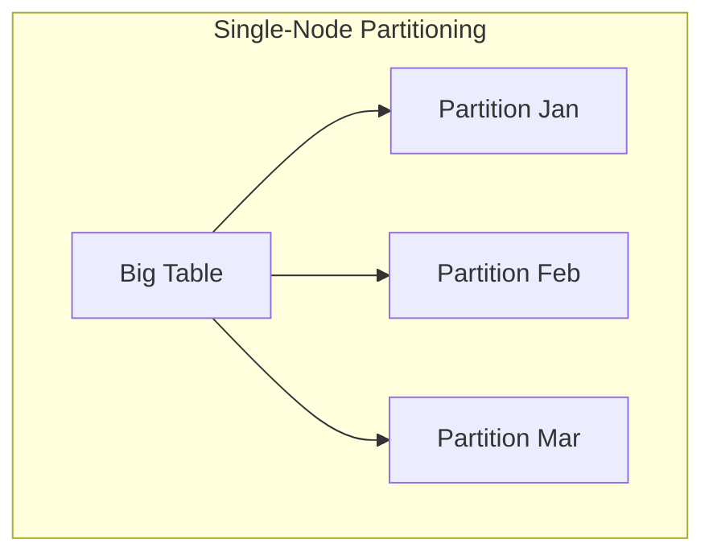
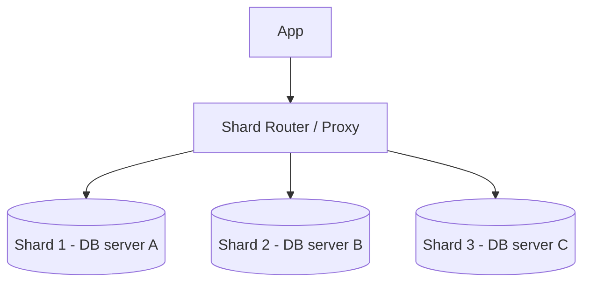
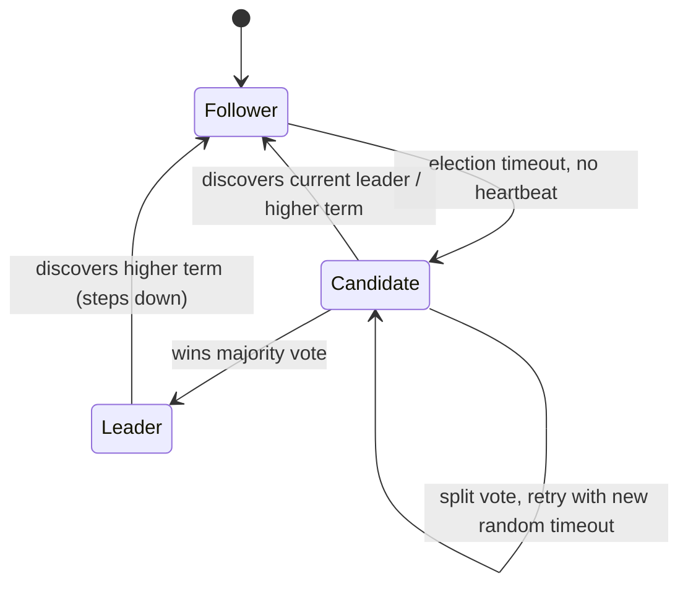
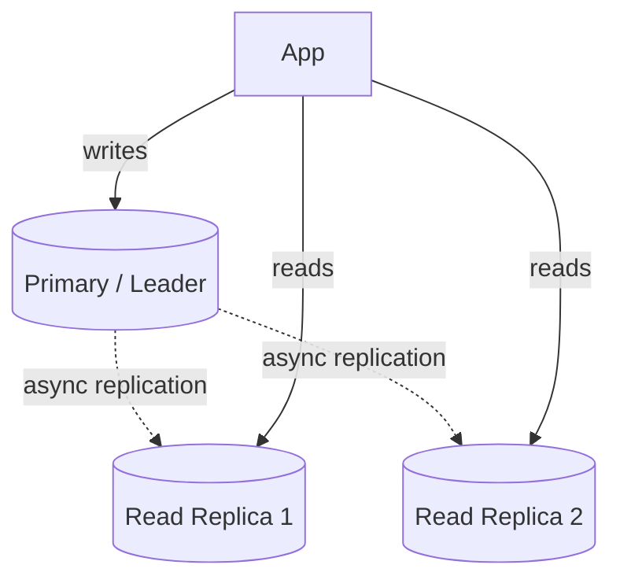
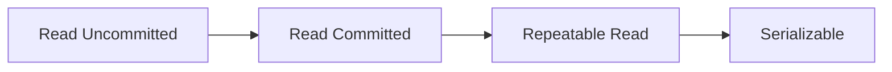

# 04 — Most Tested Database Topics

---

## 1. Partitioning vs Sharding

### Definitions (these are often conflated — clarify in interviews)
- **Partitioning**: splitting a large dataset into smaller pieces, which may live on the **same** server (e.g., partitioning a huge table by date range within one Postgres instance) or across multiple servers. It's the general umbrella concept.
- **Sharding**: a specific *kind* of partitioning where data is split across **multiple separate database instances/nodes** (horizontal scaling), each shard being an independent database holding a subset of the data.

**In short: all sharding is partitioning, not all partitioning is sharding.**

### Partitioning strategies
| Strategy | How | Pros | Cons |
|---|---|---|---|
| **Range-based** | Partition by key ranges (e.g., date, ID ranges) | Efficient range queries, simple | Hot spots if data isn't uniform (e.g., all recent writes hit the newest partition) |
| **Hash-based** | `hash(key) % N` determines partition | Uniform distribution, avoids hot spots | Range queries become inefficient (scattered across partitions) |
| **Directory-based** | Lookup service maps key → partition explicitly | Very flexible, easy rebalancing | Extra indirection hop, lookup service is a critical dependency |
| **Consistent hashing** | Hash ring with virtual nodes | Minimal data movement when adding/removing nodes | More complex to implement correctly |

### Sharding key selection — the most important decision
A bad shard key causes **hot shards** (see reliability section) or requires **cross-shard joins/transactions** (expensive/complex).

**Good shard key properties**: high cardinality, evenly distributed access pattern, aligns with the majority of query patterns (so most queries hit a single shard).

**Example**: for a multi-tenant SaaS app, `tenant_id` is often a good shard key — most queries are naturally scoped to one tenant, and tenants provide natural cardinality. But a single giant "whale" tenant can still create a hot shard (mitigated via further sub-sharding for that tenant).

### Challenges introduced by sharding
1. **Cross-shard joins**: no longer possible as a single SQL join; must be done at the application layer (fetch from each shard, join in memory) or via denormalization to avoid the join entirely.
2. **Cross-shard transactions**: need distributed transaction protocols (2PC) or, more commonly in practice, redesign to avoid needing cross-shard atomicity (e.g., via the Saga pattern — see reliability/real-world section).
3. **Rebalancing**: adding/removing shards requires moving data — consistent hashing minimizes this; naive `hash % N` requires nearly a full reshuffle when N changes.
4. **Secondary indexes**: a query filtering on a non-shard-key column must either scatter-gather across all shards (slow) or maintain a separate global secondary index service (added complexity, potential staleness).

### Trade-off summary
| Aspect | Benefit of Sharding | Cost |
|---|---|---|
| Write throughput | Scales horizontally beyond a single machine's limits | Operational complexity multiplies (N databases to manage, monitor, back up) |
| Storage | No single-machine disk limit | Cross-shard queries/joins become hard |
| Fault isolation | A shard failure only affects its subset of data/users | Need robust routing layer; shard-aware backup/restore |

---

## 2. Leader Election in Replicated Systems

### Why it's needed
In a replicated system (DB replicas, distributed queue brokers, coordination services), exactly one node should act as the authoritative **leader** (accepts writes, coordinates) while others are **followers**. When the leader fails, the system must detect this and elect a new one — automatically, correctly, without ending up with two leaders simultaneously (**split-brain**).

### Core algorithms

**Raft** (most commonly referenced in interviews — used by etcd, Consul, CockroachDB, modern Kafka KRaft):
- Nodes are in one of three states: **Follower**, **Candidate**, **Leader**.
- Time is divided into **terms**; each term has at most one leader.
- If a follower doesn't hear a heartbeat from the leader within an election timeout (randomized, to reduce split votes), it becomes a candidate, increments the term, and requests votes from peers.
- A candidate becomes leader if it wins a **majority** of votes.
- Randomized timeouts + majority requirement are what prevent split-brain and repeated election ties.

**Paxos**: theoretically foundational (older, more academically referenced), functionally similar goals to Raft but notoriously harder to understand/implement correctly — Raft was explicitly designed as a more understandable alternative. Mention Paxos exists, but lead with Raft in interviews unless asked specifically.

**ZooKeeper's ZAB (ZooKeeper Atomic Broadcast)**: another Paxos-family protocol; ZooKeeper itself is commonly used *by other systems* (Kafka historically, HBase) as an external coordination service to perform leader election for them, rather than each system implementing its own consensus from scratch.

### Why majority quorum matters
Requiring a majority (`N/2 + 1`) to elect a leader or commit a write ensures any two majorities overlap by at least one node — this overlap is what prevents split-brain and ensures the new leader has seen all previously committed data. This is why clusters are typically sized as **odd numbers** (3, 5, 7) — a 4-node cluster tolerates the same number of failures as a 3-node cluster (1) but needs more nodes to agree, so it's strictly worse.

| Cluster size | Fault tolerance (nodes that can fail) |
|---|---|
| 3 | 1 |
| 5 | 2 |
| 7 | 3 |

### Split-brain and how it's avoided
Split-brain: a network partition causes two sub-groups to each believe they're the leader, both accepting writes → data divergence/corruption.
- **Mitigation**: majority quorum requirement means only the partition containing a majority of nodes can elect/keep a leader; the minority partition cannot elect a new leader (can't get majority votes) and should step down / refuse writes (a well-behaved leader in the minority partition also self-demotes once it fails to get heartbeat acks from a majority).

### Trade-offs
| Aspect | Effect |
|---|---|
| Larger cluster | More fault tolerance, but higher latency per write (must reach more nodes for quorum) and more network chatter |
| Randomized election timeout | Reduces (but doesn't eliminate) chance of repeated split votes among candidates |
| External coordinator (ZooKeeper) vs built-in (Raft) | External = one well-tested dependency shared across systems, but adds an operational component and a hop; built-in = no external dependency, one less moving part to operate, but implemented per-system |

---

## 3. Read Replicas and Replication Lag

### Purpose of read replicas
Scale **read** throughput horizontally by directing read queries to replica copies of the database, keeping the primary/leader free to handle writes (and often reads that require strong consistency).

### Replication modes
| Mode | Description | Trade-off |
|---|---|---|
| **Synchronous** | Primary waits for replica ack before confirming write | Strong consistency, but write latency = slowest replica; if replica is down, writes can block/fail |
| **Asynchronous** | Primary confirms write immediately, replicates in background | Fast writes, but replicas can lag behind — stale reads possible |
| **Semi-synchronous** | Primary waits for at least one replica to ack (not all) | Balance — guarantees durability beyond just the primary, without waiting for every replica |

### Replication lag — the core problem
Async replication (most common for read-scaling) means a replica's data is always *slightly* behind the primary. This causes real, frequently-interviewed problems:

1. **Read-your-own-writes violation**: user updates their profile, immediately reads it back from a lagging replica, sees the *old* value. 
   - **Mitigations**: route the user's own reads to the primary for a short window after their write; or track a "read-after-write" token (e.g., last write's log sequence number) and have the client/session ensure the replica it reads from has caught up past that point before serving; or simply read-your-writes from a sticky session pinned to the primary/same replica for N seconds.
2. **Monotonic read violation**: user reads from replica A (up to date), then a subsequent read hits replica B (further behind) and sees *older* data than before — feels like time going backward.
   - **Mitigation**: consistent routing — pin a user's session to the same replica for the duration of their session (sticky routing), or route based on a minimum-lag requirement per request.
3. **Causal consistency violation**: user A posts a comment, user B (who should see it via a notification) reads from a replica that hasn't caught up yet.

### Measuring & monitoring lag
- Track lag in **time** (seconds behind primary) and/or **log position** (bytes/offset behind) — both are useful; time is more intuitive for alerting, offset is more precise for read-your-write logic.
- Alert and potentially **remove a replica from the read pool** if its lag exceeds a threshold (protects users from very stale reads) — this is itself a trade-off (reduces read capacity when the system may already be under load, which is often *why* lag increased in the first place — a feedback loop to watch for).

### Trade-offs
| Decision | Benefit | Cost |
|---|---|---|
| More read replicas | Higher read throughput | More replication fan-out load on primary, more infra cost |
| Synchronous replication | No lag / stale reads possible | Higher write latency, availability risk if replica unreachable |
| Sticky session routing | Solves read-your-writes/monotonic reads simply | Reduces load balancing flexibility, can create uneven load across replicas |

---

## 4. Transaction Isolation Levels

### Why isolation levels exist
Concurrent transactions can interfere with each other in specific, well-characterized ways. Isolation levels define *how much* interference is allowed, trading consistency guarantees for performance/concurrency.

### The anomalies (know these cold)
| Anomaly | Description |
|---|---|
| **Dirty read** | Transaction reads data written by another transaction that hasn't committed yet (and might roll back) |
| **Non-repeatable read** | Transaction reads the same row twice, gets different values, because another transaction committed an update in between |
| **Phantom read** | Transaction re-runs a range query and finds new rows that match the condition, inserted by another committed transaction in between |
| **Lost update** | Two transactions read-modify-write the same row concurrently; one's update overwrites the other's without either noticing |

### The standard isolation levels (SQL standard, ANSI)

| Level | Dirty Read | Non-repeatable Read | Phantom Read | Notes |
|---|---|---|---|---|
| Read Uncommitted | Possible | Possible | Possible | Rarely used in practice; almost no real guarantee |
| Read Committed | Prevented | Possible | Possible | **Default in Postgres, Oracle, SQL Server** |
| Repeatable Read | Prevented | Prevented | Possible (technically; MySQL's implementation actually also prevents phantoms via next-key locking) | **Default in MySQL/InnoDB** |
| Serializable | Prevented | Prevented | Prevented | Strongest — transactions behave *as if* executed one at a time |

### How they're implemented
- **Locking-based**: shared/exclusive row and range locks held for the transaction's duration (traditional approach, e.g., 2-Phase Locking for serializable).
- **MVCC (Multi-Version Concurrency Control)**: instead of locking on read, each transaction sees a consistent *snapshot* of the data as of some point in time; writes create new versions rather than overwriting in place. Used by Postgres, MySQL/InnoDB, Oracle — allows readers to never block writers and vice versa, which is why Read Committed/Repeatable Read are cheap in these systems.
- **Serializable Snapshot Isolation (SSI)**: Postgres's approach to true serializable — detects dangerous read-write conflict patterns at commit time and aborts one transaction if a serialization anomaly would occur, rather than locking pessimistically upfront.

### Trade-offs
| Higher isolation | Lower isolation |
|---|---|
| Fewer anomalies, easier to reason about correctness | More throughput/concurrency, fewer lock waits/aborts |
| More lock contention or more transaction aborts (in optimistic/SSI systems) | Risk of subtle bugs from anomalies (e.g., lost updates in a naive "read balance, subtract, write balance" flow under Read Committed) |
| Serializable can significantly reduce throughput under high contention | Read Committed is usually "good enough" + explicit locking (`SELECT FOR UPDATE`) used only where truly needed |

### Practical interview example
"Design a bank transfer (debit A, credit B)." 
- Under **Read Committed**, a naive read-modify-write of balances is vulnerable to lost updates if two transfers touch the same account concurrently.
- Fix options: use `SELECT ... FOR UPDATE` (explicit row lock) to serialize access to that row, or use **atomic** `UPDATE accounts SET balance = balance - 100 WHERE id = ?` (push the arithmetic into the single atomic statement — avoids the read-modify-write race entirely, the best practical fix), or bump isolation to Serializable and handle retry-on-conflict.
- This shows interviewers you understand isolation levels aren't just trivia — they directly determine correctness of real financial logic.
