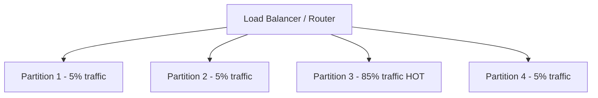
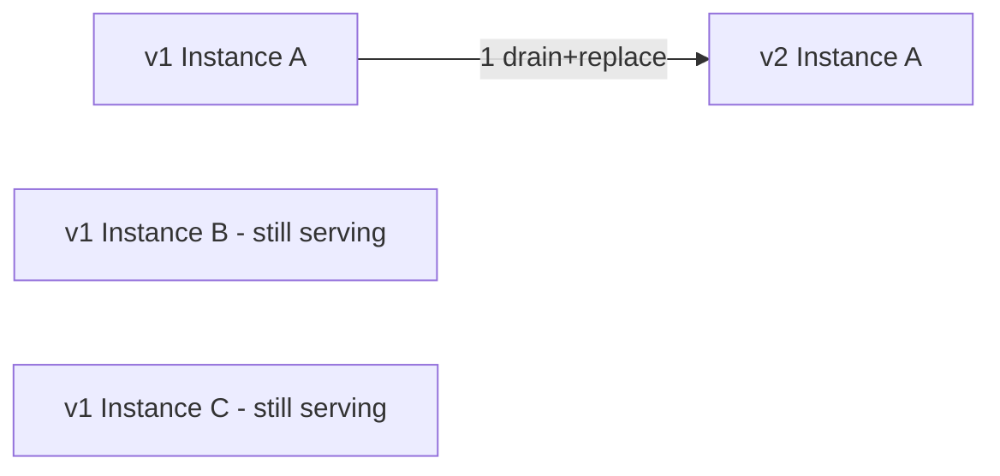
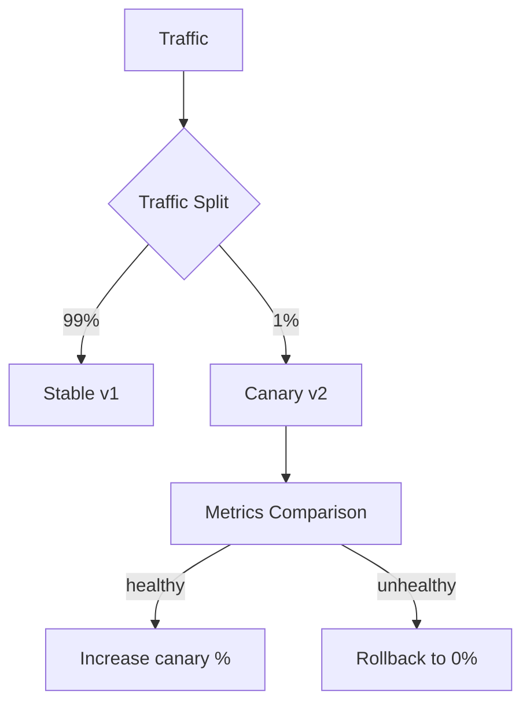
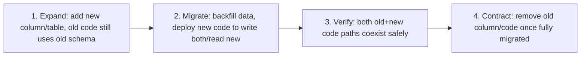

# 05 — Most Asked Real-World Architecture Problems

---

## 1. Handling Hot Partitions

### What a hot partition is
In a sharded/partitioned system, load (reads, writes, or both) is supposed to be roughly even across partitions. A **hot partition** (or hot shard/hot key) is one that receives disproportionately more traffic than others — it becomes a bottleneck even though the overall cluster has spare capacity elsewhere.

### Common causes
1. **Skewed key distribution** — e.g., celebrity user in a social app, a viral product in an e-commerce catalog, a popular chat group — all traffic concentrates on one shard key.
2. **Poor shard key choice** — e.g., sharding by `date` when all *current* writes naturally go to today's partition (classic "hot write" pattern in time-series data).
3. **Sequential/monotonic keys** — auto-incrementing IDs or timestamp-prefixed keys cause all new writes to land on the same partition (the "last" one), since B-Tree-based systems route by key range.
4. **Access pattern skew** — a small set of frequently-read items (Zipfian distribution — very common in real traffic: a few items get most of the reads).

### Mitigation strategies

| Strategy | How it works | Trade-off |
|---|---|---|
| **Key salting / sharding suffix** | Append a random or hashed suffix to the hot key (`user123#0`..`user123#9`), spreading its writes across N sub-partitions, then fan-in on read (query all N, merge) | Reads become more expensive (scatter-gather); needs to know which keys are hot in advance or dynamically detect them |
| **Caching hot keys** | Put an in-memory cache (Redis, or even a local per-node cache) in front of the hot partition for reads | Doesn't help write-heavy hot keys; adds cache invalidation complexity |
| **Read replicas for hot shard** | Give the hot partition extra read replicas specifically | Only helps reads, not writes; asymmetric infra management |
| **Randomized/hashed keys instead of sequential** | Use `hash(id)` or UUID instead of auto-increment / timestamp prefix as the partition key | Loses natural range-query/ordering ability on that key |
| **Dynamic re-sharding / splitting** | Detect a hot partition and split it further (e.g., HBase/Bigtable auto-split regions) | Requires infrastructure support for online splitting; some downtime/rebalancing cost |
| **Request coalescing** | For hot *reads*, collapse many concurrent identical requests into a single backend fetch, fan the result out to all waiters | Only helps when many callers want the *same* data simultaneously |
| **Application-level rate limiting per key** | Cap the traffic a single key can generate, degrade gracefully beyond that (return cached/stale, or reject) | Explicit trade-off of the hot user's experience for overall system health |

### Example: DynamoDB's approach
DynamoDB detects "hot keys" via adaptive capacity, automatically shifting throughput allocation to hotter partitions, and recommends **write sharding** (adding a random suffix to partition keys for known hot items, e.g., a trending product ID) as the primary application-level mitigation.

### Interview framing
Always tie the answer to **why** the hot partition occurred (bad key choice vs organic traffic skew) — the fix differs: organic skew (celebrity user) needs caching + read replicas + possibly key salting; structural skew (monotonic keys) needs a key redesign at the source.

---

## 2. Zero-Downtime Deployments

### Goal
Deploy new versions of a service without any client-facing errors, dropped connections, or downtime window.

### Core techniques

**1. Rolling deployment**
- Replace instances behind a load balancer one (or a small batch) at a time: drain traffic from an instance, take it down, deploy new version, health-check, add back to the pool, move to the next.

- **Requires**: load balancer health checks, graceful connection draining (stop accepting new requests, let in-flight ones finish before killing the process — `SIGTERM` handling with a grace period).

**2. Blue-Green deployment**
- Run two full identical environments ("blue" = current live, "green" = new version). Deploy fully to green, run smoke tests, then **atomically switch traffic** (DNS or load balancer target group swap) from blue to green.
- **Pros**: instant rollback (just switch back to blue), no partial-version window.
- **Cons**: requires 2x infrastructure during the deployment window (cost); database/schema must be compatible with both versions simultaneously if they share a DB.

**3. Canary deployment**
- Roll out the new version to a small % of traffic (e.g., 1% → 5% → 25% → 100%), monitoring error rates/latency at each stage before proceeding, auto-rollback if metrics degrade.
- **Pros**: limits blast radius of a bad deploy to a small fraction of users; catches issues with real production traffic before full rollout.
- **Cons**: slower full rollout, needs good automated metrics/monitoring to make promote/rollback decisions reliably, and requires request routing sophisticated enough to steer a precise traffic percentage.

### Comparison
| Strategy | Rollback speed | Infra cost during deploy | Blast radius of bad deploy | Complexity |
|---|---|---|---|---|
| Rolling | Slow (roll back same way) | Low (no doubling) | Partial (some instances new, briefly mixed) | Low |
| Blue-Green | Instant | High (2x for the window) | None if smoke tests catch it pre-switch; full if not | Medium |
| Canary | Fast (reduce % to 0) | Low-Medium | Small, controlled | High (needs traffic-splitting + automated analysis) |

### Supporting practices required for any of these to actually be zero-downtime
1. **Graceful shutdown**: handle `SIGTERM`, stop accepting new connections, finish in-flight requests, then exit — a hard kill mid-request breaks zero-downtime guarantees.
2. **Health checks**: readiness probes (is this instance ready to serve traffic?) separate from liveness probes (is the process alive at all?) — load balancer should only route to instances passing readiness.
3. **Idempotent/stateless services**: if a request fails mid-deploy and the client retries, it should be safe to retry against a different (new-version) instance.
4. **Database migration compatibility** (see next topic) — the app-level deploy strategy is worthless if a breaking schema change accompanies it.
5. **Connection draining at the load balancer**: don't abruptly cut TCP connections to an instance being removed from the pool.

---

## 3. Backward Compatibility During Schema Migrations

### The core problem
During a rolling/canary/blue-green deploy, **old and new code run simultaneously** for some window, and both may be reading/writing the **same database**. A schema change that isn't compatible with both versions simultaneously will break the old version's instances (or the new version's, or both) during that window.

### The expand-contract pattern (a.k.a. parallel change) — the standard solution

**Example — renaming a column `name` → `full_name`:**
1. **Expand**: add new column `full_name` (nullable), without touching `name`. Deploy this migration alone — fully backward compatible, old code doesn't even know it exists.
2. **Dual-write**: deploy new application code that writes to **both** `name` and `full_name` on every write, but still reads from `name` (old code, still running during rollout, continues to work unaffected).
3. **Backfill**: run a background job to populate `full_name` for all existing rows that predate the dual-write change.
4. **Migrate reads**: deploy another change where application code now reads from `full_name` instead of `name` (by this point all rows have `full_name` populated).
5. **Contract**: once fully rolled out and confident, stop writing to `name`, then drop the `name` column in a later, separate migration.

**Why so many small steps?** Each step individually must be safe for *both* the currently-deployed old version and the about-to-be-deployed new version to coexist against the database at the same time — this is the essential constraint any single "big bang" migration violates.

### Rules of thumb for safe migrations
| Change type | Safe as single step? | Why |
|---|---|---|
| Add a new nullable column | Yes | Old code ignores it; doesn't break |
| Add a new table | Yes | Nothing references it yet |
| Drop a column | **No** — only after all code stops referencing it | Old code still running would error/behave incorrectly |
| Rename a column | **No** | Equivalent to simultaneous add+drop; breaks whichever version wasn't updated |
| Change a column type | **No**, usually | Can break serialization/deserialization on either version reading unexpected format |
| Add a `NOT NULL` constraint | **No**, until backfilled | Old code writing rows without that field will fail inserts |
| Add an index | Usually yes (online index build) | But watch for lock contention on large tables during build — use online/concurrent index building (e.g., Postgres `CREATE INDEX CONCURRENTLY`) |

### Additional real-world considerations
- **API versioning** follows the same principle — never remove/change a field's meaning in a way that breaks currently-deployed old clients; add new fields, deprecate old ones over a support window, communicate deprecation timelines.
- **Feature flags** are often used alongside expand-contract to decouple "deploy" from "release" — the new code path can be merged/deployed dark, then activated via a flag once the data migration step is confirmed complete, giving an instant kill-switch if something's wrong (without needing a redeploy/rollback).
- **Large table migrations**: for very large tables, even an "expand" step (adding a column) can lock the table for a long time on some databases — use online schema change tools (e.g., `gh-ost`, `pt-online-schema-change` for MySQL) that perform the migration via shadow tables + triggers to avoid long locks.

### Interview framing
This topic tests whether a candidate thinks about deployments as a **temporal, multi-version problem**, not a single atomic switch — the strongest answers explicitly say "at any moment during rollout, two versions of the code may be talking to the database simultaneously, so every single migration step must be compatible with both."
