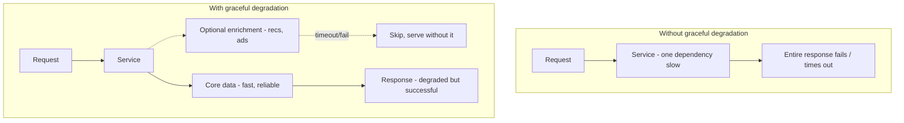
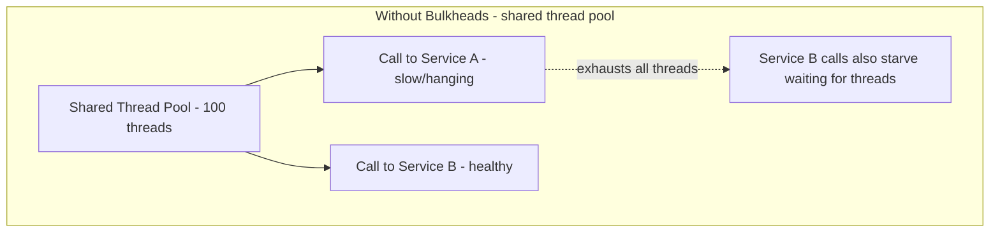
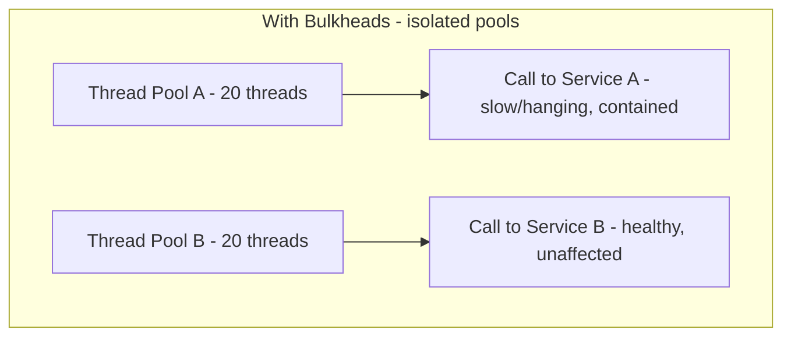
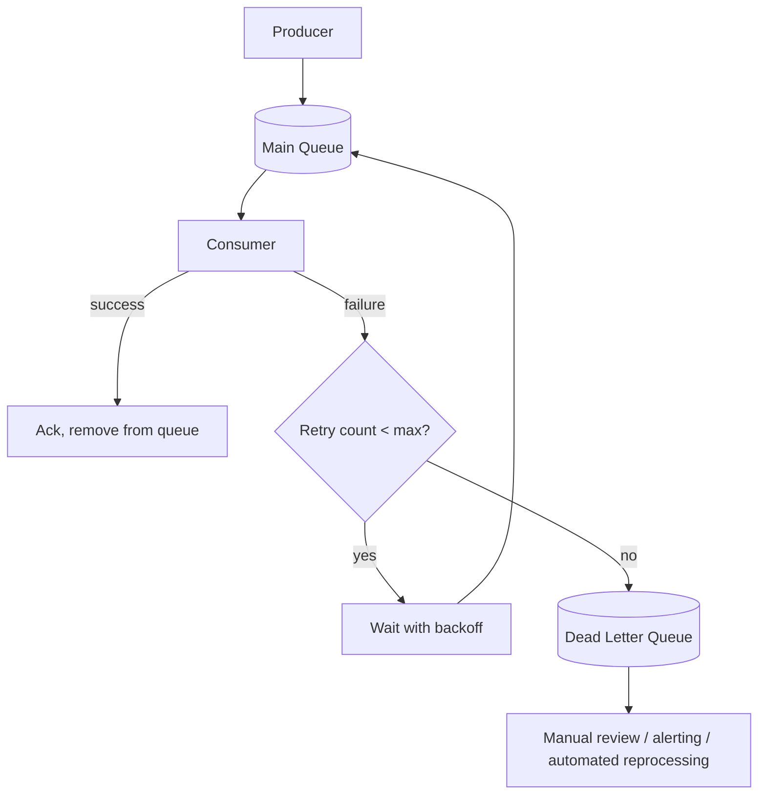
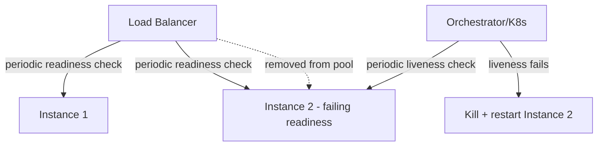
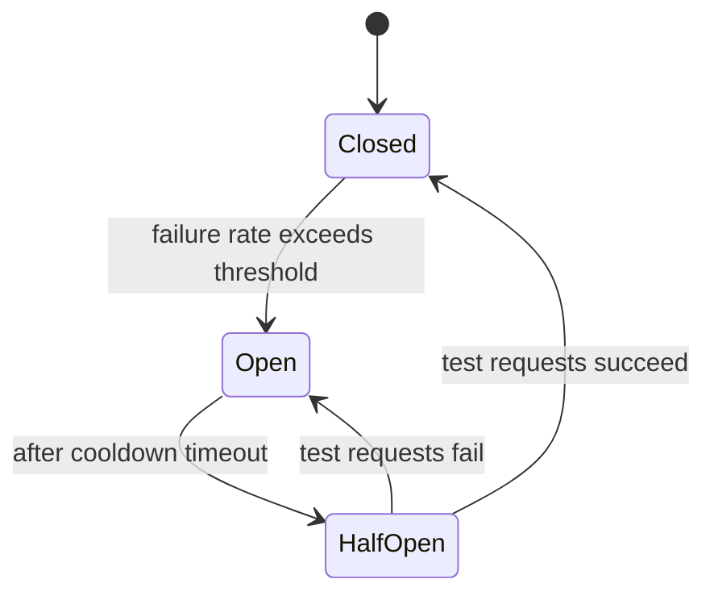

# 06 — Most Tested Reliability Topics

---

## 1. Graceful Degradation

### Definition
When a system (or a dependency of it) is under stress or partially failing, **graceful degradation** means intentionally reducing functionality or quality to preserve core availability, rather than failing completely.

### Contrast with the naive approach

### Real-world techniques
1. **Feature shedding**: an e-commerce product page needs price + availability (core) but also shows "customers also bought" (optional). If the recommendation service is slow/down, render the page without that section rather than failing the whole page load.
2. **Serving stale/cached data**: if the live/authoritative source is unavailable, fall back to a cached version even if slightly outdated — better than an error for most use cases (e.g., showing yesterday's follower count rather than nothing).
3. **Reduced precision/quality**: video streaming reduces resolution under bandwidth constraints instead of buffering/stopping entirely (adaptive bitrate streaming) — same principle applied to media delivery.
4. **Read-only mode**: under extreme load or during a partial outage, disable writes (which are riskier and often costlier) while keeping reads available — many systems (databases, e-commerce during flash sales) do this deliberately.
5. **Load shedding**: reject a portion of incoming requests (typically lowest priority ones first) once past a capacity threshold, so the system stays responsive for the requests it *does* accept, instead of everyone getting a slow/timeout experience (see also: admission control).
6. **Priority tiers**: classify requests/users by priority (e.g., paying customers vs free tier, or critical checkout flow vs browsing) and shed/degrade lower-priority traffic first.

### Design principle: separate "must-have" from "nice-to-have" at the architecture level
This requires explicitly identifying, per page/API, which dependencies are **critical path** vs **optional/enrichment**, and wrapping optional calls with timeouts + fallback defaults (often paired with circuit breakers — see below).

### Trade-offs
| Benefit | Cost |
|---|---|
| System stays available/usable during partial failures | Extra engineering complexity — every optional dependency needs a defined fallback behavior |
| Better user experience than a hard error | Risk of masking real problems if degraded mode becomes the "normal" unnoticed state (needs strong monitoring/alerting on degraded-mode frequency) |

---

## 2. Bulkhead Isolation Pattern

### Origin of the name
From ship design — a ship's hull is divided into watertight compartments (bulkheads) so that if one section floods, the whole ship doesn't sink. Applied to software: isolate resources (thread pools, connection pools, service instances) per dependency/use-case so that failure or saturation in one doesn't exhaust resources needed by others.

### The problem it solves
Without isolation, a single slow/failing downstream dependency can exhaust a **shared** resource pool (e.g., a shared thread pool where all outgoing calls compete for the same limited threads), causing **all** functionality to degrade — even calls to completely unrelated, healthy dependencies — because they're all starved waiting for threads stuck on the slow dependency.

### Implementations
1. **Thread pool isolation**: dedicate a separate, bounded thread pool per downstream dependency (classic Hystrix pattern). If dependency A's pool fills up (because A is slow), new calls to A are rejected fast (fail-fast), but calls to B use B's separate pool and are unaffected.
2. **Connection pool isolation**: separate DB/HTTP connection pools per downstream service or per tenant, so one noisy/slow consumer can't starve connections needed by others.
3. **Process/container-level isolation**: run different workloads in separate processes/containers/pods with their own resource limits (CPU/memory quotas via cgroups/Kubernetes resource limits) so one workload's resource spike doesn't starve another's.
4. **Semaphore isolation** (lighter-weight alternative to thread pools): use a counting semaphore to limit concurrent calls to a dependency within the *same* thread pool — less isolation than separate thread pools (a slow call still occupies a caller's thread) but much lower overhead, appropriate for very high-volume, low-latency in-process calls.
5. **Tenant-level bulkheads** in multi-tenant systems: isolate resources per tenant (dedicated shard, rate limit, or resource quota) so one tenant's traffic spike or bad query can't degrade service for other tenants ("noisy neighbor" problem).

### Trade-offs
| Benefit | Cost |
|---|---|
| Contains failure blast radius | More total resources needed (can't share a pool efficiently across all uses) — some over-provisioning per bulkhead |
| Predictable degradation (only the affected dependency's calls fail) | More configuration/tuning — sizing each pool correctly requires understanding per-dependency traffic and latency characteristics |
| Pairs naturally with circuit breakers for fast-fail | Added operational complexity (more pools/limits to monitor) |

### How it pairs with circuit breakers
Bulkheads limit *how many* concurrent calls can be made to a dependency (containing resource exhaustion); circuit breakers stop making calls *at all* once a dependency is detected as failing (containing wasted effort/latency on calls likely to fail anyway). They're complementary, not alternatives.

---

## 3. Dead Letter Queues (DLQ)

### Definition
A separate queue/topic where messages that **repeatedly fail processing** are routed, instead of being retried forever or silently dropped. Preserves failed messages for inspection, debugging, and manual/automated reprocessing, while letting the main queue keep flowing.

### Why not just retry forever?
1. **Poison messages**: a malformed message that will *never* succeed (bad schema, corrupted data) would otherwise be retried infinitely, wasting resources and potentially blocking the queue for messages behind it (head-of-line blocking in strictly-ordered queues).
2. **Observability**: without a DLQ, silent message drops or infinite retry loops are invisible; a DLQ gives an explicit, inspectable signal of what's failing and why.
3. **Isolating bad data from good throughput**: keeps the main processing pipeline healthy and fast by removing the "stuck" messages from its critical path.

### Design considerations
1. **Retry policy before DLQ**: use **exponential backoff with jitter** (not immediate/tight retries, which can amplify load on an already-struggling downstream dependency) and a max retry count/time window before routing to DLQ.
2. **Preserve context**: DLQ messages should carry metadata — original topic/queue, failure reason/exception, retry count, timestamp of first/last failure — essential for debugging without needing to reproduce the failure.
3. **Alerting**: DLQ depth growing is itself an important signal — alert on DLQ message count/rate, not just "is the main queue healthy."
4. **Reprocessing strategy**: after fixing the root cause (bug fix, downstream recovery), messages in the DLQ need a path back — either an automated replay-to-main-queue job or a manual/semi-automated review tool, since blindly replaying can also re-trigger the same failure or cause duplicate side effects if not idempotent.
5. **Idempotency is essential**: since DLQ implies retries happened, consumers must be idempotent (dedup by message ID) — a message might have partially succeeded (e.g., side effect happened) before ultimately being marked failed and moved to DLQ.

### Real system examples
- **AWS SQS**: native DLQ support — configure `maxReceiveCount`, after which a message auto-moves to a designated DLQ.
- **Kafka**: no built-in DLQ primitive, but the same pattern is implemented at the application/consumer level (or via Kafka Connect's dead letter queue config) by publishing failed messages to a separate `topic.DLQ` topic.

### Trade-offs
| Benefit | Cost |
|---|---|
| Prevents poison messages from blocking/looping forever | Requires operational process to monitor and act on DLQ contents (a DLQ that's never looked at is just a silent data-loss bucket with extra steps) |
| Preserves data for debugging/reprocessing (vs silent drop) | Extra infrastructure (another queue/topic to provision and secure) |
| Isolates main pipeline health from bad messages | Reprocessing logic adds complexity, and must handle idempotency correctly |

---

## 4. Health Checks and Self-Healing Systems

### Types of health checks
| Type | Question it answers | Used by |
|---|---|---|
| **Liveness probe** | "Is the process alive / not deadlocked?" | Orchestrator (e.g., Kubernetes) — if it fails, the process is **restarted** |
| **Readiness probe** | "Is this instance ready to receive traffic right now?" | Load balancer / orchestrator — if it fails, instance is **removed from the routing pool** but *not* necessarily restarted (e.g., still warming up a cache) |
| **Startup probe** | "Has the app finished its slow initial startup?" | Orchestrator — prevents liveness checks from prematurely killing a slow-starting app |
| **Deep/dependency health check** | "Are my critical downstream dependencies (DB, cache) reachable?" | Often exposed at `/health/deep` — used cautiously, since a dependency outage shouldn't necessarily take down every instance simultaneously (cascading effect risk) |

### Self-healing patterns
1. **Auto-restart on liveness failure**: orchestrator kills and restarts a hung/crashed process automatically (Kubernetes `restartPolicy`, systemd, supervisord).
2. **Auto-scaling based on health/load metrics**: if healthy instance count drops or load per instance rises, spin up replacements/additional instances automatically.
3. **Circuit breakers** (self-healing at the *dependency call* level): after a dependency fails repeatedly, the circuit "opens" — stop calling it for a cooldown period (fail fast instead), then periodically send a small number of test requests (**half-open** state) to check if it's recovered, and fully "close" the circuit (resume normal calls) if those succeed.

4. **Auto-remediation runbooks**: automated response to known failure signatures (e.g., disk usage >90% → auto-trigger log rotation/cleanup; a specific error pattern → auto-restart the affected service) — codifying what used to be manual on-call actions.
5. **Self-healing data**: anti-entropy processes (e.g., Merkle-tree-based repair in Dynamo-style stores, as covered in the Key-Value Store design) automatically detect and fix replica drift without human intervention.

### Designing good health checks — common pitfalls
- **Checking too much in a liveness probe** (e.g., checking DB connectivity in liveness): if the DB is briefly down, this kills and restarts *every* app instance simultaneously — restarting doesn't fix a DB outage and now you also have a cold-start storm the moment the DB recovers. **Dependency checks belong in readiness, not liveness**, in most cases — liveness should check "is *this process* internally functioning," not "are external dependencies up."
- **Cascading health-check failures**: if health checks call a slow dependency synchronously and don't have their own timeout, the health check itself can hang, causing false-negative failures under load — health checks need short, strict timeouts independent of normal request-handling timeouts.
- **Thundering herd on recovery**: when a previously-down dependency recovers, all waiting/backed-off clients retrying simultaneously can immediately overwhelm it again — mitigate with jittered backoff and gradual traffic ramp-up (similar to canary logic) rather than an instant full-traffic resumption.

### Trade-offs
| Design choice | Trade-off |
|---|---|
| Aggressive health checks (short intervals, strict thresholds) | Faster detection of real failures, but more false positives (flapping) under transient blips |
| Lenient health checks (longer intervals, higher failure thresholds) | Fewer false positives, but slower to detect and react to real failures |
| Automated self-healing (auto-restart/auto-remediate) | Faster recovery, but risk of automation masking or even exacerbating a root cause if the "fix" is a blunt instrument (e.g., auto-restart looping on a genuinely broken deploy) — always pair with alerting so humans see it happened even if the system recovered on its own |
