# Agentic AI Design Patterns — Complete Reference Guide

*Core patterns for building LLM-powered agentic systems, with diagrams, LangGraph code snippets, advantages/disadvantages, and guidance on which pattern fits which use case.*

> **Note on code:** Snippets use LangGraph's `StateGraph` API (Python) to show the *shape* of each pattern. They're illustrative — trimmed of full error handling, prompt engineering detail, and production concerns (retries, guardrails, observability) for readability.

---

## Table of Contents
1. ReAct (Reason + Act)
2. Tool Use / Function Calling
3. Reflection (Self-Critique)
4. Planning (Plan-and-Execute)
5. Routing
6. Parallelization (Fan-Out/Fan-In)
7. Orchestrator-Workers (Supervisor Pattern)
8. Evaluator-Optimizer
9. Hierarchical Multi-Agent
10. Human-in-the-Loop
11. Multi-Agent Debate / Collaboration
12. Memory-Augmented Agent
13. Comparison Table
14. Decision Guide

---

## 1. ReAct (Reason + Act)

**Description:** The agent interleaves reasoning ("thoughts") with actions (tool calls), observing the result of each action before deciding the next step. The classic loop: **Thought → Action → Observation → repeat** until the agent decides it has enough information to answer.

**Problem It Solves:** A single LLM call can't dynamically gather external information or take multiple dependent actions — ReAct lets the model reason step-by-step, decide when it needs a tool, use it, and adjust based on what comes back.

**Use Case:** A research assistant that searches the web, reads a result, decides it needs another search with refined terms, then synthesizes a final answer.

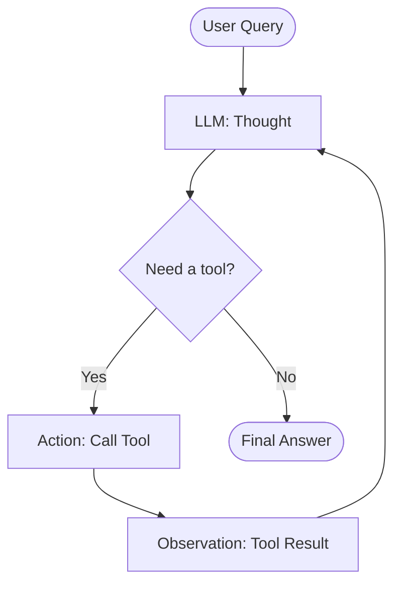

**LangGraph Snippet:**
```python
from langgraph.graph import StateGraph, END
from langgraph.prebuilt import ToolNode
from langchain_core.messages import HumanMessage
from typing import TypedDict, Annotated
import operator

class AgentState(TypedDict):
    messages: Annotated[list, operator.add]

def call_model(state: AgentState):
    response = llm_with_tools.invoke(state["messages"])
    return {"messages": [response]}

def should_continue(state: AgentState):
    last_message = state["messages"][-1]
    return "tools" if last_message.tool_calls else END

graph = StateGraph(AgentState)
graph.add_node("agent", call_model)
graph.add_node("tools", ToolNode(tools=[web_search, calculator]))
graph.set_entry_point("agent")
graph.add_conditional_edges("agent", should_continue, {"tools": "tools", END: END})
graph.add_edge("tools", "agent")   # loop back: observation feeds the next thought

app = graph.compile()
```

**Advantages:**
- Grounds reasoning in real, verifiable data instead of relying purely on model recall
- Flexible — the agent decides dynamically how many steps/tools it needs
- Transparent, inspectable trace of thought → action → observation for debugging

**Disadvantages:**
- Can loop excessively or get stuck without a step/iteration cap
- Each loop iteration costs a full LLM call — slower and more expensive than a single-shot answer
- Quality heavily depends on tool descriptions and prompt design; poor tool docs cause bad tool selection

**When to Use:** Tasks requiring dynamic, multi-step information gathering (research, troubleshooting, data lookup) where the number of steps isn't known in advance.
**When Not to Use:** Simple, single-step tasks where a direct tool call or single LLM completion suffices.

---

## 2. Tool Use / Function Calling

**Description:** The LLM is given a set of tool/function definitions (schema + description); the model outputs a structured call to the tool with arguments when needed, and the calling code executes it and returns the result to the model.

**Problem It Solves:** LLMs can't natively query databases, call APIs, do precise math, or take real-world actions — tool use is the foundational mechanism that lets an agent *do* things, not just talk.

**Use Case:** An agent that looks up a customer's order status by calling an `get_order_status(order_id)` function against a real order-management API.

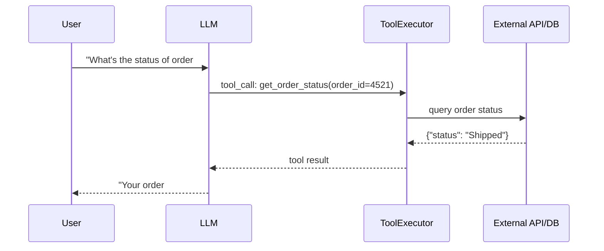

**LangGraph Snippet:**
```python
from langchain_core.tools import tool

@tool
def get_order_status(order_id: int) -> str:
    """Look up the shipping status of an order by its ID."""
    return order_service.get_status(order_id)   # real backend call

llm_with_tools = llm.bind_tools([get_order_status])

response = llm_with_tools.invoke([HumanMessage("What's the status of order #4521?")])
# response.tool_calls -> [{"name": "get_order_status", "args": {"order_id": 4521}}]
```

**Advantages:**
- Extends the model beyond its training data — real-time, accurate, actionable information
- Structured schemas (JSON schema/Pydantic) make tool calls reliable and type-checked
- Composable — tools can be swapped/added without retraining the model

**Disadvantages:**
- Model can hallucinate tool arguments or call the wrong tool if descriptions are ambiguous
- Adds latency (extra round-trip per tool call)
- Security risk if tools have side effects (writes, deletes) and aren't properly gated/validated

**When to Use:** Virtually every non-trivial agent — this is the foundational building block underneath ReAct, Planning, and most other patterns below.
**When Not to Use:** Pure text generation/summarization tasks needing no external data or actions.

---

## 3. Reflection (Self-Critique)

**Description:** After producing an initial output, the agent (or a second LLM call/agent) critiques its own work against the original requirements, then revises based on that critique — often looped until quality converges or a max iteration count is reached.

**Problem It Solves:** A single LLM pass often misses edge cases, makes factual errors, or produces subpar quality on the first attempt. Reflection adds a self-correction loop that meaningfully improves output quality, especially for complex generation tasks (code, long-form writing).

**Use Case:** A code-generation agent writes a function, then a "critic" step reviews it for bugs/style issues, and the agent revises accordingly before returning final code.

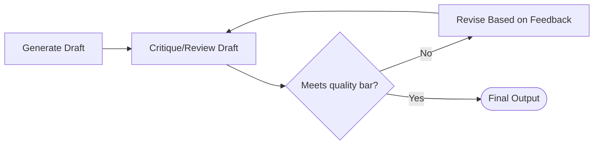

**LangGraph Snippet:**
```python
class ReflectionState(TypedDict):
    draft: str
    critique: str
    iteration: int

def generate(state: ReflectionState):
    draft = llm.invoke(f"Write code for: {task}. Prior feedback: {state.get('critique','')}")
    return {"draft": draft, "iteration": state["iteration"] + 1}

def critique(state: ReflectionState):
    review = llm.invoke(f"Critique this code for bugs and style issues:\n{state['draft']}")
    return {"critique": review}

def should_revise(state: ReflectionState):
    if "no issues found" in state["critique"].lower() or state["iteration"] >= 3:
        return END
    return "generate"

graph = StateGraph(ReflectionState)
graph.add_node("generate", generate)
graph.add_node("critique", critique)
graph.set_entry_point("generate")
graph.add_edge("generate", "critique")
graph.add_conditional_edges("critique", should_revise, {"generate": "generate", END: END})

app = graph.compile()
```

**Advantages:**
- Meaningfully improves output quality vs. single-pass generation, especially for code/writing
- Catches errors, omissions, and inconsistencies the first pass missed
- Can use a different (sometimes cheaper/faster) model for critique vs. generation

**Disadvantages:**
- Multiplies cost/latency — every reflection loop is at least 2 extra LLM calls
- Can loop without real improvement if critique quality is poor or vague
- Needs a clear stopping condition, or it never converges

**When to Use:** High-stakes or quality-sensitive generation tasks: code, legal/technical writing, complex summarization.
**When Not to Use:** Simple, low-stakes outputs where the extra cost/latency isn't justified (e.g., a quick chat reply).

---

## 4. Planning (Plan-and-Execute)

**Description:** The agent first generates an explicit multi-step plan for the entire task, then executes each step (often delegating to sub-agents or tools), potentially re-planning if a step fails or new information changes the approach.

**Problem It Solves:** ReAct's step-by-step reasoning can be inefficient or short-sighted for genuinely complex, multi-part tasks. Planning upfront gives the agent (and the developer/observer) a clear roadmap before execution begins, improving coherence and predictability.

**Use Case:** "Plan and book a 3-day trip to Tokyo" — the agent first drafts a plan (flights → hotel → itinerary → budget check), then executes each step, adjusting the plan if a flight isn't available.

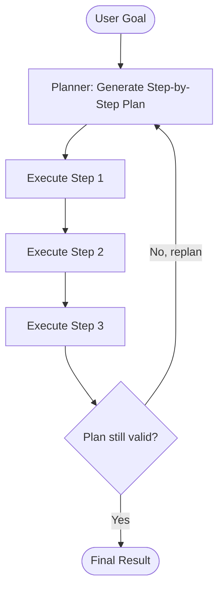

**LangGraph Snippet:**
```python
class PlanExecuteState(TypedDict):
    goal: str
    plan: list[str]
    past_steps: Annotated[list, operator.add]

def planner(state: PlanExecuteState):
    plan = planning_llm.invoke(f"Break this goal into ordered steps: {state['goal']}")
    return {"plan": plan.steps}

def executor(state: PlanExecuteState):
    next_step = state["plan"][len(state["past_steps"])]
    result = execution_agent.invoke(next_step)   # could itself be a ReAct sub-agent
    return {"past_steps": [(next_step, result)]}

def should_replan(state: PlanExecuteState):
    if len(state["past_steps"]) >= len(state["plan"]):
        return END
    if execution_failed(state["past_steps"][-1]):
        return "planner"   # re-plan on failure
    return "executor"

graph = StateGraph(PlanExecuteState)
graph.add_node("planner", planner)
graph.add_node("executor", executor)
graph.set_entry_point("planner")
graph.add_edge("planner", "executor")
graph.add_conditional_edges("executor", should_replan, {"planner": "planner", "executor": "executor", END: END})

app = graph.compile()
```

**Advantages:**
- Better coherence for long, multi-part tasks — the plan is explicit and inspectable
- Enables parallelizing independent steps of the plan (see Parallelization pattern)
- Easier to add human review/approval of the plan before execution begins

**Disadvantages:**
- Upfront plan can be wrong or become outdated as execution reveals new information — requires re-planning logic
- More architectural complexity than direct ReAct for simple tasks
- Planning itself costs an extra LLM call and can be a bottleneck if the plan needs frequent revision

**When to Use:** Complex, multi-step goals with reasonably well-defined sub-tasks (trip booking, multi-file code refactors, research reports).
**When Not to Use:** Simple, short tasks where a plan adds overhead without benefit.

---

## 5. Routing

**Description:** An initial classification step examines the input and routes it to one of several specialized downstream handlers (different prompts, different models, or different sub-agents), rather than using one generic handler for everything.

**Problem It Solves:** A single generic agent/prompt trying to handle very different types of requests (billing questions, technical support, sales) tends to perform worse than specialized handlers tuned for each category.

**Use Case:** A customer support agent classifies an incoming message as "billing," "technical," or "general," then routes it to a specialized sub-agent/prompt for that category.

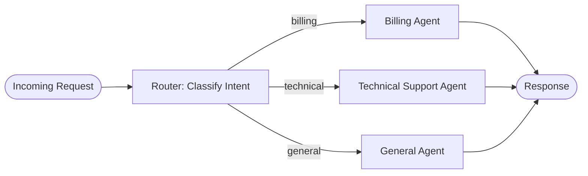

**LangGraph Snippet:**
```python
class RouterState(TypedDict):
    query: str
    category: str
    response: str

def route(state: RouterState):
    category = classifier_llm.invoke(f"Classify as billing/technical/general: {state['query']}")
    return {"category": category.strip().lower()}

def pick_route(state: RouterState):
    return state["category"]   # matches node names below

graph = StateGraph(RouterState)
graph.add_node("router", route)
graph.add_node("billing", lambda s: {"response": billing_agent.invoke(s["query"])})
graph.add_node("technical", lambda s: {"response": tech_agent.invoke(s["query"])})
graph.add_node("general", lambda s: {"response": general_agent.invoke(s["query"])})

graph.set_entry_point("router")
graph.add_conditional_edges("router", pick_route,
    {"billing": "billing", "technical": "technical", "general": "general"})
graph.add_edge("billing", END)
graph.add_edge("technical", END)
graph.add_edge("general", END)

app = graph.compile()
```

**Advantages:**
- Each specialized handler can use a tuned prompt, tools, or even a different/cheaper model per category
- Simplifies each individual handler's logic (single responsibility)
- Easy to extend — add new categories/routes without touching existing handlers

**Disadvantages:**
- Misclassification at the router step sends the request down the wrong path entirely
- Adds an extra LLM call for classification before the "real" work begins
- Category boundaries can be ambiguous for real-world messy input, requiring fallback/general handlers

**When to Use:** Systems handling clearly distinguishable categories of requests where specialized handling meaningfully improves quality (customer support, multi-domain assistants).
**When Not to Use:** Homogeneous request types where one well-designed generic agent already performs well.

---

## 6. Parallelization (Fan-Out/Fan-In)

**Description:** Independent subtasks are dispatched to multiple LLM calls/agents simultaneously, and their results are aggregated once all (or enough) complete. Two common variants: **sectioning** (split one task into independent parts) and **voting** (run the same task multiple times and aggregate/vote on results).

**Problem It Solves:** Sequential processing of independent subtasks wastes time when they could run concurrently; running the same task multiple times and combining results also improves reliability/quality (ensemble effect).

**Use Case:** Reviewing a long document for compliance issues: split it into sections, run a compliance-check agent on each section in parallel, then aggregate all findings into one report.

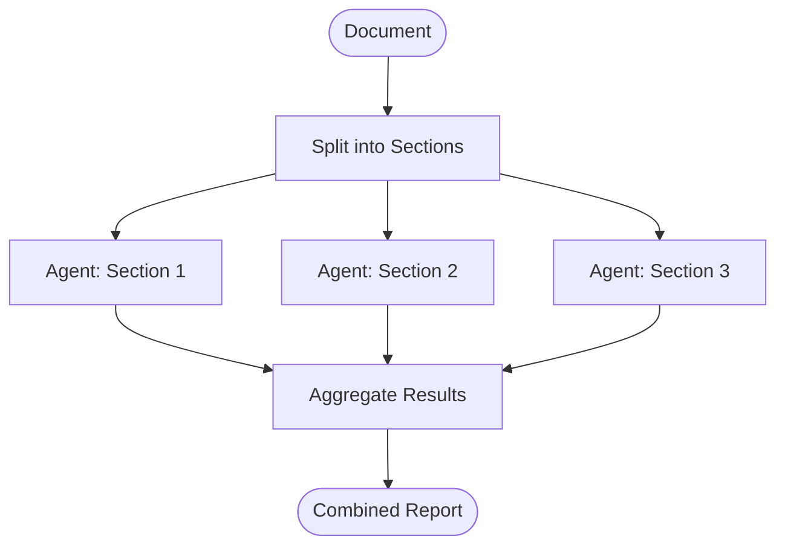

**LangGraph Snippet:**
```python
class ParallelState(TypedDict):
    sections: list[str]
    results: Annotated[list, operator.add]

def dispatch_section(section: str):
    def run(state: ParallelState):
        result = compliance_agent.invoke(section)
        return {"results": [result]}
    return run

graph = StateGraph(ParallelState)
graph.add_node("split", lambda s: {"sections": split_into_sections(s["document"])})

# fan-out: add a node per section, all running independently
for i, section in enumerate(document_sections):
    graph.add_node(f"check_{i}", dispatch_section(section))
    graph.add_edge("split", f"check_{i}")   # all run in parallel from the same source
    graph.add_edge(f"check_{i}", "aggregate")

graph.add_node("aggregate", lambda s: {"results": [summarize(s["results"])]})
graph.set_entry_point("split")
graph.add_edge("aggregate", END)

app = graph.compile()   # LangGraph executes independent branches concurrently
```

**Advantages:**
- Significantly faster wall-clock time for independent subtasks vs. sequential processing
- Voting/ensemble variants improve accuracy and reduce the impact of a single bad LLM response
- Scales naturally with more compute (more parallel workers = faster, up to rate limits)

**Disadvantages:**
- Aggregation step must sensibly combine/reconcile potentially conflicting results
- Higher instantaneous cost (many concurrent LLM calls) even if total latency improves
- Not applicable when subtasks have sequential dependencies on each other

**When to Use:** Tasks that naturally decompose into independent, order-agnostic subtasks (multi-section document review, multi-perspective analysis, majority-vote classification).
**When Not to Use:** Tasks with strict sequential dependencies between steps.

---

## 7. Orchestrator-Workers (Supervisor Pattern)

**Description:** A central "orchestrator" (or "supervisor") LLM dynamically decides which specialized worker agent should handle each part of a task, delegates to it, collects the result, and decides the next step — unlike static Routing, the orchestrator can call workers repeatedly, in any order, based on evolving context.

**Problem It Solves:** Complex tasks often need multiple specialized capabilities (coding, research, writing) applied in a sequence that isn't known in advance. A supervisor dynamically coordinates specialists rather than following a fixed pipeline.

**Use Case:** A "build a feature" supervisor agent delegates to a Research Agent (look up API docs), then a Coding Agent (write the implementation), then a Testing Agent (write and run tests) — deciding dynamically whether to loop back to Research if the Coding Agent hits a gap.

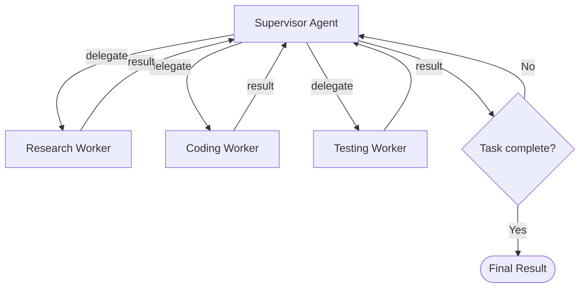

**LangGraph Snippet:**
```python
class SupervisorState(TypedDict):
    task: str
    history: Annotated[list, operator.add]
    next_worker: str

def supervisor(state: SupervisorState):
    decision = supervisor_llm.invoke(
        f"Task: {state['task']}\nHistory: {state['history']}\n"
        f"Which worker should act next: research, coder, tester, or done?"
    )
    return {"next_worker": decision.strip().lower()}

def route_to_worker(state: SupervisorState):
    return state["next_worker"]

graph = StateGraph(SupervisorState)
graph.add_node("supervisor", supervisor)
graph.add_node("research", lambda s: {"history": [research_agent.invoke(s["task"])]})
graph.add_node("coder", lambda s: {"history": [coding_agent.invoke(s["task"])]})
graph.add_node("tester", lambda s: {"history": [testing_agent.invoke(s["task"])]})

graph.set_entry_point("supervisor")
graph.add_conditional_edges("supervisor", route_to_worker,
    {"research": "research", "coder": "coder", "tester": "tester", "done": END})
graph.add_edge("research", "supervisor")   # workers report back, supervisor decides next
graph.add_edge("coder", "supervisor")
graph.add_edge("tester", "supervisor")

app = graph.compile()
```

**Advantages:**
- Handles complex, dynamic workflows where the sequence of specialists isn't known upfront
- Specialization improves quality per sub-task (each worker has a focused prompt/toolset)
- Supervisor provides a central point for oversight, logging, and control

**Disadvantages:**
- Supervisor itself can become a bottleneck or single point of failure/error propagation
- More LLM calls (supervisor decision + worker execution) means higher cost/latency than a fixed pipeline
- Debugging can be harder — the path through workers is dynamic and non-deterministic

**When to Use:** Complex, open-ended tasks needing multiple specialized capabilities applied in a data-dependent order (software engineering agents, complex research/report generation).
**When Not to Use:** Tasks with a known, fixed sequence of steps — a simpler pipeline (or Planning pattern) is cheaper and more predictable.

---

## 8. Evaluator-Optimizer

**Description:** One LLM generates a response; a separate "evaluator" LLM (or rubric-based check) scores it against explicit criteria; if it doesn't pass, feedback is sent back to the generator for another attempt — similar to Reflection, but with a distinctly separate, often more rigorously-defined evaluator role and explicit pass/fail criteria.

**Problem It Solves:** For tasks with clear, checkable success criteria (does the translation preserve meaning? does the code pass tests?), having a dedicated evaluator with well-defined criteria produces more reliable quality control than the generator "reflecting" on its own work.

**Use Case:** A translation agent generates a translation; an evaluator agent checks it against fluency and accuracy criteria and provides specific feedback; the generator retries until it passes.

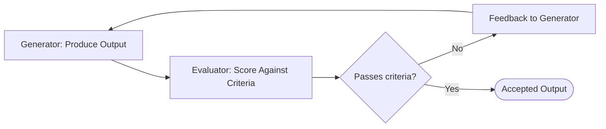

**LangGraph Snippet:**
```python
class EvalOptState(TypedDict):
    source_text: str
    translation: str
    feedback: str
    passed: bool

def generate_translation(state: EvalOptState):
    translation = translator_llm.invoke(
        f"Translate: {state['source_text']}. Feedback to address: {state.get('feedback','')}"
    )
    return {"translation": translation}

def evaluate(state: EvalOptState):
    result = evaluator_llm.invoke(
        f"Evaluate this translation for accuracy and fluency. "
        f"Source: {state['source_text']}\nTranslation: {state['translation']}\n"
        f"Respond PASS or FAIL with specific feedback."
    )
    passed = result.startswith("PASS")
    return {"passed": passed, "feedback": result}

def route(state: EvalOptState):
    return END if state["passed"] else "generate_translation"

graph = StateGraph(EvalOptState)
graph.add_node("generate_translation", generate_translation)
graph.add_node("evaluate", evaluate)
graph.set_entry_point("generate_translation")
graph.add_edge("generate_translation", "evaluate")
graph.add_conditional_edges("evaluate", route, {"generate_translation": "generate_translation", END: END})

app = graph.compile()
```

**Advantages:**
- Clear, explicit success criteria make quality control more objective and consistent than free-form reflection
- Evaluator can use a different model/rubric optimized specifically for judging, not generating
- Well-suited to tasks with checkable correctness (tests passing, factual accuracy, format compliance)

**Disadvantages:**
- Requires well-defined, checkable criteria — vague criteria produce unreliable evaluation
- Multiplies cost/latency (generation + evaluation, potentially several rounds)
- Evaluator itself can be wrong/inconsistent if not carefully prompted or if criteria are subjective

**When to Use:** Tasks with clear, checkable success criteria (translation quality, code correctness via tests, structured-format compliance).
**When Not to Use:** Highly subjective tasks with no clear pass/fail criteria (open-ended creative writing).

---

## 9. Hierarchical Multi-Agent

**Description:** Agents are organized in a tree/hierarchy — a top-level agent delegates to mid-level "team lead" agents, which further delegate to specialized worker agents beneath them, each level handling a narrower scope than the one above.

**Problem It Solves:** A single supervisor coordinating dozens of workers directly becomes overloaded and loses context; hierarchical delegation lets each layer manage only a manageable number of direct reports, similar to organizational management structures.

**Use Case:** A "build a full-stack application" top agent delegates to a "Frontend Team Lead" and "Backend Team Lead," each of whom further delegates to specialized workers (UI component agent, API agent, database schema agent).

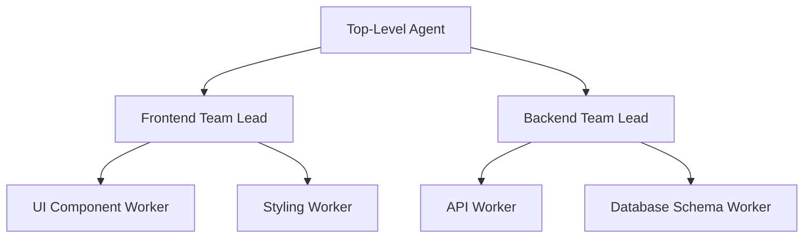

**LangGraph Snippet** (each team lead is itself a compiled sub-graph, composed into the parent graph):
```python
# Backend team's own sub-graph (a supervisor pattern nested one level down)
backend_graph = StateGraph(BackendState)
backend_graph.add_node("api_worker", api_agent_node)
backend_graph.add_node("db_worker", db_agent_node)
backend_graph.add_node("backend_lead", backend_lead_node)
backend_graph.set_entry_point("backend_lead")
# ... conditional edges to api_worker/db_worker, looping back to backend_lead ...
backend_subgraph = backend_graph.compile()

# Top-level graph treats the compiled sub-graph as a single node
top_graph = StateGraph(TopState)
top_graph.add_node("frontend_team", frontend_subgraph)   # nested compiled graph
top_graph.add_node("backend_team", backend_subgraph)     # nested compiled graph
top_graph.add_node("top_lead", top_lead_node)
top_graph.set_entry_point("top_lead")
top_graph.add_conditional_edges("top_lead", route_to_team,
    {"frontend": "frontend_team", "backend": "backend_team", "done": END})
top_graph.add_edge("frontend_team", "top_lead")
top_graph.add_edge("backend_team", "top_lead")

app = top_graph.compile()
```

**Advantages:**
- Scales to much larger, more complex tasks than a flat supervisor-worker structure can manage
- Each level of the hierarchy has a manageable, focused span of control (mirrors human org design)
- Sub-graphs (teams) can be developed, tested, and reused independently

**Disadvantages:**
- Significant architectural complexity — multiple layers of coordination, state passing, and error handling
- Latency compounds across layers (top agent → team lead → worker → back up)
- Debugging/tracing failures across many hierarchy levels is challenging without strong observability tooling

**When to Use:** Very large, complex, multi-domain tasks that genuinely exceed what a flat single-supervisor design can coordinate (large software projects, complex research programs).
**When Not to Use:** Most tasks — this is the heaviest-weight pattern here and should only be reached for when Orchestrator-Workers alone becomes unwieldy.

---

## 10. Human-in-the-Loop

**Description:** The agent pauses at defined checkpoints to request human approval, input, or correction before proceeding — particularly before high-stakes or irreversible actions (sending an email, executing a financial transaction, deleting data).

**Problem It Solves:** Fully autonomous agents can take incorrect or harmful actions with no opportunity for correction; human-in-the-loop checkpoints add a safety/control gate at the moments that matter most.

**Use Case:** An agent drafts a customer refund but pauses for human approval before actually processing the refund through the payment system.

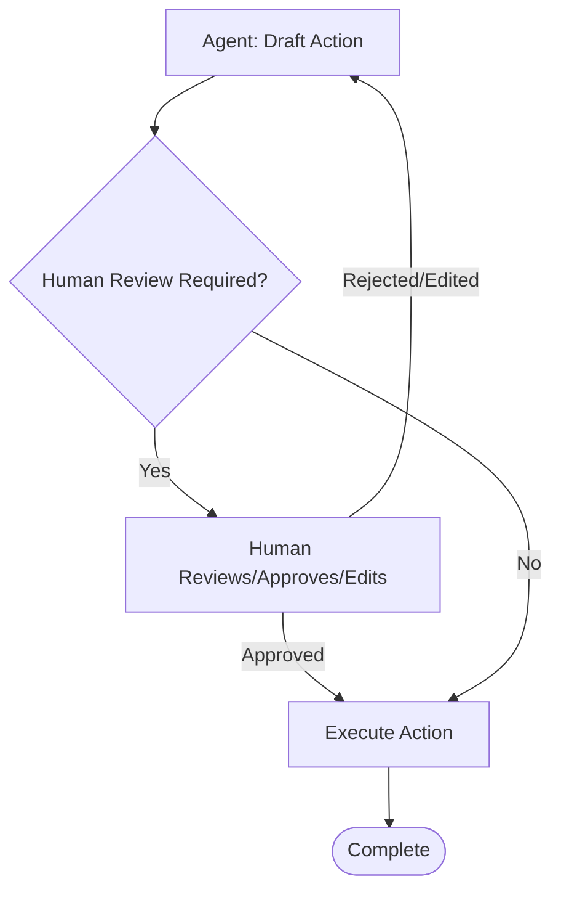

**LangGraph Snippet** (using LangGraph's built-in interrupt for human approval):
```python
from langgraph.checkpoint.memory import MemorySaver

class RefundState(TypedDict):
    request: str
    draft_refund: dict
    approved: bool

def draft_refund(state: RefundState):
    draft = refund_agent.invoke(state["request"])
    return {"draft_refund": draft}

def execute_refund(state: RefundState):
    payment_api.process_refund(state["draft_refund"])
    return {}

graph = StateGraph(RefundState)
graph.add_node("draft_refund", draft_refund)
graph.add_node("execute_refund", execute_refund)
graph.set_entry_point("draft_refund")
graph.add_edge("draft_refund", "execute_refund")

# interrupt_before pauses execution here until a human resumes the run with approval
app = graph.compile(checkpointer=MemorySaver(), interrupt_before=["execute_refund"])
```

**Advantages:**
- Adds a critical safety net for high-stakes, irreversible, or ambiguous actions
- Builds trust with users/operators by keeping a human in control of consequential decisions
- Human feedback at checkpoints can also be captured as training/improvement signal

**Disadvantages:**
- Breaks full automation — introduces latency and requires human availability
- Poorly chosen checkpoints either annoy users (too many interruptions) or miss real risks (too few)
- Adds engineering complexity for pause/resume state management

**When to Use:** Irreversible, high-stakes, regulated, or high-cost actions (financial transactions, sending communications, deleting data, legal/medical decisions).
**When Not to Use:** Low-stakes, easily reversible, high-volume actions where human review would be pure friction.

---

## 11. Multi-Agent Debate / Collaboration

**Description:** Multiple agents (often with different roles, personas, or models) discuss/critique a problem from different angles across several rounds, with a final synthesis step combining or selecting the best conclusion.

**Problem It Solves:** A single agent's reasoning can be biased, incomplete, or miss counterarguments; structured debate between multiple perspectives surfaces flaws and strengthens the final answer, similar to peer review.

**Use Case:** Two agents argue opposing sides of a business decision (e.g., "build vs. buy"), and a third "judge" agent synthesizes the strongest points from both into a final recommendation.

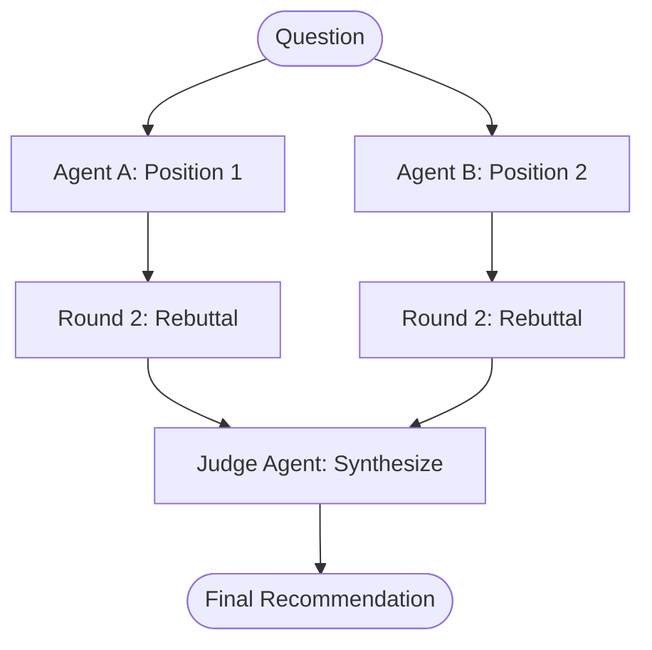

**LangGraph Snippet:**
```python
class DebateState(TypedDict):
    question: str
    position_a: str
    position_b: str
    round: int

def agent_a(state: DebateState):
    argument = debater_a_llm.invoke(
        f"Question: {state['question']}\nOpponent's last point: {state.get('position_b','')}\n"
        f"Argue for building in-house."
    )
    return {"position_a": argument}

def agent_b(state: DebateState):
    argument = debater_b_llm.invoke(
        f"Question: {state['question']}\nOpponent's last point: {state.get('position_a','')}\n"
        f"Argue for buying a vendor solution."
    )
    return {"position_b": argument, "round": state["round"] + 1}

def should_continue(state: DebateState):
    return "judge" if state["round"] >= 2 else "agent_a"

def judge(state: DebateState):
    verdict = judge_llm.invoke(
        f"Synthesize the strongest points:\nA: {state['position_a']}\nB: {state['position_b']}"
    )
    return {"final": verdict}

graph = StateGraph(DebateState)
graph.add_node("agent_a", agent_a)
graph.add_node("agent_b", agent_b)
graph.add_node("judge", judge)
graph.set_entry_point("agent_a")
graph.add_edge("agent_a", "agent_b")
graph.add_conditional_edges("agent_b", should_continue, {"agent_a": "agent_a", "judge": "judge"})
graph.add_edge("judge", END)

app = graph.compile()
```

**Advantages:**
- Surfaces counterarguments and blind spots a single agent would miss
- Improves robustness of the final decision through structured adversarial/collaborative reasoning
- Can incorporate genuinely different models or personas for true diversity of perspective

**Disadvantages:**
- Expensive — multiple agents across multiple rounds means many LLM calls
- Debate can devolve into repetition without a clear termination/convergence condition
- Judge/synthesis step is itself a single point of failure for the overall quality of the conclusion

**When to Use:** High-stakes decisions genuinely benefiting from multiple perspectives (strategic business decisions, contested factual claims, complex trade-off analysis).
**When Not to Use:** Simple factual queries or tasks with one clearly correct answer — debate adds cost without benefit.

---

## 12. Memory-Augmented Agent

**Description:** The agent maintains persistent memory beyond a single conversation/session — storing facts, preferences, or past interactions in an external store (vector DB, key-value store) and retrieving relevant memories to inform future responses.

**Problem It Solves:** LLMs have no memory beyond their context window; without external memory, an agent forgets everything about a user or task the moment the conversation ends (or the context window fills up).

**Use Case:** A personal assistant agent remembers a user's dietary restrictions mentioned weeks ago and factors them into a new restaurant recommendation today.

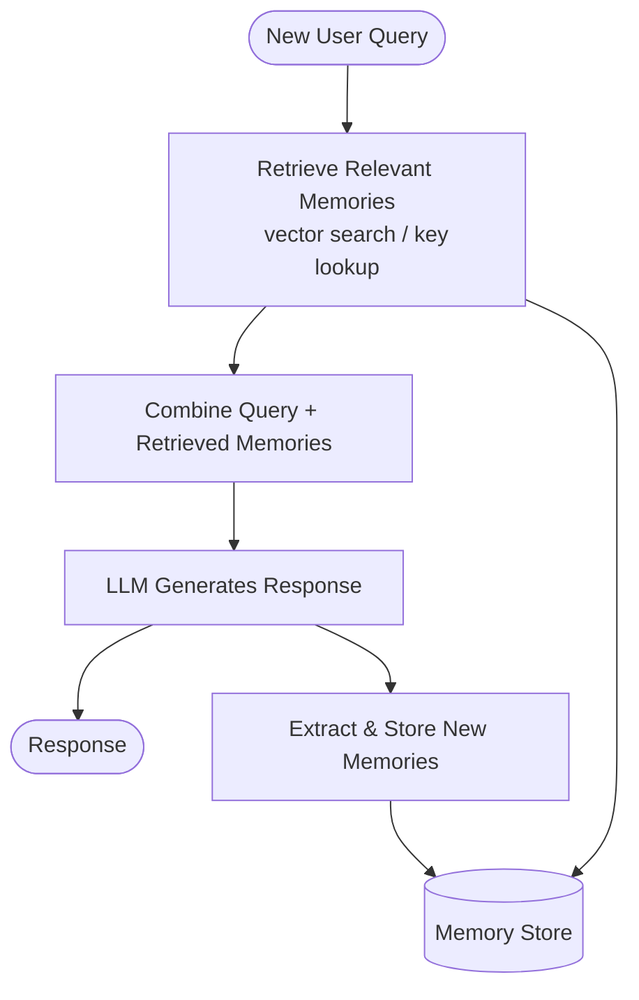

**LangGraph Snippet:**
```python
class MemoryAgentState(TypedDict):
    query: str
    retrieved_memories: list[str]
    response: str

def retrieve_memories(state: MemoryAgentState):
    memories = vector_store.similarity_search(state["query"], k=5, filter={"user_id": user_id})
    return {"retrieved_memories": [m.page_content for m in memories]}

def generate_response(state: MemoryAgentState):
    context = "\n".join(state["retrieved_memories"])
    response = llm.invoke(f"User memories:\n{context}\n\nQuery: {state['query']}")
    return {"response": response}

def store_new_memories(state: MemoryAgentState):
    facts = memory_extractor_llm.invoke(f"Extract durable facts from: {state['query']} / {state['response']}")
    for fact in facts:
        vector_store.add_texts([fact], metadatas=[{"user_id": user_id}])
    return {}

graph = StateGraph(MemoryAgentState)
graph.add_node("retrieve", retrieve_memories)
graph.add_node("generate", generate_response)
graph.add_node("store", store_new_memories)
graph.set_entry_point("retrieve")
graph.add_edge("retrieve", "generate")
graph.add_edge("generate", "store")
graph.add_edge("store", END)

app = graph.compile()
```

**Advantages:**
- Enables long-term personalization and continuity across sessions
- Reduces need to repeat context in every conversation
- Vector-based retrieval scales to large memory stores efficiently

**Disadvantages:**
- Retrieval can surface irrelevant or outdated memories, degrading response quality
- Storage/privacy concerns — persistent memory of personal data requires careful governance
- Memory extraction/summarization step can introduce errors or drift from what was actually said

**When to Use:** Long-running assistants, personalization-heavy applications, or agents needing continuity across many sessions.
**When Not to Use:** Stateless, single-turn tasks with no need for continuity (a one-off Q&A tool).

---

## 13. Comparison Table

| Pattern | Core Idea | # LLM Calls | Best For | Key Risk |
|---|---|---|---|---|
| **ReAct** | Interleave reasoning + tool actions | Variable (loop) | Dynamic info-gathering tasks | Infinite/excessive looping |
| **Tool Use** | Structured function calling | 1 per tool call | Any agent needing real-world data/actions | Hallucinated arguments |
| **Reflection** | Self-critique and revise | 2+ per revision cycle | Quality-sensitive generation (code, writing) | No convergence without a stop condition |
| **Planning** | Upfront multi-step plan, then execute | 1 (plan) + N (steps) | Complex, multi-part goals | Plan becomes stale, needs re-planning |
| **Routing** | Classify then dispatch to specialist | 1 (route) + 1 (handler) | Distinct request categories | Misclassification |
| **Parallelization** | Fan-out independent subtasks, fan-in results | N (parallel) + 1 (aggregate) | Independent, order-agnostic subtasks | Aggregation of conflicting results |
| **Orchestrator-Workers** | Dynamic supervisor delegates to specialists | Variable (loop) | Open-ended tasks, unknown step order | Supervisor bottleneck/failure |
| **Evaluator-Optimizer** | Generate, then evaluate against criteria, loop | 2+ per cycle | Checkable correctness (tests, translation) | Vague/unreliable evaluation criteria |
| **Hierarchical Multi-Agent** | Tree of supervisors and workers | High (compounds per layer) | Very large, multi-domain tasks | Complexity, latency, debugging difficulty |
| **Human-in-the-Loop** | Pause for human approval at checkpoints | Same + human latency | High-stakes/irreversible actions | Over/under-triggering checkpoints |
| **Multi-Agent Debate** | Multiple perspectives argue, then synthesize | High (rounds × agents) | High-stakes, contested decisions | Cost; unproductive repetition |
| **Memory-Augmented** | Persistent retrieval-augmented context | 1 retrieval + 1 generation (+ extraction) | Long-term personalization/continuity | Irrelevant/stale memory retrieval |

---

## 14. Decision Guide

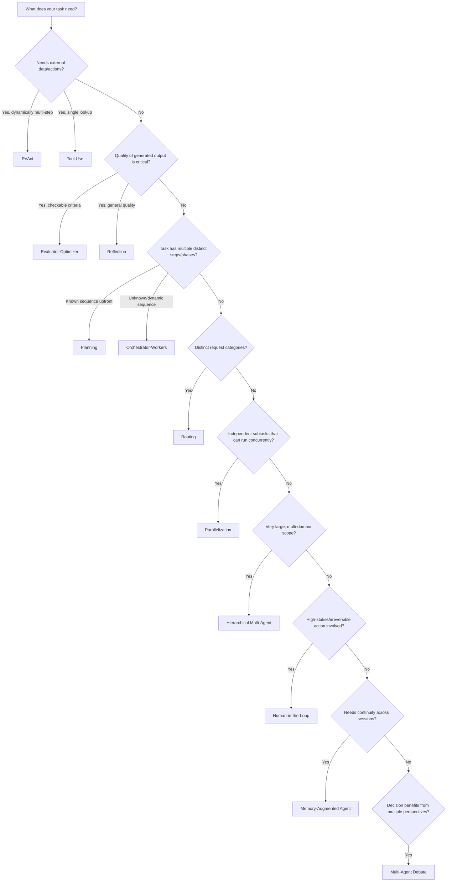

**Quick rules of thumb:**
- **Almost every agent needs:** Tool Use as the foundation.
- **Default "smart agent" starting point:** ReAct for dynamic tasks, Planning for well-scoped complex goals.
- **Add Reflection or Evaluator-Optimizer** when output quality matters more than speed/cost.
- **Add Human-in-the-Loop** wherever an action is irreversible or high-stakes — regardless of which other patterns you're using.
- **Reach for Orchestrator-Workers or Hierarchical Multi-Agent** only once a single agent/pipeline genuinely can't handle the task's complexity — these add real cost and debugging overhead.
- **Combine patterns freely:** e.g., an Orchestrator-Workers system where each worker internally uses ReAct, and high-stakes worker outputs pass through a Human-in-the-Loop gate before execution.

---

*Code snippets use LangGraph's Python API (`StateGraph`, conditional edges, compiled sub-graphs). For production systems, pair these patterns with LangSmith (or equivalent) for tracing/observability, and add explicit max-iteration guards to any looping pattern (ReAct, Reflection, Evaluator-Optimizer, Orchestrator-Workers) to prevent runaway cost.*
