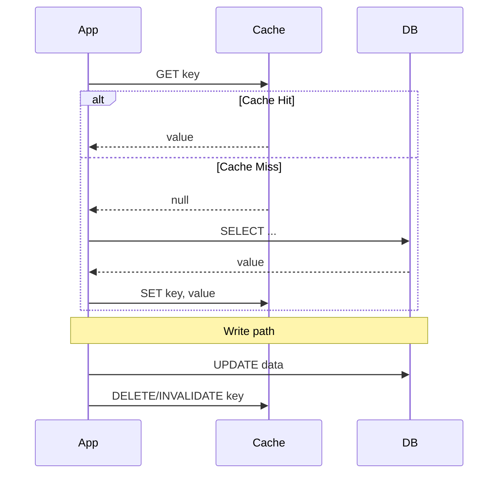
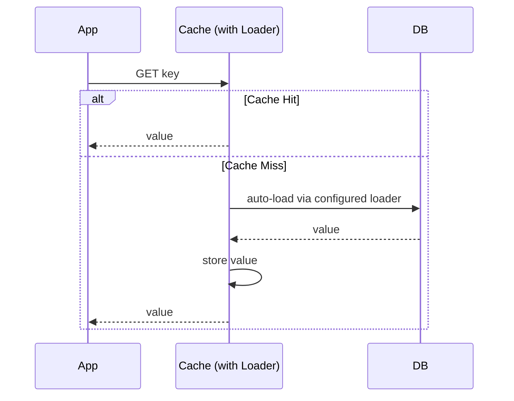
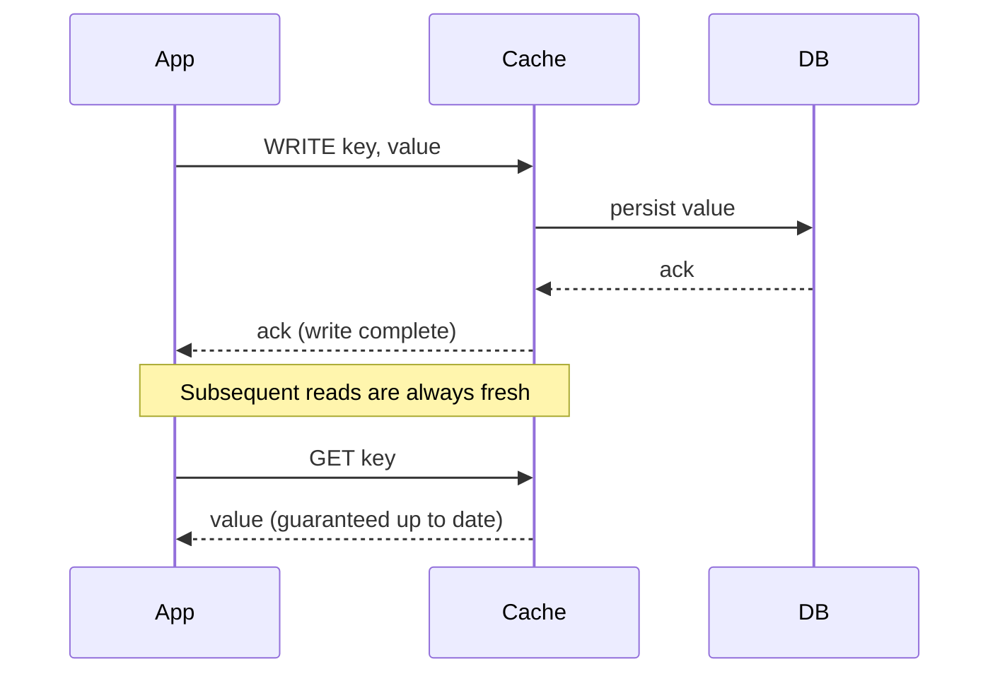
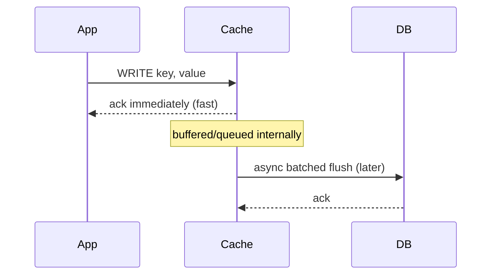
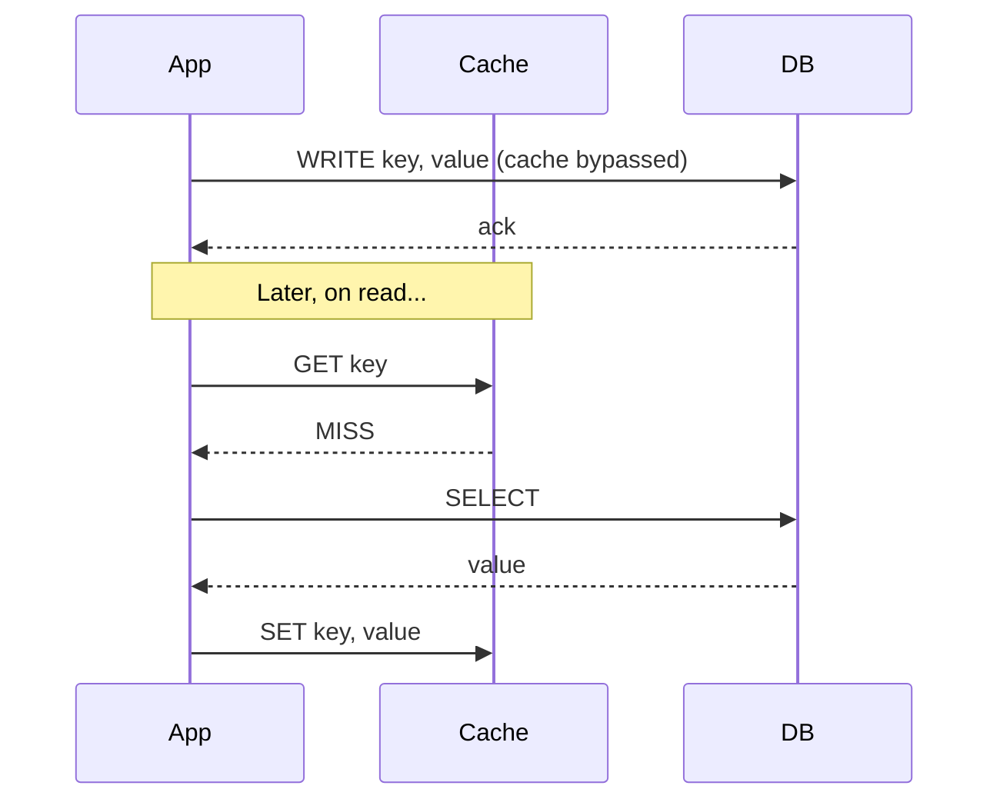
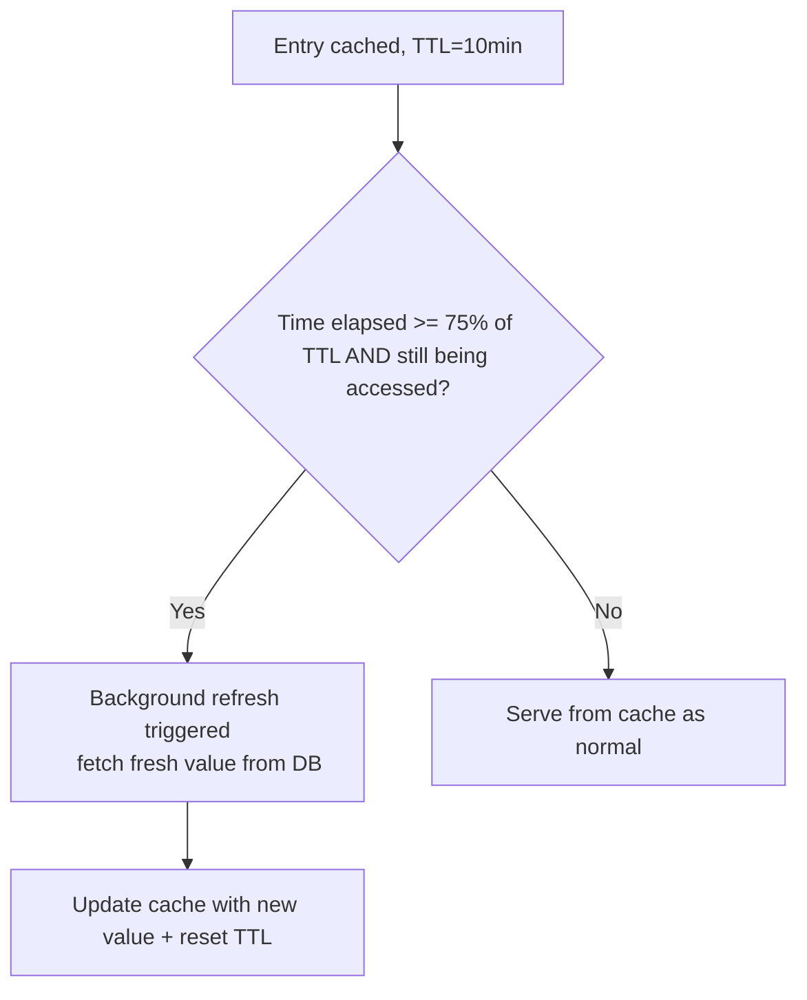
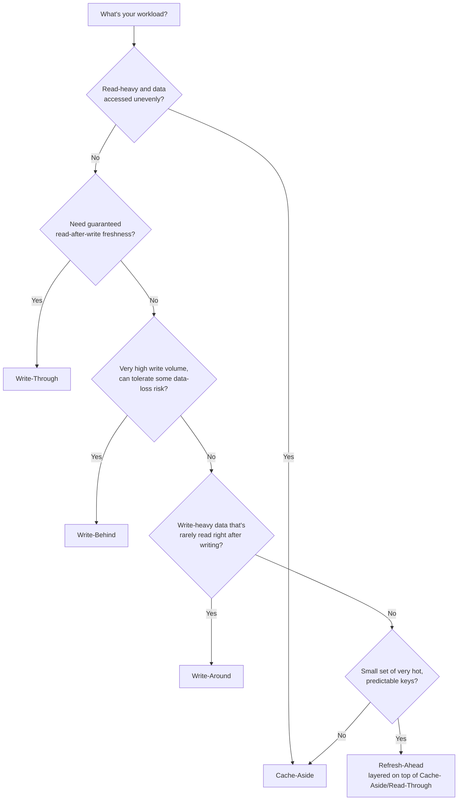

# Caching Strategies — Complete Reference Guide

*A detailed breakdown of the core caching strategies used in software architecture, with diagrams, Java snippets, advantages/disadvantages, and guidance on which strategy fits which scenario.*

---

## Table of Contents
1. Cache-Aside (Lazy Loading)
2. Read-Through
3. Write-Through
4. Write-Behind (Write-Back)
5. Write-Around
6. Refresh-Ahead
7. Comparison Table
8. Supporting Concerns: Eviction, TTL, and Invalidation
9. Decision Guide — Which Strategy Fits Best

---

## 1. Cache-Aside (Lazy Loading)

**Description:** The application code is fully responsible for managing the cache. On a read, it checks the cache first; on a miss, it reads from the database, then populates the cache. On a write, it updates the database and invalidates (or updates) the corresponding cache entry.

**Problem It Solves:** You want caching benefits without forcing every piece of data through the cache — only data that's actually requested gets cached, keeping the cache lean and relevant.



**Java Snippet:**
```java
class CacheAsideRepository {
    private final Cache<String, Product> cache;   // e.g. Redis / Caffeine
    private final ProductDatabase db;

    public Product getProduct(String id) {
        Product cached = cache.getIfPresent(id);
        if (cached != null) return cached;              // hit

        Product fromDb = db.findById(id);                // miss -> read DB
        if (fromDb != null) cache.put(id, fromDb);        // populate cache
        return fromDb;
    }

    public void updateProduct(Product product) {
        db.save(product);                                  // update source of truth
        cache.invalidate(product.getId());                // avoid stale data
    }
}
```

**Advantages:**
- Only caches data that's actually accessed (efficient memory use, no wasted cache space)
- Resilient to cache failure — the app can always fall back to the DB
- Cache and DB technology can be added/changed independently without touching the DB layer
- Simple mental model; most widely used strategy (Redis/Memcached + app code)

**Disadvantages:**
- Every cache miss incurs a full round-trip penalty (cache miss → DB read → cache write) — 3 network hops on first access
- Data can go stale between DB write and cache invalidation window (race condition possible under concurrent writes)
- Application code owns cache logic — must be implemented consistently across all data-access paths, or you get bugs where one code path forgets to invalidate

**Best Fit / When to Use:**
- Read-heavy workloads where not all data is equally popular (e.g., product catalogs, user profiles)
- When you want the cache to be optional/non-critical — if it's down, the app still works, just slower
**When Not Ideal:** Very write-heavy data, or when you need guaranteed strong consistency on every read.

---

## 2. Read-Through

**Description:** Similar goal to Cache-Aside, but the *cache itself* (not the application) is responsible for loading data from the database on a miss. The application only ever talks to the cache; the cache provider is configured with a "loader" function that fetches from the DB automatically.

**Problem It Solves:** Cache-Aside requires every part of the application to correctly implement the "check cache, then DB, then populate" logic. Read-Through centralizes that logic inside the caching layer itself, so application code stays simple and can't forget to populate the cache.



**Java Snippet** (using Caffeine's built-in loading cache — a textbook Read-Through implementation):
```java
LoadingCache<String, Product> cache = Caffeine.newBuilder()
    .maximumSize(10_000)
    .expireAfterWrite(Duration.ofMinutes(10))
    .build(id -> productDatabase.findById(id));   // loader: cache handles DB access itself

// Application code never talks to the DB directly for reads:
Product product = cache.get("SKU-123");           // hides hit/miss logic entirely
```

**Advantages:**
- Simplifies application code — callers just call `get()`, cache internals handle miss logic
- Consistent loading behavior everywhere — impossible to "forget" to populate the cache
- Centralizes cache-loading concerns (retries, stampede protection) in one place

**Disadvantages:**
- Requires a caching library/provider that supports this model (not all do natively)
- Tighter coupling between the cache layer and the data source (the cache needs direct DB access/credentials)
- First-request latency penalty still exists on a miss, same as Cache-Aside

**Best Fit / When to Use:**
- When using a caching library that natively supports loaders (Caffeine, Guava Cache, some Redis client wrappers)
- Teams that want to eliminate the risk of inconsistent Cache-Aside implementation across many code paths
**When Not Ideal:** Distributed, multi-instance caches where the loader would need to be duplicated per instance (usually paired with a local in-process cache rather than a shared remote cache).

---

## 3. Write-Through

**Description:** Every write goes to the cache first, and the cache synchronously writes it to the underlying database before the write is considered complete. Cache and database are always kept in sync on every write.

**Problem It Solves:** Cache-Aside and Read-Through only handle read-side staleness carefully; write-through guarantees the cache is *never* stale relative to the database, because every write updates both atomically (from the caller's point of view).



**Java Snippet:**
```java
class WriteThroughCache {
    private final Cache<String, Product> cache;
    private final ProductDatabase db;

    public void writeProduct(Product product) {
        db.save(product);                          // write to DB synchronously
        cache.put(product.getId(), product);        // then update cache — both stay in sync
    }

    public Product getProduct(String id) {
        return cache.get(id, k -> db.findById(k));  // reads always consistent with DB
    }
}
```

**Advantages:**
- Cache is always consistent with the database — no stale-read window
- Reads are fast because data was already cached at write time (no cold-cache penalty for recently written data)
- Simplifies reasoning about data consistency compared to Cache-Aside's invalidate-and-hope approach

**Disadvantages:**
- Writes are slower — every write pays the cost of writing to both cache and DB before returning
- Data that's written but never read still consumes cache space (unlike Cache-Aside, which only caches on read)
- If write volume is high relative to cache size, you can churn/evict useful data quickly

**Best Fit / When to Use:**
- Read-after-write consistency matters (e.g., a user updates their profile and immediately expects to see the change)
- Moderate write volume where write latency overhead is acceptable
**When Not Ideal:** Write-heavy workloads where write latency is critical (see Write-Behind instead), or data that's rarely read after being written.

---

## 4. Write-Behind (Write-Back)

**Description:** Writes go to the cache immediately and are considered complete right away; the cache asynchronously persists the data to the database later (batched, delayed, or on a schedule).

**Problem It Solves:** Write-Through's synchronous double-write makes every write pay full database latency. Write-Behind decouples the write acknowledgment from the actual database persistence, dramatically improving write throughput and latency.



**Java Snippet** (simplified illustration using a buffered async flush):
```java
class WriteBehindCache {
    private final ConcurrentHashMap<String, Product> cache = new ConcurrentHashMap<>();
    private final BlockingQueue<Product> writeQueue = new LinkedBlockingQueue<>();
    private final ProductDatabase db;

    public void writeProduct(Product product) {
        cache.put(product.getId(), product);   // immediate — caller doesn't wait for DB
        writeQueue.add(product);               // queued for async persistence
    }

    // Background worker flushes to DB, e.g. every 500ms or in batches of 100
    @Scheduled(fixedDelay = 500)
    void flushToDatabase() {
        List<Product> batch = new ArrayList<>();
        writeQueue.drainTo(batch, 100);
        if (!batch.isEmpty()) db.batchSave(batch);   // fewer, larger DB writes
    }
}
```

**Advantages:**
- Dramatically improves write latency/throughput — caller never waits on the database
- Batching writes reduces database load (fewer, larger writes instead of many small ones)
- Great for high write-volume workloads (metrics, counters, activity logs)

**Disadvantages:**
- **Risk of data loss** — if the cache crashes before the buffered write is flushed, that data is gone (unless the cache itself is durable/replicated)
- Database is temporarily inconsistent with the cache (eventual consistency, not immediate)
- More complex to implement correctly — needs retry logic, durability guarantees, and ordering handling for the async flush

**Best Fit / When to Use:**
- Very high write-throughput scenarios where some risk of data loss is acceptable (analytics counters, activity/telemetry logs, session data)
- Systems that can tolerate eventual consistency between cache and database
**When Not Ideal:** Financial transactions, or any data where losing a write is unacceptable — the durability risk is too high without additional safeguards (e.g., write-ahead logs).

---

## 5. Write-Around

**Description:** Writes go directly to the database, bypassing the cache entirely. The cache is only populated later, on a subsequent read (functioning like Cache-Aside for reads).

**Problem It Solves:** Write-Through and Write-Behind cache every write, even data that may never be read again. Write-Around avoids polluting the cache with write-heavy, rarely-read data.



**Java Snippet:**
```java
class WriteAroundCache {
    private final Cache<String, LogEntry> cache;
    private final LogDatabase db;

    public void writeLog(LogEntry entry) {
        db.save(entry);   // straight to DB — cache is never touched on write
    }

    public LogEntry getLog(String id) {
        LogEntry cached = cache.getIfPresent(id);
        if (cached != null) return cached;

        LogEntry fromDb = db.findById(id);
        if (fromDb != null) cache.put(id, fromDb);   // cache only populated on actual read demand
        return fromDb;
    }
}
```

**Advantages:**
- Prevents cache pollution from write-heavy data that's rarely read (e.g., audit logs, write-once records)
- Keeps cache space reserved for genuinely "hot" read data
- Simple to reason about — cache is purely a read-side optimization

**Disadvantages:**
- Recently-written data is *not* cached, so the first read after a write always incurs a cache miss (higher latency for read-after-write scenarios)
- Not suitable when the application frequently reads data immediately after writing it
- Combined incorrectly with Cache-Aside, teams sometimes forget the invalidation step is unnecessary here (since cache was never populated on write) — but stale data can still occur if an old cached value exists from a *previous* read before this write

**Best Fit / When to Use:**
- Write-heavy data that's rarely re-read shortly after being written (logging, audit trails, IoT sensor ingestion)
- Systems where cache space is precious and shouldn't be spent on write-only data
**When Not Ideal:** Read-after-write patterns (e.g., "save profile, then immediately view profile") — users will experience a cache miss right after writing.

---

## 6. Refresh-Ahead

**Description:** The cache proactively refreshes "hot" entries *before* they expire, based on predicted access patterns or a threshold (e.g., refresh when 75% of TTL has elapsed and the key is still being accessed).

**Problem It Solves:** With a plain TTL-based cache, once an entry expires, the next request suffers a full cache-miss penalty even if that data is extremely popular. Refresh-Ahead eliminates this "cache stampede on expiry" for hot keys by refreshing proactively in the background.



**Java Snippet** (Caffeine's `refreshAfterWrite`, a built-in Refresh-Ahead mechanism):
```java
LoadingCache<String, Product> cache = Caffeine.newBuilder()
    .maximumSize(10_000)
    .refreshAfterWrite(Duration.ofMinutes(7))     // proactively refresh before hard expiry
    .expireAfterWrite(Duration.ofMinutes(10))      // hard expiry as a safety net
    .build(id -> productDatabase.findById(id));

// Reads never block on a refresh: Caffeine serves the (slightly) stale value
// while asynchronously reloading it in the background.
Product product = cache.get("SKU-123");
```

**Advantages:**
- Eliminates the "thundering herd" cache-miss spike for popular keys at expiry time
- Keeps hot data continuously fresh with minimal latency impact on readers
- Great for predictable, popular, frequently-accessed keys (top products, trending content)

**Disadvantages:**
- Refreshing data nobody is requesting anymore wastes resources — needs good "is this key still hot" heuristics
- More complex to implement/tune correctly (refresh threshold, concurrency of refresh vs. serve)
- Doesn't help with unpredictable/long-tail keys — only pays off for genuinely hot data

**Best Fit / When to Use:**
- High-traffic, predictable hot keys where a cache-miss stampede would be costly (trending items, homepage content, leaderboard data)
- Systems already using a caching library with built-in refresh-ahead support (Caffeine, Guava)
**When Not Ideal:** Low-traffic or unpredictable access patterns — the proactive refresh overhead isn't justified.

---

## 7. Comparison Table

| Strategy | Write Path | Read Path | Consistency | Write Latency | Data-Loss Risk | Best For |
|---|---|---|---|---|---|---|
| **Cache-Aside** | App writes DB, invalidates cache | App checks cache, falls back to DB on miss | Eventual (brief staleness window) | Low (DB only) | None (cache is disposable) | General read-heavy workloads, most common default |
| **Read-Through** | (paired with Write-Through/Around) | Cache auto-loads from DB on miss | Same as paired write strategy | N/A (read-focused) | None | Simplifying app code; caching libraries with loaders |
| **Write-Through** | App writes cache, cache writes DB synchronously | Always from cache, always fresh | Strong | Higher (double write, synchronous) | None | Read-after-write consistency requirements |
| **Write-Behind** | App writes cache, DB updated async/batched | From cache | Eventual (lag until flush) | Very low | **Yes** — risk if cache crashes before flush | High write-throughput, tolerant of eventual consistency |
| **Write-Around** | App writes DB directly, cache untouched | Cache miss on recent writes, populated on next read | Eventual | Low (DB only) | None | Write-heavy, rarely-reread data (logs, audit trails) |
| **Refresh-Ahead** | N/A (read-side optimization) | Proactively refreshed before expiry for hot keys | Near-real-time for hot keys | N/A | None | High-traffic predictable hot keys, avoiding stampedes |

---

## 8. Supporting Concerns: Eviction, TTL, and Invalidation

These aren't strategies on their own, but every caching strategy above needs a policy for *removing* data from the cache when it's full or outdated.

### Eviction Policies (what to remove when the cache is full)
- **LRU (Least Recently Used):** Evicts the entry that hasn't been accessed for the longest time. Most common default — good general-purpose choice.
- **LFU (Least Frequently Used):** Evicts the entry accessed least often overall. Better for workloads with a stable set of "always hot" items.
- **FIFO (First In, First Out):** Evicts the oldest entry regardless of access pattern. Simple but often suboptimal.
- **TTL-based (Time To Live):** Entries expire automatically after a fixed duration, regardless of access frequency. Often combined with LRU/LFU as a safety net.

### Invalidation Strategies
- **Explicit invalidation:** Application code actively deletes/updates a cache key when the underlying data changes (used with Cache-Aside).
- **TTL expiry:** Simplest — just let data expire after N seconds/minutes; accepts some staleness in exchange for simplicity.
- **Event-driven invalidation:** A change event (e.g., a database change-feed, or a Pub/Sub message) triggers cache invalidation across all cache instances — important for multi-instance/distributed caches where a local invalidate() call won't reach other nodes.

> As the well-known saying goes, "There are only two hard things in Computer Science: cache invalidation and naming things." Budget real design time for this — it's usually the hardest part of any caching strategy, not the caching mechanism itself.

---

## 9. Decision Guide — Which Strategy Fits Best



**Quick rules of thumb:**
- **Default starting point for most apps:** Cache-Aside — simplest, safest, works with any cache/DB combo.
- **Need reads to always reflect the very latest write:** Write-Through.
- **Write throughput is your bottleneck, and losing a rare write is tolerable:** Write-Behind.
- **You're caching logs/audit data that's rarely re-read soon after writing:** Write-Around.
- **A handful of keys get disproportionate traffic (trending/leaderboard/homepage data):** Layer Refresh-Ahead on top of whichever base strategy you're using.
- **You want to stop worrying about cache-loading logic scattered across the codebase:** Read-Through (if your caching library supports it).

**Combining strategies in practice:** Real systems often mix these — e.g., Cache-Aside for general catalog data, Write-Behind for high-volume click/view counters, and Refresh-Ahead for the homepage's "trending now" widget, all within the same application.

---

*These strategies apply across caching technologies — Redis, Memcached, Caffeine/Guava (in-process), CDN edge caches, and database query caches — though the exact mechanics of "the cache" differ (remote vs. in-process, single-node vs. distributed).*
