# Cloud Design Patterns — Full Reference with Diagrams & Java Snippets

*42 Azure Architecture Center cloud design patterns. Each entry includes: Short Description, Problem Solved, Use Case, a Diagram (Mermaid), a Java code snippet illustrating the core idea, Advantages, Disadvantages, and When to Use / When Not to Use.*

> **Diagram note:** Diagrams are written in Mermaid syntax — they render visually in Markdown viewers that support Mermaid (GitHub, VS Code, Obsidian, Claude, etc.).
> **Code note:** Java snippets are minimal, illustrative implementations meant to show the *shape* of the pattern, not production-ready libraries. In real systems, prefer proven libraries (Resilience4j, Spring Cloud, Axon Framework, etc.) over hand-rolled versions of these patterns.

---

## Table of Contents
1. Ambassador
2. Anti-Corruption Layer
3. Asynchronous Request-Reply
4. Backends for Frontends
5. Bulkhead
6. Cache-Aside
7. Choreography
8. Circuit Breaker
9. Claim Check
10. Compensating Transaction
11. Competing Consumers
12. Compute Resource Consolidation
13. CQRS
14. Deployment Stamps
15. Event Sourcing
16. External Configuration Store
17. Federated Identity
18. Gatekeeper
19. Gateway Aggregation
20. Gateway Offloading
21. Gateway Routing
22. Geode
23. Health Endpoint Monitoring
24. Index Table
25. Leader Election
26. Materialized View
27. Messaging Bridge
28. Pipes and Filters
29. Priority Queue
30. Publisher-Subscriber
31. Quarantine
32. Queue-Based Load Leveling
33. Rate Limiting
34. Retry
35. Saga
36. Scheduler Agent Supervisor
37. Sequential Convoy
38. Sharding
39. Sidecar
40. Static Content Hosting
41. Strangler Fig
42. Throttling
43. Valet Key

---

## 1. Ambassador

**Short Description:** A helper "sidecar" service that sends network requests on behalf of a consumer service, handling retries, TLS, logging, and monitoring transparently.

**Problem Solved:** Cross-cutting network logic (retry, circuit breaking, TLS, monitoring) shouldn't be duplicated in every service or language.

**Use Case:** A legacy app gets retry/circuit-breaker behavior added without code changes, via a co-located ambassador container.

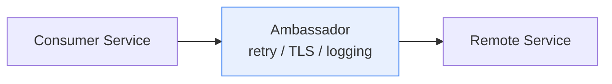

**Java Snippet** (Ambassador wrapping an outbound call with retry + logging):
```java
public class ServiceAmbassador {
    private final int maxRetries = 3;

    public String callRemoteService(String request) throws Exception {
        int attempt = 0;
        while (true) {
            try {
                attempt++;
                System.out.println("Ambassador: forwarding request, attempt " + attempt);
                return RemoteServiceClient.send(request); // actual network call
            } catch (Exception ex) {
                if (attempt >= maxRetries) throw ex;
                Thread.sleep((long) Math.pow(2, attempt) * 100); // backoff
            }
        }
    }
}

class RemoteServiceClient {
    static String send(String request) throws Exception {
        // simulate a network call to the real remote service
        return "response-for:" + request;
    }
}
```

**Advantages:** Decouples network concerns from business logic; language-agnostic; centralizes policy; reusable across services.
**Disadvantages:** Extra latency hop; added operational complexity; overkill for simple apps.
**When to Use:** Polyglot microservices, legacy modernization, service-mesh-lite needs.
**When Not to Use:** Simple single-language apps where a shared library suffices.

---

## 2. Anti-Corruption Layer

**Short Description:** A façade/adapter between a modern application and a legacy or external system, translating models so legacy quirks don't leak into the new domain model.

**Problem Solved:** Directly integrating with a legacy system's messy model pollutes the new system's clean domain design.

**Use Case:** A microservice talks to a decades-old mainframe inventory system through a translation layer.

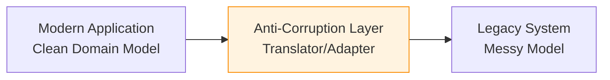

**Java Snippet:**
```java
// Legacy system's messy contract
class LegacyInventoryResponse {
    String ITM_CD; String QTY_STR; // e.g. "00042" as a string
}

// Clean modern domain model
record InventoryItem(String sku, int quantity) {}

class InventoryAntiCorruptionLayer {
    InventoryItem translate(LegacyInventoryResponse legacy) {
        String sku = legacy.ITM_CD.trim();
        int qty = Integer.parseInt(legacy.QTY_STR.trim());
        return new InventoryItem(sku, qty);
    }
}
```

**Advantages:** Keeps new domain model clean; isolates legacy tech debt; enables incremental modernization.
**Disadvantages:** Adds a translation layer to build/maintain; can become a bottleneck; risk of ACL itself growing complex.
**When to Use:** Integrating with legacy/incompatible external systems.
**When Not to Use:** Systems already have clean, compatible APIs.

---

## 3. Asynchronous Request-Reply

**Short Description:** Decouple long-running back-end processing from the front end by immediately acknowledging the request and letting the client poll or get notified later.

**Problem Solved:** Long operations exceed normal HTTP timeouts, but the client still needs a prompt initial response.

**Use Case:** Report generation: client gets `202 Accepted` + a status URL; polls until the report is ready.

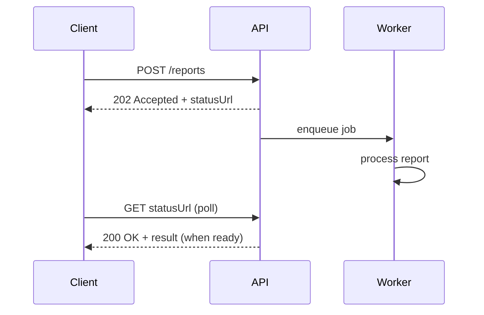

**Java Snippet:**
```java
@RestController
class ReportController {
    private final Map<String, String> jobStatus = new ConcurrentHashMap<>();

    @PostMapping("/reports")
    public ResponseEntity<?> createReport() {
        String jobId = UUID.randomUUID().toString();
        jobStatus.put(jobId, "Running");
        CompletableFuture.runAsync(() -> {
            // simulate long-running work
            try { Thread.sleep(5000); } catch (InterruptedException ignored) {}
            jobStatus.put(jobId, "Completed");
        });
        return ResponseEntity.accepted()
            .header("Location", "/reports/" + jobId)
            .body(Map.of("jobId", jobId));
    }

    @GetMapping("/reports/{jobId}")
    public ResponseEntity<?> getStatus(@PathVariable String jobId) {
        return ResponseEntity.ok(Map.of("status", jobStatus.getOrDefault(jobId, "NotFound")));
    }
}
```

**Advantages:** Avoids client timeouts; improves perceived responsiveness; decouples processing time from request lifecycle.
**Disadvantages:** More complex client logic (polling/webhooks); needs status tracking storage.
**When to Use:** Long-running operations invoked from front ends expecting a quick ack.
**When Not to Use:** Fast operations within normal timeouts.

---

## 4. Backends for Frontends (BFF)

**Short Description:** Separate backend services tailored to specific frontend clients (web, mobile, third-party) instead of one shared general-purpose API.

**Problem Solved:** A single shared backend accumulates client-specific logic and becomes bloated/conflicted across very different client needs.

**Use Case:** Mobile BFF returns lightweight aggregated payloads; Web BFF returns richer data.

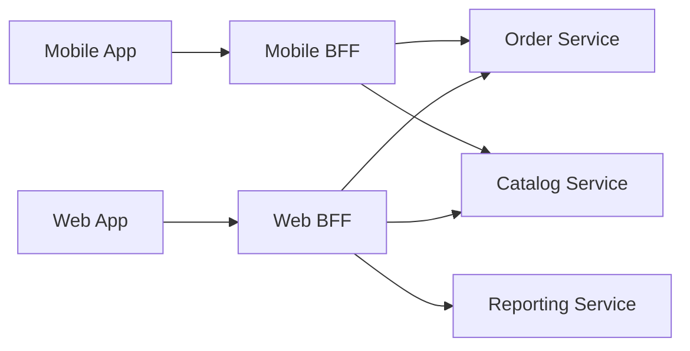

**Java Snippet:**
```java
@RestController
@RequestMapping("/mobile-bff")
class MobileBff {
    @GetMapping("/product/{id}")
    public MobileProductView getProduct(@PathVariable String id) {
        var basic = catalogClient.getBasicInfo(id); // minimal fields only
        return new MobileProductView(basic.name(), basic.price());
    }
}

@RestController
@RequestMapping("/web-bff")
class WebBff {
    @GetMapping("/product/{id}")
    public WebProductView getProduct(@PathVariable String id) {
        var basic = catalogClient.getBasicInfo(id);
        var reviews = reviewClient.getReviews(id);
        var stock = inventoryClient.getStock(id);
        return new WebProductView(basic, reviews, stock); // richer aggregate
    }
}
```

**Advantages:** Each client gets an API shaped for its needs; independent team/deploy cadence; reduces "god API" complexity.
**Disadvantages:** Code duplication risk; more services to operate; business logic can leak into BFFs.
**When to Use:** Multiple client types with very different data needs.
**When Not to Use:** Single client type or near-identical needs across clients.

---

## 5. Bulkhead

**Short Description:** Isolate resources (thread pools, connections) into separate pools so a failure in one doesn't exhaust resources needed by unrelated functionality.

**Problem Solved:** A shared resource pool lets one failing/slow dependency starve unrelated functionality of threads/connections.

**Use Case:** Separate connection pools per downstream dependency so a slow "Recommendations" call can't block "Checkout."

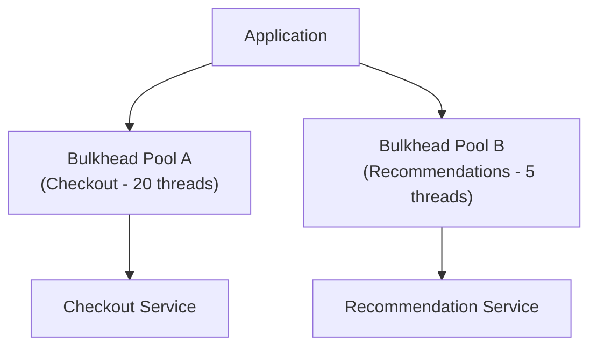

**Java Snippet** (using separate `ExecutorService` pools as bulkheads):
```java
class BulkheadExample {
    private final ExecutorService checkoutPool = Executors.newFixedThreadPool(20);
    private final ExecutorService recommendationPool = Executors.newFixedThreadPool(5);

    public Future<String> callCheckout(Callable<String> task) {
        return checkoutPool.submit(task);
    }

    public Future<String> callRecommendations(Callable<String> task) {
        return recommendationPool.submit(task); // isolated — can't starve checkoutPool
    }
}
```

**Advantages:** Contains failures; improves overall resiliency; enables differentiated capacity by criticality.
**Disadvantages:** More resource overhead (multiple pools); added config complexity; needs capacity planning per bulkhead.
**When to Use:** Multi-tenant systems or services calling dependencies with different reliability profiles.
**When Not to Use:** Simple systems with a single dependency and low contention risk.

---

## 6. Cache-Aside

**Short Description:** Load data into a cache on demand from the data store on a cache miss, rather than always keeping the cache pre-populated.

**Problem Solved:** Repeated reads directly against the primary store are slow/expensive.

**Use Case:** Web app checks Redis first; on miss, reads DB, populates cache, returns result.

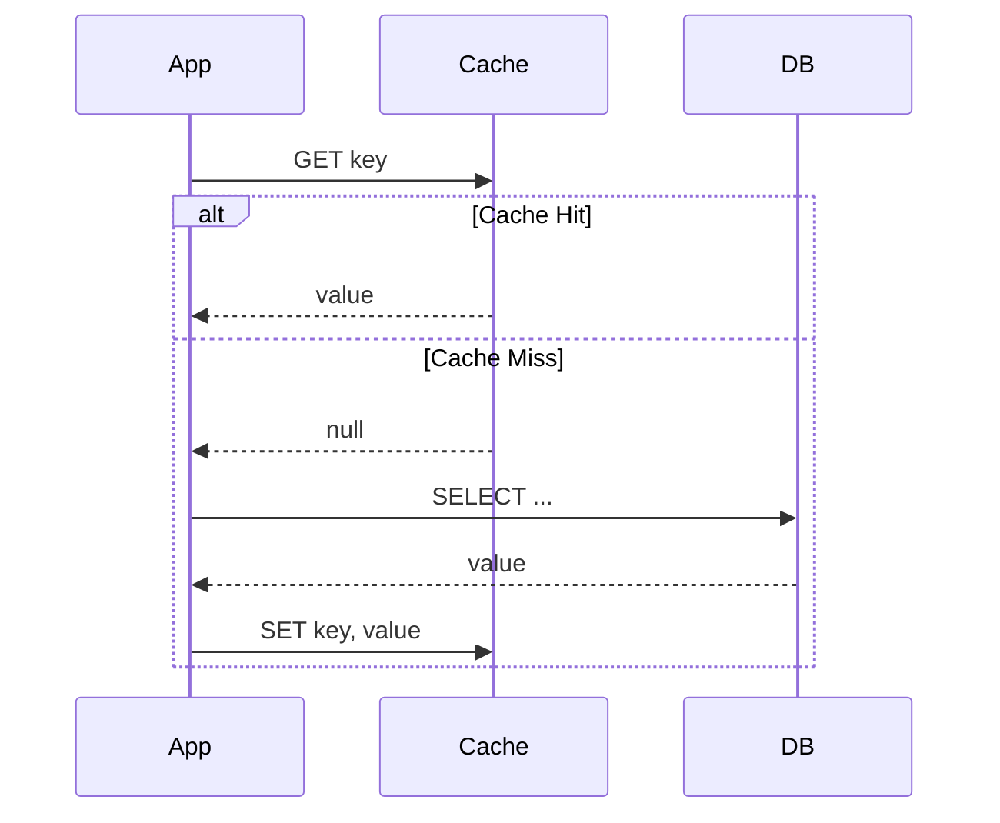

**Java Snippet:**
```java
class CacheAsideRepository {
    private final Cache<String, Product> cache; // e.g. Caffeine/Redis client wrapper
    private final ProductDatabase db;

    public Product getProduct(String id) {
        Product cached = cache.getIfPresent(id);
        if (cached != null) return cached;

        Product fromDb = db.findById(id); // cache miss -> hit the DB
        if (fromDb != null) cache.put(id, fromDb);
        return fromDb;
    }

    public void updateProduct(Product product) {
        db.save(product);
        cache.invalidate(product.getId()); // avoid stale cache
    }
}
```

**Advantages:** Improves read performance; reduces DB load; only caches actually-requested data; resilient to cache failure.
**Disadvantages:** Stale data risk; cache-stampede risk on popular key expiry; two places to keep in sync.
**When to Use:** Read-heavy workloads tolerant of brief staleness.
**When Not to Use:** Write-heavy or strong-consistency-required workloads.

---

## 7. Choreography

**Short Description:** Services react independently to events to collectively complete a business process, with no central orchestrator.

**Problem Solved:** A central orchestrator becomes a bottleneck/tightly-coupled "God" component.

**Use Case:** Order → Payment → Shipping, each service reacting to the previous service's event.

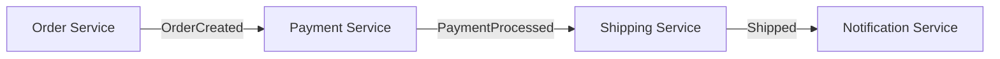

**Java Snippet** (Spring event-style choreography):
```java
class OrderCreatedEvent { String orderId; }
class PaymentProcessedEvent { String orderId; }

@Component
class PaymentService {
    @EventListener
    public void onOrderCreated(OrderCreatedEvent event) {
        // process payment...
        eventPublisher.publishEvent(new PaymentProcessedEvent(event.orderId));
    }
}

@Component
class ShippingService {
    @EventListener
    public void onPaymentProcessed(PaymentProcessedEvent event) {
        // schedule shipment — no central coordinator involved
    }
}
```

**Advantages:** Highly decoupled; no single point of failure/bottleneck; scales organically.
**Disadvantages:** Hard to see overall flow; difficult debugging/tracing; implicit coupling via event contracts.
**When to Use:** Systems where services/teams own their reactions independently.
**When Not to Use:** Complex workflows needing clear central visibility — consider orchestration instead.

---

## 8. Circuit Breaker

**Short Description:** Stop repeatedly calling an operation likely to fail by "tripping" a circuit after a failure threshold, failing fast until the dependency recovers.

**Problem Solved:** Continuously retrying a failing dependency wastes resources and can cascade failures.

**Use Case:** Payment service down → circuit opens → fail fast/fallback → periodic half-open test call checks recovery.

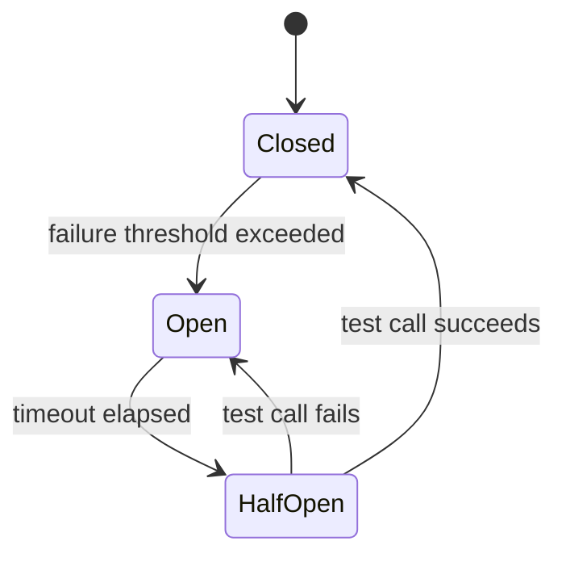

**Java Snippet** (using Resilience4j, the standard Java library for this pattern):
```java
CircuitBreakerConfig config = CircuitBreakerConfig.custom()
    .failureRateThreshold(50)
    .waitDurationInOpenState(Duration.ofSeconds(30))
    .slidingWindowSize(10)
    .build();

CircuitBreaker circuitBreaker = CircuitBreaker.of("paymentService", config);

Supplier<String> decorated = CircuitBreaker
    .decorateSupplier(circuitBreaker, () -> paymentClient.charge(request));

try {
    String result = decorated.get();
} catch (CallNotPermittedException ex) {
    // circuit is open — fail fast / return fallback
}
```

**Advantages:** Prevents cascading failures; fails fast; gives dependencies time to recover.
**Disadvantages:** Added state-management complexity; needs careful threshold tuning; needs monitoring of open circuits.
**When to Use:** Calls to remote services where failure could cascade.
**When Not to Use:** Cheap, purely local, non-critical operations.

---

## 9. Claim Check

**Short Description:** Send a small reference ("claim check") through the message bus while the actual large payload is stored separately (e.g., Blob Storage).

**Problem Solved:** Message brokers have size limits and perform poorly with large payloads.

**Use Case:** A message references a file in Blob Storage instead of embedding it.

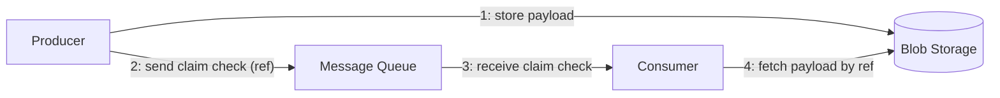

**Java Snippet:**
```java
class ClaimCheckProducer {
    void send(byte[] largePayload) {
        String blobRef = blobStorageClient.upload(largePayload); // store large data
        Message message = new Message();
        message.setBody(Map.of("claimCheck", blobRef));
        messageQueue.send(message); // send only the small reference
    }
}

class ClaimCheckConsumer {
    void handle(Message message) {
        String blobRef = (String) message.getBody().get("claimCheck");
        byte[] payload = blobStorageClient.download(blobRef); // retrieve when needed
        process(payload);
    }
}
```

**Advantages:** Keeps messages small; avoids broker size limits; separates storage from messaging concerns.
**Disadvantages:** Extra round-trip latency; must manage blob lifecycle/cleanup.
**When to Use:** Messaging workloads with large payloads (files, images).
**When Not to Use:** Small payloads well within broker limits.

---

## 10. Compensating Transaction

**Short Description:** Undo the effects of a multi-step, eventually-consistent operation when a later step fails, via explicit compensating actions.

**Problem Solved:** Distributed systems typically can't use ACID transactions across services; failures mid-sequence need a rollback strategy.

**Use Case:** Trip booking: flight + hotel + car; if car booking fails, cancel flight and hotel.

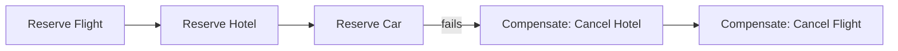

**Java Snippet:**
```java
class TripBookingSaga {
    void bookTrip(TripRequest req) {
        String flightId = null, hotelId = null;
        try {
            flightId = flightService.reserve(req.flight());
            hotelId = hotelService.reserve(req.hotel());
            carService.reserve(req.car()); // may throw
        } catch (Exception ex) {
            if (hotelId != null) hotelService.cancel(hotelId);   // compensate
            if (flightId != null) flightService.cancel(flightId); // compensate
            throw new TripBookingFailedException(ex);
        }
    }
}
```

**Advantages:** Enables consistency across distributed systems without 2PC; flexible business-driven "undo."
**Disadvantages:** Compensating logic can be complex; not all actions are truly reversible; no true isolation.
**When to Use:** Multi-step distributed processes needing eventual consistency.
**When Not to Use:** Single-database operations where native ACID suffices.

---

## 11. Competing Consumers

**Short Description:** Multiple concurrent consumers process messages from the same channel in parallel, scaling out message processing.

**Problem Solved:** A single consumer can't keep up with message volume.

**Use Case:** Multiple worker instances read from the same Service Bus queue.

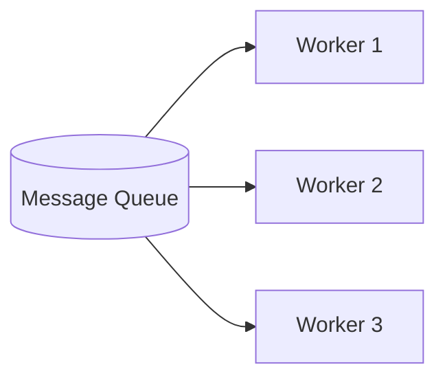

**Java Snippet:**
```java
ExecutorService workerPool = Executors.newFixedThreadPool(3);

for (int i = 0; i < 3; i++) {
    workerPool.submit(() -> {
        while (true) {
            Message msg = queue.receive(); // broker ensures only one consumer gets each message
            if (msg == null) continue;
            try {
                process(msg);
                queue.complete(msg);
            } catch (Exception ex) {
                queue.abandon(msg); // retry or dead-letter
            }
        }
    });
}
```

**Advantages:** Scales processing horizontally; improves availability; pairs with auto-scaling.
**Disadvantages:** Ordering not guaranteed across consumers; idempotency required; poison messages need dead-lettering.
**When to Use:** High-volume queued workloads needing parallel processing.
**When Not to Use:** Strict global ordering requirements (use Sequential Convoy instead).

---

## 12. Compute Resource Consolidation

**Short Description:** Consolidate multiple small tasks/services onto shared compute infrastructure to raise utilization and lower overhead.

**Problem Solved:** Many lightly-loaded workloads on dedicated instances waste resources and increase management overhead.

**Use Case:** Several low-traffic microservices share one Kubernetes cluster/App Service Plan instead of dedicated VMs each.

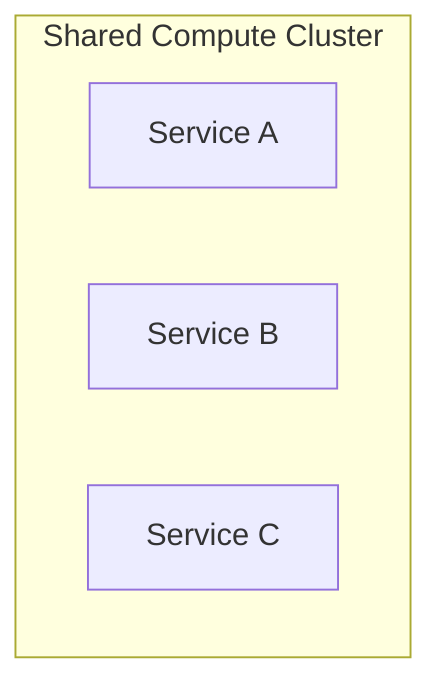

**Java Snippet** (conceptual — consolidating tasks onto a shared scheduler):
```java
class ConsolidatedTaskRunner {
    private final ScheduledExecutorService sharedScheduler = Executors.newScheduledThreadPool(4);

    void registerTask(Runnable task, long intervalSeconds) {
        // multiple lightweight tasks share the same pool of threads
        sharedScheduler.scheduleAtFixedRate(task, 0, intervalSeconds, TimeUnit.SECONDS);
    }
}
```

**Advantages:** Improves utilization/cost; reduces management surface.
**Disadvantages:** Reduces isolation (pair with Bulkhead); harder per-workload capacity reasoning.
**When to Use:** Many small, low-utilization workloads.
**When Not to Use:** Workloads with strict isolation/compliance needs.

---

## 13. CQRS

**Short Description:** Separate read (query) and write (command) models/interfaces instead of one shared model for both.

**Problem Solved:** One model optimized for both reads and writes often serves neither well, especially under complex domains or high contention.

**Use Case:** Rich validated write model for order commands; denormalized fast read model for catalog/reporting queries.

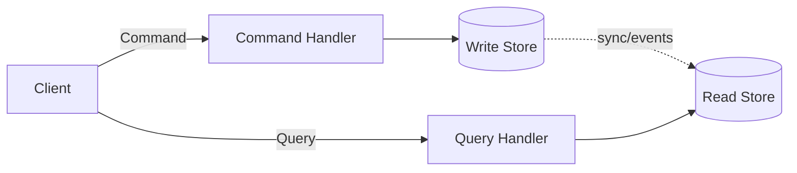

**Java Snippet:**
```java
// Command side
record CreateOrderCommand(String customerId, List<String> items) {}

class OrderCommandHandler {
    void handle(CreateOrderCommand cmd) {
        Order order = new Order(cmd.customerId(), cmd.items()); // business rules enforced here
        writeRepository.save(order);
        eventPublisher.publish(new OrderCreatedEvent(order.getId()));
    }
}

// Query side — separate, denormalized read model
record OrderSummaryView(String orderId, String customerName, int itemCount) {}

class OrderQueryHandler {
    OrderSummaryView getOrderSummary(String orderId) {
        return readRepository.findSummaryById(orderId); // fast, pre-shaped for display
    }
}
```

**Advantages:** Independent scaling/optimization of reads vs writes; simplifies complex domain write logic.
**Disadvantages:** Significant complexity; eventual consistency between sides; more moving parts.
**When to Use:** Complex domains with very different read/write demands.
**When Not to Use:** Simple CRUD apps.

---

## 14. Deployment Stamps

**Short Description:** Deploy multiple independent copies ("stamps") of the full application stack, often per customer or region.

**Problem Solved:** A single shared deployment hits scale limits or can't meet per-tenant isolation/data-residency needs.

**Use Case:** Each large enterprise customer gets a dedicated stamp (app + DB).

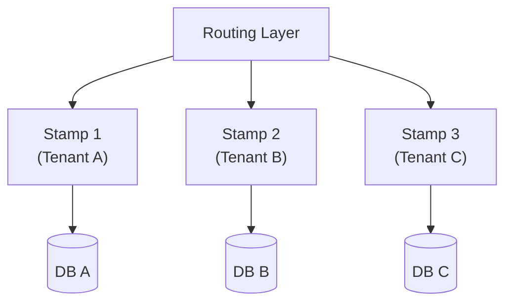

**Java Snippet** (routing a request to the correct tenant stamp):
```java
class StampRouter {
    private final Map<String, String> tenantToStampUrl = Map.of(
        "tenantA", "https://stamp1.internal",
        "tenantB", "https://stamp2.internal"
    );

    String resolveStampUrl(String tenantId) {
        return tenantToStampUrl.getOrDefault(tenantId,
            () -> { throw new IllegalArgumentException("Unknown tenant"); }.get());
    }
}
```

**Advantages:** Strong tenant isolation; near-linear scaling; supports data residency.
**Disadvantages:** High operational overhead (many deployments); cross-stamp reporting is harder.
**When to Use:** SaaS needing strong isolation/compliance or scale beyond one deployment.
**When Not to Use:** Small-scale, shared multi-tenant deployment is simpler/cheaper.

---

## 15. Event Sourcing

**Short Description:** Store the full sequence of state-changing events (append-only log) instead of just current state; derive state by replaying events.

**Problem Solved:** Traditional CRUD loses history, making audit/replay/temporal queries hard.

**Use Case:** A banking ledger stores every deposit/withdrawal event rather than just a balance.

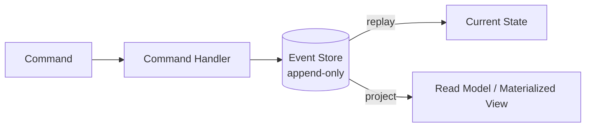

**Java Snippet:**
```java
sealed interface AccountEvent permits Deposited, Withdrawn {}
record Deposited(BigDecimal amount) implements AccountEvent {}
record Withdrawn(BigDecimal amount) implements AccountEvent {}

class Account {
    private BigDecimal balance = BigDecimal.ZERO;
    private final List<AccountEvent> history = new ArrayList<>();

    void apply(AccountEvent event) {
        history.add(event); // append to the log
        if (event instanceof Deposited d) balance = balance.add(d.amount());
        else if (event instanceof Withdrawn w) balance = balance.subtract(w.amount());
    }

    static Account rebuild(List<AccountEvent> events) {
        Account acc = new Account();
        events.forEach(acc::apply); // replay to derive current state
        return acc;
    }
}
```

**Advantages:** Full audit trail; temporal queries; decouples write/read models; natural event-driven integration.
**Disadvantages:** Steeper complexity; needs projections for current-state queries; schema evolution challenges; storage grows indefinitely without snapshotting.
**When to Use:** Domains needing audit history or event-driven integration.
**When Not to Use:** Simple CRUD with no history requirements.

---

## 16. External Configuration Store

**Short Description:** Move configuration information out of the application deployment package into a centralized, externally managed store.

**Problem Solved:** Configuration baked into deployment packages requires a redeploy for every config change, and can't easily be shared/updated consistently across many instances.

**Use Case:** Feature flags and connection strings stored in Azure App Configuration / Key Vault, read at startup and refreshed at runtime, instead of hardcoded in each service's package.

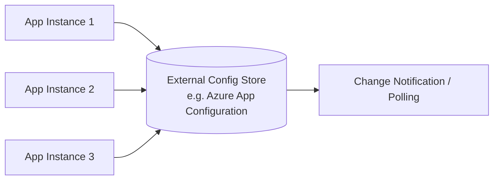

**Java Snippet:**
```java
class ExternalConfigService {
    private final Map<String, String> cache = new ConcurrentHashMap<>();

    void refresh() {
        Map<String, String> latest = configStoreClient.getAllSettings(); // e.g. Azure App Config SDK
        cache.clear();
        cache.putAll(latest);
    }

    String get(String key, String defaultValue) {
        return cache.getOrDefault(key, defaultValue);
    }
}

// Periodically refresh without redeploying the app
scheduledExecutor.scheduleAtFixedRate(configService::refresh, 0, 60, TimeUnit.SECONDS);
```

**Advantages:** Config changes without redeployment; centralized, consistent config across many instances; supports feature flags/versioning.
**Disadvantages:** Adds dependency on config store availability; needs caching/fallback strategy for outages; secrets require additional protection (pair with a vault).
**When to Use:** Multi-instance deployments needing centrally-managed, dynamically-updatable configuration.
**When Not to Use:** Single-instance apps with rarely-changing configuration.

---

## 17. Federated Identity

**Short Description:** Delegate authentication to an external identity provider (IdP) instead of managing credentials directly.

**Problem Solved:** Applications managing their own credential stores carry heavy security burden and fragment the user's identity across systems.

**Use Case:** Enterprise SSO via Microsoft Entra ID; consumer "Sign in with Google."

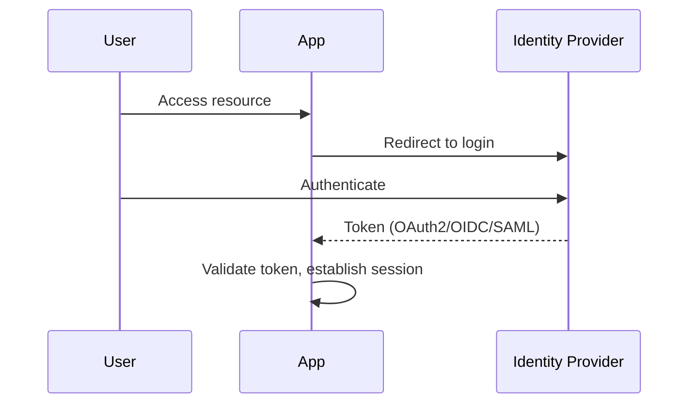

**Java Snippet** (validating a JWT issued by an external IdP, Spring Security style):
```java
@Configuration
class SecurityConfig {
    @Bean
    SecurityFilterChain filterChain(HttpSecurity http) throws Exception {
        http.oauth2ResourceServer(oauth2 -> oauth2.jwt(jwt ->
            jwt.jwtAuthenticationConverter(jwtAuthenticationConverter())
        ));
        return http.build();
    }

    JwtAuthenticationConverter jwtAuthenticationConverter() {
        // maps IdP-issued claims (roles/groups) to Spring authorities
        var converter = new JwtAuthenticationConverter();
        converter.setJwtGrantedAuthoritiesConverter(jwt ->
            ((List<String>) jwt.getClaim("roles")).stream()
                .map(SimpleGrantedAuthority::new).collect(Collectors.toList()));
        return converter;
    }
}
```

**Advantages:** Removes credential-storage burden; enables SSO; leverages IdP's stronger security investment.
**Disadvantages:** Dependency on external IdP availability; federation protocol integration complexity.
**When to Use:** Enterprise SSO or reducing consumer credential burden.
**When Not to Use:** Very simple, isolated internal tools.

---

## 18. Gatekeeper

**Short Description:** A dedicated, minimally-privileged host validates and sanitizes requests before forwarding them to protected back-end resources.

**Problem Solved:** Directly exposing backend services to untrusted clients increases attack surface.

**Use Case:** A gatekeeper validates/filters public requests before forwarding sanitized calls to a backend holding elevated data privileges.

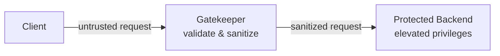

**Java Snippet:**
```java
@RestController
class GatekeeperController {
    @PostMapping("/gateway/submit")
    public ResponseEntity<?> handle(@RequestBody RawRequest raw) {
        if (!InputValidator.isSafe(raw)) {
            return ResponseEntity.badRequest().build(); // reject before it ever reaches backend
        }
        SanitizedRequest sanitized = InputValidator.sanitize(raw);
        return backendClient.forward(sanitized); // low-privilege gatekeeper calls high-privilege backend
    }
}
```

**Advantages:** Reduces attack surface; centralizes input validation; isolates backend from direct exposure.
**Disadvantages:** Extra latency hop; another component to secure/maintain.
**When to Use:** High-security systems where backend must never be directly reachable.
**When Not to Use:** Low-risk internal systems behind strong perimeter controls already.

---

## 19. Gateway Aggregation

**Short Description:** A gateway combines multiple backend requests into a single client-facing request/response.

**Problem Solved:** Clients (especially mobile) would otherwise need many chatty round-trips to render one screen.

**Use Case:** A product page needs Inventory + Pricing + Reviews — gateway fetches all three and returns one response.

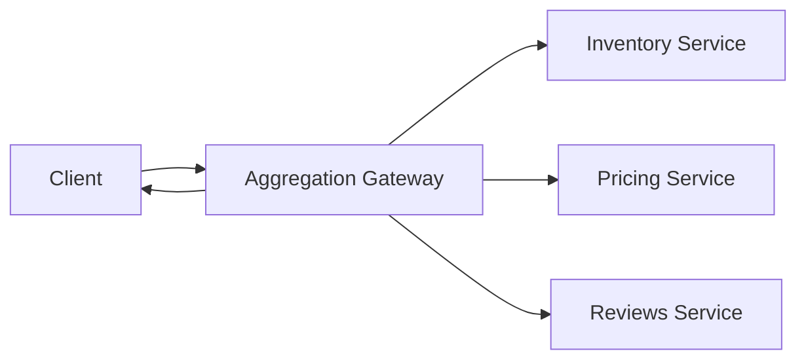

**Java Snippet:**
```java
@RestController
class AggregationGateway {
    @GetMapping("/product/{id}/full")
    public ProductFullView getFull(@PathVariable String id) {
        CompletableFuture<Inventory> inv = CompletableFuture.supplyAsync(() -> inventoryClient.get(id));
        CompletableFuture<Price> price = CompletableFuture.supplyAsync(() -> pricingClient.get(id));
        CompletableFuture<List<Review>> reviews = CompletableFuture.supplyAsync(() -> reviewClient.get(id));

        CompletableFuture.allOf(inv, price, reviews).join(); // fan-out/fan-in
        return new ProductFullView(inv.join(), price.join(), reviews.join());
    }
}
```

**Advantages:** Fewer client round-trips; simplifies client code; centralizes fan-out/fan-in.
**Disadvantages:** Must handle partial failures gracefully; couples gateway to multiple backend shapes.
**When to Use:** Mobile/low-bandwidth clients, dashboard-style aggregated pages.
**When Not to Use:** Clients that tolerate parallel direct calls, or highly divergent per-client needs (use BFF).

---

## 20. Gateway Offloading

**Short Description:** Offload shared/specialized functionality (TLS termination, compression, auth, rate limiting) to a gateway proxy.

**Problem Solved:** Every service reimplementing TLS/auth/compression independently duplicates effort and risks inconsistency.

**Use Case:** TLS termination and JWT validation handled at an API gateway; backends communicate over plain HTTP internally.

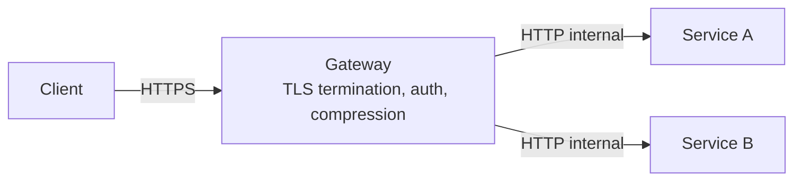

**Java Snippet** (Spring Cloud Gateway filter offloading auth validation):
```java
@Bean
GlobalFilter authOffloadFilter() {
    return (exchange, chain) -> {
        String token = exchange.getRequest().getHeaders().getFirst("Authorization");
        if (!TokenValidator.isValid(token)) {
            exchange.getResponse().setStatusCode(HttpStatus.UNAUTHORIZED);
            return exchange.getResponse().setComplete();
        }
        // valid: backend services never need to re-validate auth themselves
        return chain.filter(exchange);
    };
}
```

**Advantages:** Simplifies backend services; consistent centrally-managed security/compression; easier cert rotation.
**Disadvantages:** Gateway becomes complex/critical, needs HA; less flexibility for bespoke handling per service.
**When to Use:** Multiple services sharing common cross-cutting concerns.
**When Not to Use:** Very few services or services needing bespoke handling.

---

## 21. Gateway Routing

**Short Description:** Route incoming requests to multiple backend services through a single endpoint, based on path/header rules.

**Problem Solved:** Clients need one stable entry point while the backend topology changes/scales independently.

**Use Case:** `/orders/*` → Order Service, `/users/*` → User Service, behind one gateway.

```mermaid
flowchart LR
    Client --> GW[API Gateway]
    GW -->|/orders/*| Orders[Order Service]
    GW -->|/users/*| Users[User Service]
    GW -->|/catalog/*| Catalog[Catalog Service]
```

**Java Snippet** (Spring Cloud Gateway route config):
```java
@Bean
RouteLocator routes(RouteLocatorBuilder builder) {
    return builder.routes()
        .route("orders", r -> r.path("/orders/**")
            .uri("lb://order-service"))
        .route("users", r -> r.path("/users/**")
            .uri("lb://user-service"))
        .build();
}
```

**Advantages:** Decouples clients from internal topology; simplifies client config; enables central canary/blue-green routing.
**Disadvantages:** Gateway is a critical dependency needing HA; extra hop latency; risk of accumulating too much logic.
**When to Use:** Microservices needing a unified entry point.
**When Not to Use:** Monoliths or very small systems.

---

## 22. Geode

**Short Description:** Deploy back-end services across geographically distributed nodes ("geodes"), each capable of serving requests from any region.

**Problem Solved:** Single-region deployment causes high latency for distant users and a single point of regional failure.

**Use Case:** Identical stamps deployed in multiple Azure regions; traffic routed to nearest healthy geode via Traffic Manager/Front Door.

```mermaid
flowchart TB
    User1[User - Europe] --> TM[Global Traffic Router]
    User2[User - Asia] --> TM
    TM --> G1["Geode: West Europe"]
    TM --> G2["Geode: Southeast Asia"]
    G1 <-->|data replication| G2
```

**Java Snippet** (client picking nearest geode based on latency probe — conceptual):
```java
class GeodeRouter {
    List<String> geodeEndpoints = List.of("https://eu.geode.example",
                                           "https://asia.geode.example");

    String pickFastest() {
        return geodeEndpoints.stream()
            .min(Comparator.comparingLong(this::probeLatency)) // ping each, pick lowest latency
            .orElseThrow();
    }

    long probeLatency(String endpoint) {
        long start = System.nanoTime();
        healthClient.ping(endpoint);
        return System.nanoTime() - start;
    }
}
```

**Advantages:** Reduces latency for global users; improves resiliency (regional outage doesn't take down service).
**Disadvantages:** Data replication/conflict resolution is hard; high cost/operational complexity.
**When to Use:** Global apps with geographically dispersed users.
**When Not to Use:** Regional/local apps close to a single region.

---

## 23. Health Endpoint Monitoring

**Short Description:** Expose functional health-check endpoints that external tools/load balancers poll to verify the app is genuinely working.

**Problem Solved:** Process-liveness checks don't reveal whether the app can actually do its job (e.g., broken DB connection).

**Use Case:** `/health` checks DB + cache + dependency status; a load balancer removes unhealthy instances from rotation.

```mermaid
flowchart LR
    LB[Load Balancer] -->|poll /health| I1[Instance 1]
    LB -->|poll /health| I2[Instance 2]
    I1 --> DB[(Database)]
    I1 --> Cache[(Cache)]
```

**Java Snippet** (Spring Boot Actuator-style custom health indicator):
```java
@Component
class DatabaseHealthIndicator implements HealthIndicator {
    @Override
    public Health health() {
        try {
            dataSource.getConnection().isValid(2); // real functional check
            return Health.up().build();
        } catch (Exception ex) {
            return Health.down(ex).build();
        }
    }
}
```

**Advantages:** Enables automated detection/remediation; improves real observability; supports readiness/liveness distinctions.
**Disadvantages:** Poorly designed checks cause false positives/cascading restarts; deep checks add load.
**When to Use:** Any production service behind a load balancer/orchestrator.
**When Not to Use:** N/A — almost always beneficial when implemented well.

---

## 24. Index Table

**Short Description:** Create secondary indexes over fields frequently queried but not part of the primary/partition key.

**Problem Solved:** NoSQL/partitioned stores often only query efficiently by primary key; other queries force full scans.

**Use Case:** A table partitioned by `CustomerId` also needs fast lookup by `Email` via a separate index table.

```mermaid
flowchart LR
    Q[Query by Email] --> IT[(Index Table
    Email -> CustomerId)]
    IT --> MT[(Main Table
    partitioned by CustomerId)]
```

**Java Snippet:**
```java
class EmailIndexTable {
    // secondary index: email -> customerId
    void onCustomerWrite(Customer customer) {
        mainTable.put(customer.getCustomerId(), customer);
        indexTable.put(customer.getEmail(), customer.getCustomerId()); // maintain index on every write
    }

    Customer findByEmail(String email) {
        String customerId = indexTable.get(email);
        return customerId == null ? null : mainTable.get(customerId);
    }
}
```

**Advantages:** Enables efficient alternate-key queries; avoids full-table scans.
**Disadvantages:** Extra storage/write overhead; consistency between index and main data must be actively managed.
**When to Use:** NoSQL stores where common queries don't align with the partition key.
**When Not to Use:** Relational DBs with native secondary indexes, or rare alternate-key queries.

---

## 25. Leader Election

**Short Description:** Elect one instance as the leader responsible for coordinating a task among a set of collaborating, redundant instances.

**Problem Solved:** Some tasks must run on exactly one instance, even though the app is deployed redundantly across many.

**Use Case:** A cluster elects a leader (via a distributed lock/lease) to run a nightly batch job exactly once.

```mermaid
flowchart TB
    I1[Instance 1] -->|acquire lease| Lock[(Distributed Lock/Lease)]
    I2[Instance 2] -->|attempt| Lock
    I3[Instance 3] -->|attempt| Lock
    Lock -->|granted| I1
    I1 -.leader.-> Task[Scheduled Job]
```

**Java Snippet** (using a blob lease / distributed lock abstraction):
```java
class LeaderElection {
    boolean tryBecomeLeader() {
        return distributedLock.tryAcquire("scheduler-leader-lock", Duration.ofSeconds(30));
    }

    void runIfLeader() {
        if (tryBecomeLeader()) {
            try {
                runNightlyJob(); // only the leader executes this
            } finally {
                distributedLock.release("scheduler-leader-lock");
            }
        }
    }
}
```

**Advantages:** Singleton coordination in a redundant system; automatic failover on leader loss.
**Disadvantages:** Coordination complexity; dependency on a reliable consensus mechanism; brief leaderless gaps during failover.
**When to Use:** Tasks that must run exactly once across a fleet.
**When Not to Use:** Stateless idempotent tasks safe to run redundantly.

---

## 26. Materialized View

**Short Description:** Precompute and store query-optimized views over data when the source format doesn't suit required queries.

**Problem Solved:** Computing complex joins/aggregations on every query is slow/expensive.

**Use Case:** "Total sales by category by day" dashboard backed by a precomputed, periodically-refreshed view instead of live aggregation.

```mermaid
flowchart LR
    Source[(Transactional Data)] -- ETL / event trigger --> MV[(Materialized View
    Sales by Category by Day)]
    Dashboard --> MV
```

**Java Snippet:**
```java
@Scheduled(fixedRate = 300_000) // refresh every 5 minutes
void refreshSalesByCategoryView() {
    List<SalesAggregate> aggregated = transactionRepository.aggregateSalesByCategoryAndDay();
    materializedViewRepository.replaceAll(aggregated); // read-optimized, pre-shaped store
}
```

**Advantages:** Dramatically improves read performance for complex aggregations; reduces load on primary store.
**Disadvantages:** View can go stale; extra storage cost; sync complexity.
**When to Use:** Read-heavy reporting/dashboards.
**When Not to Use:** Data changes so fast that refresh overhead outweighs savings.

---

## 27. Messaging Bridge

**Short Description:** An intermediary translates and relays messages between two otherwise-incompatible messaging systems.

**Problem Solved:** Different systems use incompatible messaging tech but still need to exchange messages during migration/integration.

**Use Case:** Legacy MSMQ system bridges to modern Azure Service Bus during a phased migration.

```mermaid
flowchart LR
    Legacy[Legacy System
    MSMQ] --> Bridge[Messaging Bridge
    translate & relay]
    Bridge --> Modern[Modern System
    Azure Service Bus]
```

**Java Snippet:**
```java
class MessagingBridge {
    void bridgeLegacyToModern() {
        LegacyMessage legacyMsg = msmqClient.receive();
        ModernMessage translated = new ModernMessage(
            legacyMsg.getBody(),
            Map.of("source", "legacy-bridge")
        );
        serviceBusClient.send(translated); // relay to the modern system
    }
}
```

**Advantages:** Enables integration across heterogeneous messaging tech without rewriting either side; useful transitional tool.
**Disadvantages:** Adds a component that can bottleneck; ongoing maintenance if meant to be temporary but lingers.
**When to Use:** Migrations/integrations bridging incompatible messaging systems.
**When Not to Use:** Both systems already share a common messaging technology.

---

## 28. Pipes and Filters

**Short Description:** Break a complex processing task into a series of discrete, reusable, independently deployable steps (filters) connected by channels (pipes).

**Problem Solved:** A monolithic processing task is hard to reuse, test, or scale piece-by-piece.

**Use Case:** Image pipeline: resize → watermark → compress → upload, each an independent filter.

```mermaid
flowchart LR
    In[Input Image] --> F1[Resize Filter]
    F1 --> F2[Watermark Filter]
    F2 --> F3[Compress Filter]
    F3 --> Out[Upload Filter]
```

**Java Snippet:**
```java
interface Filter<T> { T process(T input); }

class ResizeFilter implements Filter<BufferedImage> {
    public BufferedImage process(BufferedImage input) { return ImageUtils.resize(input, 800, 600); }
}
class WatermarkFilter implements Filter<BufferedImage> {
    public BufferedImage process(BufferedImage input) { return ImageUtils.watermark(input, "© Acme"); }
}

class Pipeline {
    List<Filter<BufferedImage>> filters = List.of(new ResizeFilter(), new WatermarkFilter());

    BufferedImage run(BufferedImage input) {
        BufferedImage result = input;
        for (Filter<BufferedImage> filter : filters) {
            result = filter.process(result); // each filter is independently reusable/testable
        }
        return result;
    }
}
```

**Advantages:** Encourages reuse of steps; independent development/testing/scaling of each filter.
**Disadvantages:** Serialization/transport overhead between stages; growing end-to-end latency; multi-stage error handling complexity.
**When to Use:** Complex processing with naturally sequential, reusable steps.
**When Not to Use:** Simple single-step processing.

---

## 29. Priority Queue

**Short Description:** Prioritize requests so higher-priority messages are processed ahead of lower-priority ones.

**Problem Solved:** Treating all requests equally delays critical operations during high load.

**Use Case:** Support tickets: "Critical" severity processed before "Low" severity.

```mermaid
flowchart LR
    HighQ[(High-Priority Queue)] --> W[Worker]
    LowQ[(Low-Priority Queue)] --> W
    W -.checks high queue first.-> HighQ
```

**Java Snippet:**
```java
class PriorityMessageQueue {
    private final PriorityBlockingQueue<Ticket> queue = new PriorityBlockingQueue<>(
        11, Comparator.comparingInt(Ticket::priority).reversed()); // higher priority first

    void submit(Ticket ticket) { queue.put(ticket); }

    Ticket takeNext() throws InterruptedException { return queue.take(); }
}

record Ticket(String id, int priority) {} // e.g. 3 = Critical, 0 = Low
```

**Advantages:** Ensures urgent work processed promptly; enables service tiering.
**Disadvantages:** Starvation risk for low-priority items without aging; added consumer complexity.
**When to Use:** Systems with clearly differentiated urgency/service tiers.
**When Not to Use:** All requests are truly equal importance.

---

## 30. Publisher-Subscriber

**Short Description:** An application announces events to multiple consumers asynchronously without coupling the sender to receivers.

**Problem Solved:** Direct point-to-point integration between producer and every consumer creates tight coupling.

**Use Case:** "OrderPlaced" published to a topic; Inventory, Shipping, and Notification services each subscribe independently.

```mermaid
flowchart LR
    Pub[Publisher] --> Topic{{Topic}}
    Topic --> Sub1[Inventory Subscriber]
    Topic --> Sub2[Shipping Subscriber]
    Topic --> Sub3[Notification Subscriber]
```

**Java Snippet:**
```java
class OrderPublisher {
    void publishOrderPlaced(Order order) {
        topicClient.publish("order-events", new OrderPlacedEvent(order.getId()));
    }
}

@Component
class InventorySubscriber {
    @JmsListener(destination = "order-events") // subscribes independently of the publisher
    void onOrderPlaced(OrderPlacedEvent event) {
        inventoryService.reserveStock(event.orderId());
    }
}
```

**Advantages:** Complete decoupling of producers/consumers; easy to add subscribers; supports reactive architectures.
**Disadvantages:** Harder end-to-end tracing; eventual consistency; delivery-guarantee complexity (dedup, ordering).
**When to Use:** Event-driven architectures with many independent consumers.
**When Not to Use:** Simple direct request/response between two known parties.

---

## 31. Quarantine

**Short Description:** Ensure external assets meet an agreed quality/security bar before the workload consumes them.

**Problem Solved:** Blindly trusting externally-sourced files/data exposes the system to malware or corrupted data.

**Use Case:** User uploads land in a quarantine container, get scanned, then move to a trusted container only after passing.

```mermaid
flowchart LR
    Upload[User Upload] --> QC[(Quarantine Container)]
    QC --> Scan[Malware/Validation Scan]
    Scan -- pass --> TC[(Trusted Container)]
    Scan -- fail --> Reject[Reject/Alert]
```

**Java Snippet:**
```java
class QuarantineService {
    void handleUpload(byte[] file, String fileName) {
        String quarantineRef = quarantineStorage.save(fileName, file);

        ScanResult result = antivirusScanner.scan(quarantineRef);
        if (result.isClean()) {
            trustedStorage.moveFrom(quarantineStorage, quarantineRef); // promote to trusted
        } else {
            quarantineStorage.delete(quarantineRef);
            alertService.notifySecurityTeam(fileName, result);
        }
    }
}
```

**Advantages:** Prevents malicious/malformed content from reaching production; auditable security checkpoint.
**Disadvantages:** Adds latency between upload and availability; needs scanning infra; false positives need an appeals path.
**When to Use:** Systems accepting external/untrusted content.
**When Not to Use:** Fully trusted, internally-generated content only.

---

## 32. Queue-Based Load Leveling

**Short Description:** Use a queue as a buffer between a task/producer and a service/consumer to smooth intermittent heavy loads.

**Problem Solved:** Bursty workloads sent directly to a service can overwhelm it even if average load is manageable.

**Use Case:** Flash-sale order submissions placed on a queue and processed by workers at a sustainable rate.

```mermaid
flowchart LR
    Producer[Producer - bursty traffic] --> Q[(Queue - buffer)]
    Q --> Consumer[Consumer - steady rate]
```

**Java Snippet:**
```java
class OrderIntake {
    void submitOrder(Order order) {
        queueClient.send(order); // absorbs bursts instantly, doesn't block the caller
    }
}

class OrderProcessor {
    @Scheduled(fixedDelay = 1000)
    void processNext() {
        Order order = queueClient.receive(); // consumed at a sustainable, controlled rate
        if (order != null) orderService.process(order);
    }
}
```

**Advantages:** Smooths spikes; decouples producers from consumers; enables independent, cost-efficient scaling.
**Disadvantages:** Introduces async processing (not for immediate-response needs); added latency; needs queue-depth monitoring.
**When to Use:** Bursty/unpredictable workloads, batch-friendly processing.
**When Not to Use:** Strictly synchronous, low-latency requirements.

---

## 33. Rate Limiting

**Short Description:** Proactively control the rate at which a client consumes a resource, to avoid or minimize throttling errors.

**Problem Solved:** Even well-behaved clients can accidentally overload a dependent service without a deliberate rate cap.

**Use Case:** An API gateway enforces a token-bucket limiter per API key.

```mermaid
flowchart LR
    Client --> RL{Rate Limiter
    Token Bucket}
    RL -- tokens available --> Service
    RL -- no tokens --> Reject[429 Too Many Requests]
```

**Java Snippet** (using Resilience4j RateLimiter):
```java
RateLimiterConfig config = RateLimiterConfig.custom()
    .limitForPeriod(100)                 // 100 requests
    .limitRefreshPeriod(Duration.ofSeconds(1))
    .timeoutDuration(Duration.ofMillis(50))
    .build();

RateLimiter rateLimiter = RateLimiter.of("apiClientLimiter", config);

Supplier<String> limited = RateLimiter.decorateSupplier(rateLimiter, () -> callDownstreamApi());

try {
    String result = limited.get();
} catch (RequestNotPermitted ex) {
    // rate limit exceeded — reject or queue
}
```

**Advantages:** Prevents overload proactively; protects both service and client budget; fine burst control (token bucket, sliding window).
**Disadvantages:** Adds latency for delayed requests; wrong limits throttle legitimate spikes; needs distributed counters at scale.
**When to Use:** Public/partner-facing APIs, protecting known-capacity dependencies.
**When Not to Use:** Purely internal, low-risk calls with generous headroom.

---

## 34. Retry

**Short Description:** Transparently retry an operation that fails due to a transient fault.

**Problem Solved:** Transient failures (network blips, momentary unavailability) cause failures that would succeed if retried shortly after.

**Use Case:** A DB/API call times out; client retries with exponential backoff before surfacing an error.

```mermaid
flowchart TB
    Call[Call Operation] --> Fail{Failed?}
    Fail -- No --> Success[Return Result]
    Fail -- Yes --> Check{Retries left AND transient?}
    Check -- Yes --> Backoff[Wait with Backoff] --> Call
    Check -- No --> Error[Throw Error]
```

**Java Snippet** (using Resilience4j Retry):
```java
RetryConfig config = RetryConfig.custom()
    .maxAttempts(3)
    .intervalFunction(IntervalFunction.ofExponentialBackoff(200, 2.0))
    .retryOnException(ex -> ex instanceof TransientException)
    .build();

Retry retry = Retry.of("dbCallRetry", config);
Supplier<String> decorated = Retry.decorateSupplier(retry, () -> database.query(sql));

String result = decorated.get(); // retries automatically on transient failures
```

**Advantages:** Improves perceived reliability against transient issues; simple to implement with libraries; configurable backoff/jitter.
**Disadvantages:** Naive retries can amplify load ("retry storms"); not all failures are transient; requires idempotency.
**When to Use:** Calls to remote services/resources prone to transient faults.
**When Not to Use:** Non-idempotent operations without safeguards, or permanent/logical errors.

---

## 35. Saga

**Short Description:** Manage data consistency across microservices by breaking a distributed transaction into local transactions, each with a compensating action.

**Problem Solved:** Long-running processes span multiple services/databases with no distributed ACID transaction available.

**Use Case:** Order processing: reserve inventory → charge payment → schedule shipping, via orchestration or choreography.

```mermaid
flowchart LR
    Orchestrator[Saga Orchestrator] --> S1[Reserve Inventory]
    Orchestrator --> S2[Charge Payment]
    Orchestrator --> S3[Schedule Shipping]
    S2 -- fails --> C1[Compensate: Release Inventory]
```

**Java Snippet** (orchestration-based saga):
```java
class OrderSagaOrchestrator {
    void execute(OrderRequest request) {
        String reservationId = null;
        String paymentId = null;
        try {
            reservationId = inventoryService.reserve(request.items());
            paymentId = paymentService.charge(request.customerId(), request.amount());
            shippingService.schedule(request.orderId());
        } catch (Exception ex) {
            if (paymentId != null) paymentService.refund(paymentId);       // compensate
            if (reservationId != null) inventoryService.release(reservationId); // compensate
            throw new SagaFailedException(ex);
        }
    }
}
```

**Advantages:** Maintains consistency without tight distributed transactions; choreography keeps services loosely coupled; orchestration gives clear visibility.
**Disadvantages:** More complex than a single ACID transaction; harder debugging/tracing; compensating logic needed for every failure point.
**When to Use:** Multi-service business transactions requiring eventual consistency.
**When Not to Use:** Single-service/single-database operations.

---

## 36. Scheduler Agent Supervisor

**Short Description:** Coordinate a distributed multi-step operation using a Scheduler (sequences steps), Agents (execute steps remotely), and a Supervisor (manages recovery on failure).

**Problem Solved:** A multi-step distributed workflow needs resilient coordination — failures/hangs must be detected and recovered automatically.

**Use Case:** A workflow engine schedules a chain of remote provisioning operations; a supervisor retries or rolls back failed steps.

```mermaid
flowchart LR
    Scheduler[Scheduler] --> Agent1[Agent: Step 1]
    Scheduler --> Agent2[Agent: Step 2]
    Supervisor[Supervisor] -.monitors.-> Agent1
    Supervisor -.monitors.-> Agent2
    Supervisor -->|retry/recover on failure| Scheduler
```

**Java Snippet:**
```java
class WorkflowSupervisor {
    void monitorAndRecover(WorkflowState state) {
        if (state.getStatus() == Status.TIMED_OUT || state.getStatus() == Status.FAILED) {
            if (state.getRetryCount() < 3) {
                scheduler.retryStep(state.getCurrentStep()); // recover
            } else {
                scheduler.rollback(state); // give up, compensate
            }
        }
    }
}
```

**Advantages:** Structured, resilient coordination of complex workflows; clear separation of scheduling/execution/recovery.
**Disadvantages:** Adds architectural complexity (3 cooperating roles); requires durable state tracking; overkill for simple workflows.
**When to Use:** Long-running, multi-step distributed workflows needing robust recovery.
**When Not to Use:** Short synchronous operations.

---

## 37. Sequential Convoy

**Short Description:** Process a set of related messages in a defined order without blocking processing of unrelated message groups.

**Problem Solved:** Global FIFO ordering across an entire queue kills parallelism, but ordering is often only needed within a related group.

**Use Case:** Events for a given `OrderId` processed in sequence; different `OrderId`s processed fully in parallel via message sessions.

```mermaid
flowchart LR
    Q[(Session-Enabled Queue)] --> Session1["Session: OrderId=A
    (in order)"]
    Q --> Session2["Session: OrderId=B
    (in order, parallel to A)"]
```

**Java Snippet** (using Azure Service Bus sessions concept):
```java
class SequentialConvoyProcessor {
    void processSession(String sessionId) {
        MessageSession session = serviceBusClient.acceptSession(sessionId);
        Message msg;
        while ((msg = session.receive()) != null) {
            process(msg); // guaranteed in-order within this sessionId (e.g. per OrderId)
            session.complete(msg);
        }
    }
}
```

**Advantages:** Preserves needed per-entity ordering while keeping overall parallel throughput.
**Disadvantages:** More complex consumer logic; uneven load on "hot" groups; requires session-aware messaging infra.
**When to Use:** Event-driven systems needing per-entity (not global) ordering.
**When Not to Use:** Fully independent messages with no ordering needs.

---

## 38. Sharding

**Short Description:** Divide a data store into horizontal partitions (shards), each holding a subset of data, distributed across multiple nodes.

**Problem Solved:** A single data store instance can't scale to the required data volume/throughput.

**Use Case:** A multi-tenant DB sharded by `TenantId`, or a global user DB sharded by region/hash of `UserId`.

```mermaid
flowchart LR
    App --> Router[Shard Router]
    Router --> Shard1[(Shard 1: Tenants A-M)]
    Router --> Shard2[(Shard 2: Tenants N-Z)]
```

**Java Snippet:**
```java
class ShardRouter {
    private final Map<String, DataSource> shards; // shardKey -> DataSource

    DataSource resolveShard(String tenantId) {
        int shardIndex = Math.abs(tenantId.hashCode()) % shards.size();
        return shards.get("shard-" + shardIndex); // deterministic routing to the right shard
    }
}
```

**Advantages:** Enables horizontal scalability beyond single-machine capacity; can parallelize performance; supports data locality/residency.
**Disadvantages:** Cross-shard queries/joins become complex; rebalancing "hot shards" is operationally hard; shard key choice is hard to change later.
**When to Use:** Very large datasets/high-throughput workloads.
**When Not to Use:** Data volumes well within single-instance capability.

---

## 39. Sidecar

**Short Description:** Deploy supporting components (logging, monitoring, proxying) into a separate process/container running alongside the main application.

**Problem Solved:** Cross-cutting concerns tightly coupled into the main app's code force it into a single language/runtime and complicate independent updates.

**Use Case:** A service mesh proxy (Envoy in Istio) runs as a sidecar container next to each app container, handling mTLS/retries/metrics transparently.

```mermaid
flowchart TB
    subgraph Pod["Kubernetes Pod"]
        App[Main App Container]
        Sidecar[Sidecar: Proxy/Logging/Monitoring]
    end
    App <--> Sidecar
    Sidecar <--> Network[Network / Other Services]
```

**Java Snippet** (main app delegates metrics/logging to a sidecar over localhost):
```java
class SidecarMetricsClient {
    private final String sidecarUrl = "http://localhost:9901/metrics"; // sidecar co-located in same pod

    void recordMetric(String name, double value) {
        httpClient.post(sidecarUrl, Map.of("metric", name, "value", value));
        // main app stays simple; the sidecar handles export, batching, formatting
    }
}
```

**Advantages:** Language/runtime-agnostic; cross-cutting concerns updated independently; keeps main app single-responsibility.
**Disadvantages:** Resource overhead (extra container per instance); slight latency; requires orchestration platform support.
**When to Use:** Microservices/containerized environments needing consistent cross-cutting infra.
**When Not to Use:** Simple monolithic deployments without pod-level co-location support.

---

## 40. Static Content Hosting

**Short Description:** Serve static content (HTML, CSS, JS, images, video) directly from cloud storage/CDN instead of through application compute.

**Problem Solved:** Application servers waste compute/cost serving files that never change per-request.

**Use Case:** A SPA's JS/CSS bundle and images hosted on Blob Storage + CDN instead of an App Service instance.

```mermaid
flowchart LR
    User --> CDN[CDN Edge Node]
    CDN -- cache miss --> Blob[(Blob Storage
    Static Assets)]
    CDN -- cache hit --> User
```

**Java Snippet** (generating a direct storage URL instead of routing through the app):
```java
class StaticAssetUrlBuilder {
    String buildAssetUrl(String assetPath) {
        return "https://mycdn.azureedge.net/static/" + assetPath;
        // client fetches this directly from CDN/Blob Storage — never touches the app server
    }
}
```

**Advantages:** Much lower cost than compute-hosted files; better performance via CDN edge caching; frees app tier for dynamic logic; scales automatically.
**Disadvantages:** Cache invalidation complexity on updates; not suitable for dynamic/personalized content; requires CORS/cache-control discipline.
**When to Use:** Any app with meaningful static-asset footprint.
**When Not to Use:** Fully dynamic/personalized-per-request content.

---

## 41. Strangler Fig

**Short Description:** Incrementally migrate a legacy system by gradually replacing pieces of functionality with new applications/services.

**Problem Solved:** A full "big bang" rewrite of a large legacy system is risky, expensive, and often fails outright.

**Use Case:** A facade routes traffic between legacy monolith and new services, gradually shifting more traffic to new services as they're built.

```mermaid
flowchart LR
    Client --> Facade[Strangler Facade / Router]
    Facade -->|legacy features| Legacy[Legacy Monolith]
    Facade -->|migrated features| New[New Service A]
    Facade -->|migrated features| New2[New Service B]
```

**Java Snippet:**
```java
@RestController
class StranglerFacade {
    private final Set<String> migratedFeatures = Set.of("checkout", "search");

    @RequestMapping("/**")
    public ResponseEntity<?> route(HttpServletRequest request) {
        String feature = extractFeature(request.getRequestURI());
        if (migratedFeatures.contains(feature)) {
            return newServiceClient.forward(request); // route to new service
        }
        return legacyClient.forward(request); // still routes to legacy monolith
    }
}
```

**Advantages:** Lowers migration risk vs. big-bang rewrite; delivers incremental value; allows legacy/new coexistence.
**Disadvantages:** Migration can take a long time; running both systems adds overhead; routing/facade needs careful design (often needs ACL).
**When to Use:** Modernizing large, risky legacy systems.
**When Not to Use:** Small legacy systems where a full rewrite is genuinely faster/lower-risk.

---

## 42. Throttling

**Short Description:** Control the resource consumption of individual users, tenants, or services to protect overall system stability.

**Problem Solved:** A single noisy tenant/user can consume disproportionate resources, degrading service for everyone else.

**Use Case:** A multi-tenant SaaS API limits each tenant to N requests/second; excess requests are delayed, queued, or rejected (`429`).

```mermaid
flowchart LR
    TenantA[Tenant A - heavy usage] --> Throttle{Throttle Check}
    TenantB[Tenant B - normal usage] --> Throttle
    Throttle -- within limit --> Service
    Throttle -- over limit --> Reject[429 / Delay]
```

**Java Snippet:**
```java
class TenantThrottler {
    private final Map<String, AtomicInteger> requestCounts = new ConcurrentHashMap<>();
    private final int limitPerMinute = 1000;

    boolean allowRequest(String tenantId) {
        AtomicInteger count = requestCounts.computeIfAbsent(tenantId, k -> new AtomicInteger(0));
        return count.incrementAndGet() <= limitPerMinute; // per-tenant cap enforced
    }

    @Scheduled(fixedRate = 60_000)
    void resetCounters() { requestCounts.clear(); }
}
```

**Advantages:** Protects overall system stability/fairness; enables predictable capacity planning; supports tiered service levels.
**Disadvantages:** Poorly tuned limits frustrate legitimate high-usage customers; complexity in real-time usage tracking.
**When to Use:** Multi-tenant systems, public APIs, shared resources at risk of being overwhelmed.
**When Not to Use:** Single-tenant internal systems with predictable, controlled load.

---

## 43. Valet Key

**Short Description:** Use a limited-scope, time-bound token/key to give clients restricted, direct access to a specific resource, bypassing the application server.

**Problem Solved:** Routing every file upload/download through the app server wastes application compute/bandwidth.

**Use Case:** App issues a short-lived, scoped SAS token for Azure Blob Storage; client uploads directly to storage.

```mermaid
sequenceDiagram
    participant Client
    participant App
    participant Storage
    Client->>App: Request upload permission
    App-->>Client: Scoped, time-limited token (SAS)
    Client->>Storage: Upload directly using token
    Storage-->>Client: Success (app server never touched the bytes)
```

**Java Snippet** (issuing a scoped, time-limited SAS token — Azure SDK style):
```java
class ValetKeyService {
    String generateUploadToken(String blobName) {
        BlobSasPermission permission = new BlobSasPermission().setWritePermission(true);
        OffsetDateTime expiry = OffsetDateTime.now().plusMinutes(15); // short-lived

        BlobServiceSasSignatureValues sasValues =
            new BlobServiceSasSignatureValues(expiry, permission);

        return containerClient.getBlobClient(blobName)
            .generateSas(sasValues); // client uses this to upload directly, bypassing the app server
    }
}
```

**Advantages:** Offloads bandwidth-heavy ops from the app tier; reduces cost, improves scalability; time-limited tokens minimize exposure.
**Disadvantages:** Needs careful scoping/expiration; harder to apply per-request business logic; revocation mid-flight can be tricky.
**When to Use:** Direct client access to storage/resources (uploads/downloads, media streaming).
**When Not to Use:** Operations requiring per-request business validation that can't be delegated to storage.

---

## Quick-Reference Combination Table

| Combination | Why |
|---|---|
| Retry + Circuit Breaker | Retry transient faults, stop when they persist |
| Queue-Based Load Leveling + Competing Consumers | Buffer bursts, then scale processing |
| Gateway Routing + Aggregation + Offloading | Full API Gateway behind one endpoint |
| Saga + Compensating Transaction | Orchestrate multi-step process + rollback |
| CQRS + Event Sourcing | Event log as write model, projections as read model |
| Strangler Fig + Anti-Corruption Layer | Incremental migration + clean domain boundary |
| Sidecar + Ambassador | Ambassador is a network-focused Sidecar specialization |

---

*Diagrams use Mermaid syntax; Java snippets are illustrative — favor Resilience4j, Spring Cloud, and Axon Framework for production-grade implementations of Retry, Circuit Breaker, Rate Limiter, Bulkhead, CQRS/Event Sourcing respectively.*
