# Code Refactoring Approaches — Complete Reference Guide

*A structured catalog of refactoring techniques (based on Martin Fowler's catalog + industry practice), organized by category. Each entry includes: Description, Problem/Code Smell It Fixes, When to Use, a Before/After Diagram, and a Java Before/After snippet.*

> **Scope note:** There are 60+ named refactorings in Fowler's full catalog. This guide covers the ~30 most impactful, most frequently used ones in real-world Java codebases, organized the same way Fowler organizes them, plus a section on large-scale/architectural refactoring and the safe refactoring *process* itself.

---

## Table of Contents

1. [Composing Methods](#1-composing-methods)
2. [Simplifying Conditional Logic](#2-simplifying-conditional-logic)
3. [Organizing Data](#3-organizing-data)
4. [Simplifying Method Calls / Signatures](#4-simplifying-method-calls--signatures)
5. [Moving Features Between Objects](#5-moving-features-between-objects)
6. [Dealing with Generalization / Inheritance](#6-dealing-with-generalization--inheritance)
7. [Large-Scale / Architectural Refactoring](#7-large-scale--architectural-refactoring)
8. [Code Smell → Refactoring Map](#8-code-smell--refactoring-map)
9. [The Safe Refactoring Process](#9-the-safe-refactoring-process)

---

## 1. Composing Methods

### 1.1 Extract Method
**Description:** Take a code fragment that can be grouped together, and turn it into a method with a name that explains its purpose.

**Problem It Solves:** Long methods that do many things at once are hard to read, test, and reuse. This is the single most-used refactoring — the entry point to almost every other refactoring.

**When to Use:** A method is too long, a comment explains what a block of code does (turn the comment into the method name instead), or a fragment of logic could be reused elsewhere.

```mermaid
flowchart LR
    subgraph Before["Before: One Long Method"]
        M1[printInvoice&#40;&#41;
        - calculate subtotal
        - calculate tax
        - format output]
    end
    subgraph After["After: Composed of Named Methods"]
        M2[printInvoice&#40;&#41;] --> C1[calculateSubtotal&#40;&#41;]
        M2 --> C2[calculateTax&#40;&#41;]
        M2 --> C3[formatOutput&#40;&#41;]
    end
```

**Java — Before:**
```java
void printInvoice(List<Item> items) {
    double subtotal = 0;
    for (Item item : items) {
        subtotal += item.getPrice() * item.getQuantity();
    }
    double tax = subtotal * 0.08;
    System.out.println("Subtotal: " + subtotal);
    System.out.println("Tax: " + tax);
    System.out.println("Total: " + (subtotal + tax));
}
```

**Java — After:**
```java
void printInvoice(List<Item> items) {
    double subtotal = calculateSubtotal(items);
    double tax = calculateTax(subtotal);
    printSummary(subtotal, tax);
}

private double calculateSubtotal(List<Item> items) {
    return items.stream().mapToDouble(i -> i.getPrice() * i.getQuantity()).sum();
}

private double calculateTax(double subtotal) {
    return subtotal * 0.08;
}

private void printSummary(double subtotal, double tax) {
    System.out.println("Subtotal: " + subtotal);
    System.out.println("Tax: " + tax);
    System.out.println("Total: " + (subtotal + tax));
}
```

---

### 1.2 Inline Method
**Description:** The opposite of Extract Method — replace calls to a method with the method's actual body, when the method's indirection no longer adds clarity.

**Problem It Solves:** Over-decomposition — too many trivial one-line methods that just delegate, adding indirection without adding clarity.

**When to Use:** A method's body is as clear as its name, or you're removing a layer of unnecessary indirection during a larger refactor.

```mermaid
flowchart LR
    A["getRating&#40;&#41; calls
    moreThanFiveLateDeliveries&#40;&#41;"] -->|inline| B["getRating&#40;&#41; contains
    the logic directly"]
```

**Java — Before:**
```java
int getRating() {
    return moreThanFiveLateDeliveries() ? 2 : 1;
}
private boolean moreThanFiveLateDeliveries() {
    return numberOfLateDeliveries > 5;
}
```

**Java — After:**
```java
int getRating() {
    return numberOfLateDeliveries > 5 ? 2 : 1;
}
```

---

### 1.3 Extract Variable (Introduce Explaining Variable)
**Description:** Introduce a well-named local variable for a complex or hard-to-read expression.

**Problem It Solves:** Dense, hard-to-parse conditional or arithmetic expressions that require mental effort to decode.

**When to Use:** An expression is complex enough that a reader has to pause and decode it; naming the sub-parts makes intent explicit.

**Java — Before:**
```java
if ((platform.toUpperCase().indexOf("MAC") > -1) &&
    (browser.toUpperCase().indexOf("IE") > -1) &&
    wasInitialized() && resize > 0) {
    // do something
}
```

**Java — After:**
```java
boolean isMacOs = platform.toUpperCase().contains("MAC");
boolean isIE = browser.toUpperCase().contains("IE");
boolean wasResized = resize > 0;

if (isMacOs && isIE && wasInitialized() && wasResized) {
    // do something
}
```

---

### 1.4 Replace Temp with Query
**Description:** Extract a temporary variable's calculation into its own method, and replace all references to the temp with calls to that method.

**Problem It Solves:** Temp variables encourage long methods (since the calculation is inline) and can't be reused elsewhere.

**When to Use:** A temp variable holds the result of an expression that's used more than once, and you want to make that calculation reusable and testable independently.

**Java — Before:**
```java
double calculateTotal() {
    double basePrice = quantity * itemPrice;
    if (basePrice > 1000) {
        return basePrice * 0.95;
    }
    return basePrice * 0.98;
}
```

**Java — After:**
```java
double calculateTotal() {
    if (basePrice() > 1000) {
        return basePrice() * 0.95;
    }
    return basePrice() * 0.98;
}

private double basePrice() {
    return quantity * itemPrice;
}
```

---

### 1.5 Replace Method with Method Object
**Description:** When a method's local variables get so tangled you can't apply Extract Method cleanly, turn the whole method into its own class, with each local variable becoming a field of that class.

**Problem It Solves:** A very long, complex method with many interdependent local variables that resist decomposition using simple Extract Method.

**When to Use:** A method is too complex to break apart with local extraction alone because too many variables are shared across the logic you want to split.

```mermaid
flowchart TB
    subgraph Before
        Method["calculatePrice&#40;&#41;
        many locals: qty, discount, tax, base..."]
    end
    subgraph After
        Class["PriceCalculator class
        fields: qty, discount, tax, base
        compute&#40;&#41;, applyDiscount&#40;&#41;, applyTax&#40;&#41;"]
    end
```

**Java — Before:**
```java
class Order {
    double calculatePrice(int qty, double basePrice, double discountRate, double taxRate) {
        double primary = basePrice * qty;
        double discounted = primary - (primary * discountRate);
        double withTax = discounted + (discounted * taxRate);
        return withTax;
    }
}
```

**Java — After:**
```java
class PriceCalculator {
    private final int qty;
    private final double basePrice, discountRate, taxRate;
    private double primary, discounted;

    PriceCalculator(int qty, double basePrice, double discountRate, double taxRate) {
        this.qty = qty; this.basePrice = basePrice;
        this.discountRate = discountRate; this.taxRate = taxRate;
    }

    double compute() {
        primary = basePrice * qty;
        discounted = applyDiscount();
        return applyTax();
    }
    private double applyDiscount() { return primary - (primary * discountRate); }
    private double applyTax() { return discounted + (discounted * taxRate); }
}

class Order {
    double calculatePrice(int qty, double basePrice, double discountRate, double taxRate) {
        return new PriceCalculator(qty, basePrice, discountRate, taxRate).compute();
    }
}
```

---

## 2. Simplifying Conditional Logic

### 2.1 Decompose Conditional
**Description:** Extract the condition, the "then" branch, and the "else" branch of a complex `if` statement into separate, well-named methods.

**Problem It Solves:** Complex conditional logic embedded directly in an `if` statement obscures the *what* behind the *how*.

**When to Use:** A conditional's condition or branches are complex expressions rather than simple checks/actions.

**Java — Before:**
```java
if (date.before(SUMMER_START) || date.after(SUMMER_END)) {
    charge = quantity * winterRate + winterServiceCharge;
} else {
    charge = quantity * summerRate;
}
```

**Java — After:**
```java
if (isNotSummer(date)) {
    charge = winterCharge(quantity);
} else {
    charge = summerCharge(quantity);
}

private boolean isNotSummer(Date date) {
    return date.before(SUMMER_START) || date.after(SUMMER_END);
}
private double winterCharge(int quantity) { return quantity * winterRate + winterServiceCharge; }
private double summerCharge(int quantity) { return quantity * summerRate; }
```

---

### 2.2 Replace Nested Conditional with Guard Clauses
**Description:** Replace a nested if/else pyramid with early "guard clause" returns for edge cases, leaving the main logic path unindented and clear.

**Problem It Solves:** Deeply nested conditionals ("arrow code") where the normal/common case is buried several indentation levels deep.

**When to Use:** A method checks several special/edge conditions before doing the "real" work, and the nesting obscures the primary logic.

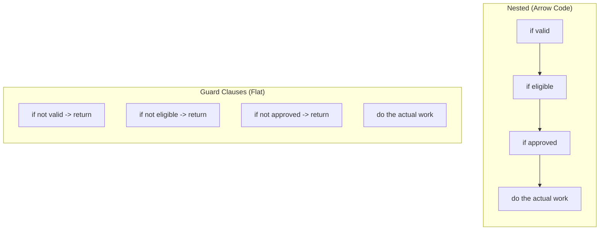

**Java — Before:**
```java
double getPayAmount() {
    double result;
    if (isDead) {
        result = deadAmount();
    } else {
        if (isSeparated) {
            result = separatedAmount();
        } else {
            if (isRetired) {
                result = retiredAmount();
            } else {
                result = normalPayAmount();
            }
        }
    }
    return result;
}
```

**Java — After:**
```java
double getPayAmount() {
    if (isDead) return deadAmount();
    if (isSeparated) return separatedAmount();
    if (isRetired) return retiredAmount();
    return normalPayAmount();
}
```

---

### 2.3 Replace Conditional with Polymorphism
**Description:** Move each branch of a conditional (often a `switch`/`if-else` chain on a type code) into an overriding method in a subclass, and let polymorphism select the right behavior.

**Problem It Solves:** The same type-based conditional logic is repeated across multiple methods, and adding a new type requires hunting down and modifying every conditional.

**When to Use:** You have conditional behavior that varies by an object's "type" and that same type-check pattern recurs in several places.

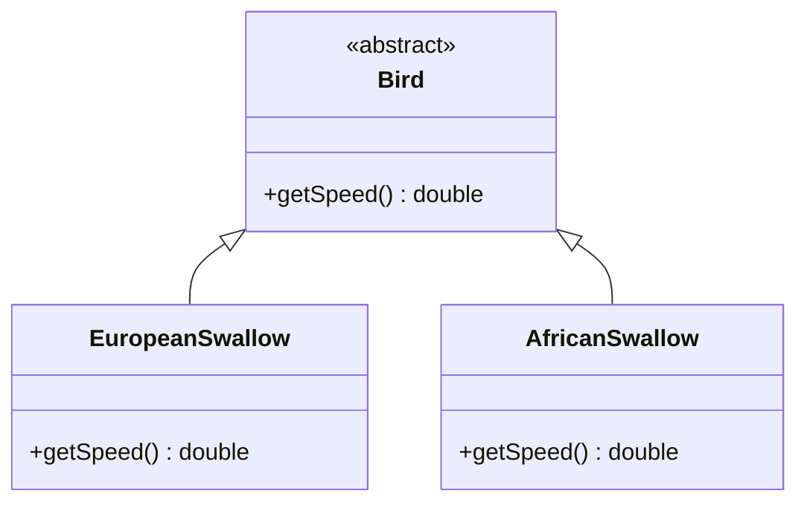

**Java — Before:**
```java
double getSpeed(Bird bird) {
    switch (bird.getType()) {
        case EUROPEAN: return 35;
        case AFRICAN: return 40 - bird.getNumberOfCoconuts() * 2;
        default: throw new IllegalArgumentException("Unknown bird type");
    }
}
```

**Java — After:**
```java
abstract class Bird {
    abstract double getSpeed();
}
class EuropeanSwallow extends Bird {
    double getSpeed() { return 35; }
}
class AfricanSwallow extends Bird {
    private int numberOfCoconuts;
    double getSpeed() { return 40 - numberOfCoconuts * 2; }
}
// Adding a new bird type no longer requires touching this switch statement at all
```

---

### 2.4 Consolidate Conditional Expression
**Description:** Combine a sequence of conditional checks that all lead to the same result into a single condition (using `&&`/`||`), extracted into one well-named method.

**Problem It Solves:** Multiple separate checks that all produce the same outcome obscure the fact that they're really one logical condition.

**When to Use:** Several sequential `if` statements return/do the same thing, hiding that they're actually one combined rule.

**Java — Before:**
```java
double disabilityAmount() {
    if (seniority < 2) return 0;
    if (monthsDisabled > 12) return 0;
    if (isPartTime) return 0;
    // compute actual disability amount
    return normalDisabilityAmount();
}
```

**Java — After:**
```java
double disabilityAmount() {
    if (isNotEligibleForDisability()) return 0;
    return normalDisabilityAmount();
}

private boolean isNotEligibleForDisability() {
    return seniority < 2 || monthsDisabled > 12 || isPartTime;
}
```

---

### 2.5 Introduce Null Object
**Description:** Replace repeated `null` checks with a special "Null Object" subclass that implements default/no-op behavior, so callers don't need to check for null at all.

**Problem It Solves:** Scattered `if (x == null)` checks throughout the codebase are repetitive and error-prone (easy to forget one, causing a `NullPointerException`).

**When to Use:** A field/value is frequently `null` and every caller has to defensively check for it before use.

**Java — Before:**
```java
Customer customer = registry.findCustomer(name);
String plan;
if (customer == null) {
    plan = "basic plan"; // default
} else {
    plan = customer.getPlan();
}
```

**Java — After:**
```java
abstract class Customer {
    abstract String getPlan();
    static Customer NULL = new NullCustomer();
}
class NullCustomer extends Customer {
    String getPlan() { return "basic plan"; } // default behavior lives here, once
}

Customer customer = registry.findCustomer(name); // never returns null now, returns Customer.NULL instead
String plan = customer.getPlan(); // no null check needed anywhere
```

---

## 3. Organizing Data

### 3.1 Encapsulate Field
**Description:** Make a public field private and provide accessor (getter/setter) methods for it.

**Problem It Solves:** Public fields let any code modify state directly, with no place to add validation, logging, or change behavior later without breaking every caller.

**When to Use:** Almost always, for any field on a class meant to have any encapsulated behavior — a foundational refactoring for OO design.

**Java — Before:**
```java
class Account {
    public double balance;
}
account.balance -= 100; // any code can do this, unchecked
```

**Java — After:**
```java
class Account {
    private double balance;
    double getBalance() { return balance; }
    void withdraw(double amount) {
        if (amount > balance) throw new IllegalStateException("Insufficient funds");
        balance -= amount; // validation now centralized
    }
}
```

---

### 3.2 Replace Magic Number with Symbolic Constant
**Description:** Replace a literal number with a named constant that explains its meaning.

**Problem It Solves:** Unexplained numeric literals scattered through code are unclear and risky to change (is `86400` always "seconds in a day," or a coincidence?).

**When to Use:** Any numeric (or string) literal whose meaning isn't immediately obvious from context, especially if it's used in more than one place.

**Java — Before:**
```java
double potentialEnergy(double mass, double height) {
    return mass * 9.81 * height;
}
```

**Java — After:**
```java
static final double GRAVITATIONAL_CONSTANT = 9.81;

double potentialEnergy(double mass, double height) {
    return mass * GRAVITATIONAL_CONSTANT * height;
}
```

---

### 3.3 Replace Data Value with Object
**Description:** Turn a simple data field (a `String`, `int`, etc.) into its own small class once it starts needing associated behavior or additional data.

**Problem It Solves:** A "primitive obsession" smell — using raw primitives for domain concepts that actually have their own rules/behavior (e.g., a phone number that needs formatting/validation).

**When to Use:** A primitive field starts to need validation, formatting, or is passed around with a lot of related logic scattered elsewhere.

**Java — Before:**
```java
class Order {
    private String customerName; // just a raw string
}
```

**Java — After:**
```java
class Customer {
    private final String name;
    Customer(String name) {
        if (name == null || name.isBlank()) throw new IllegalArgumentException("Name required");
        this.name = name;
    }
    String getName() { return name; }
}
class Order {
    private Customer customer; // now a first-class concept with its own rules
}
```

---

### 3.4 Replace Type Code with Class/Enum/Strategy
**Description:** Replace an `int`/`String` "type code" field with a proper type-safe `enum`, or with a class hierarchy/strategy object if behavior varies by type.

**Problem It Solves:** Integer or string type codes (`int type = 1; // 1=GOLD, 2=SILVER`) are error-prone (no compiler checking, no clear list of valid values) and unclear.

**When to Use:** Any field using raw ints/strings to represent a fixed, known set of categories.

**Java — Before:**
```java
class Employee {
    static final int ENGINEER = 0, SALESMAN = 1, MANAGER = 2;
    private int type;

    double payAmount() {
        switch (type) {
            case ENGINEER: return baseSalary;
            case SALESMAN: return baseSalary + commission;
            case MANAGER: return baseSalary + bonus;
            default: throw new IllegalStateException("Unknown type");
        }
    }
}
```

**Java — After:**
```java
enum EmployeeType { ENGINEER, SALESMAN, MANAGER } // type-safe, compiler-checked

class Employee {
    private EmployeeType type;
    double payAmount() {
        return switch (type) {
            case ENGINEER -> baseSalary;
            case SALESMAN -> baseSalary + commission;
            case MANAGER -> baseSalary + bonus;
        }; // compiler enforces all enum cases are handled
    }
}
```

---

### 3.5 Introduce Parameter Object
**Description:** Group a cluster of parameters that are always passed together into a single object.

**Problem It Solves:** Long parameter lists are error-prone (easy to pass arguments in the wrong order) and often signal a missing concept in the domain model.

**When to Use:** Several methods share the same group of parameters, or a parameter list is growing long and unwieldy.

**Java — Before:**
```java
double calculateInterest(double principal, double rate, int startYear, int startMonth, int endYear, int endMonth) {
    // ...
}
```

**Java — After:**
```java
record DateRange(int startYear, int startMonth, int endYear, int endMonth) {}

double calculateInterest(double principal, double rate, DateRange range) {
    // ... range.startYear(), range.endMonth(), etc.
}
```

---

## 4. Simplifying Method Calls / Signatures

### 4.1 Rename Method
**Description:** Change a method's name to better reveal its purpose.

**Problem It Solves:** A misleading or unclear method name forces readers to dig into implementation to understand intent.

**When to Use:** Anytime a name doesn't clearly communicate what the method does — one of the cheapest, highest-value refactorings, especially with IDE-supported safe renaming.

**Java — Before:**
```java
double calc(double a, double b) { return a * b * 0.08; }
```

**Java — After:**
```java
double calculateSalesTax(double price, double quantity) { return price * quantity * 0.08; }
```

---

### 4.2 Preserve Whole Object
**Description:** Instead of passing several individual values extracted from an object, pass the whole object and let the called method extract what it needs.

**Problem It Solves:** Extracting multiple fields from an object just to pass them individually creates unnecessary coupling and long parameter lists, and if the called method later needs another field, the caller must change too.

**When to Use:** A caller is pulling several values out of one object just to pass them all to another method.

**Java — Before:**
```java
int low = range.getLow();
int high = range.getHigh();
boolean within = plan.withinRange(low, high);
```

**Java — After:**
```java
boolean within = plan.withinRange(range); // pass the object itself
// inside withinRange: range.getLow(), range.getHigh()
```

---

### 4.3 Replace Constructor with Factory Method
**Description:** Replace direct `new` calls with a static factory method, enabling subclass selection, caching, or clearer naming of construction intent.

**Problem It Solves:** Plain constructors can't return a subtype, can't easily cache/reuse instances, and constructor overloading with similar signatures gets confusing.

**When to Use:** Object creation logic needs to choose between subtypes, needs meaningful naming for different construction paths, or benefits from caching.

**Java — Before:**
```java
Employee engineer = new Employee(EmployeeType.ENGINEER);
Employee salesman = new Employee(EmployeeType.SALESMAN);
```

**Java — After:**
```java
class Employee {
    static Employee createEngineer() { return new Engineer(); }
    static Employee createSalesman() { return new Salesman(); }
    // constructor can now be made private/protected
}
Employee engineer = Employee.createEngineer(); // clearer intent, can return actual subclasses
```

---

### 4.4 Replace Error Code with Exception
**Description:** Instead of returning a special error code that the caller must remember to check, throw an exception for the exceptional case.

**Problem It Solves:** Error codes are easy to ignore (no compiler enforcement), and they mix normal-path logic with error-handling logic at the call site.

**When to Use:** A method returns a sentinel/error code (`-1`, `null`, etc.) that callers must explicitly check, especially for truly exceptional conditions rather than expected outcomes.

**Java — Before:**
```java
int withdraw(double amount) {
    if (amount > balance) return -1; // error code
    balance -= amount;
    return 0;
}
// caller
if (account.withdraw(100) == -1) {
    // handle error — easy to forget this check!
}
```

**Java — After:**
```java
void withdraw(double amount) {
    if (amount > balance) throw new InsufficientFundsException(amount, balance);
    balance -= amount;
}
// caller
try {
    account.withdraw(100);
} catch (InsufficientFundsException ex) {
    // compiler/IDE nudges you to handle this — impossible to silently ignore
}
```

---

## 5. Moving Features Between Objects

### 5.1 Extract Class
**Description:** When a class is doing the work of two (or more) concepts, split it into two classes, each with a clear single responsibility.

**Problem It Solves:** A "God class" that has grown to handle multiple unrelated responsibilities becomes hard to understand, test, and change safely.

**When to Use:** A class has methods and data that naturally cluster into two distinct groups (a classic sign is a subset of methods/fields only used together, separate from the rest).

```mermaid
flowchart LR
    subgraph Before
        Person["Person
        - name, officeAreaCode, officeNumber
        - getTelephoneNumber&#40;&#41;"]
    end
    subgraph After
        P2["Person
        - name
        - getTelephoneNumber&#40;&#41; delegates"]
        TN["TelephoneNumber
        - areaCode, number
        - getTelephoneNumber&#40;&#41;"]
        P2 --> TN
    end
```

**Java — Before:**
```java
class Person {
    private String name;
    private String officeAreaCode;
    private String officeNumber;

    String getTelephoneNumber() { return "(" + officeAreaCode + ") " + officeNumber; }
}
```

**Java — After:**
```java
class TelephoneNumber {
    private String areaCode, number;
    String getTelephoneNumber() { return "(" + areaCode + ") " + number; }
}
class Person {
    private String name;
    private TelephoneNumber officeTelephone = new TelephoneNumber();

    String getTelephoneNumber() { return officeTelephone.getTelephoneNumber(); }
}
```

---

### 5.2 Inline Class
**Description:** The opposite of Extract Class — merge a class that's no longer pulling its weight back into another class.

**Problem It Solves:** Over-decomposition where a class has very little responsibility left (perhaps after other refactorings moved most of its behavior elsewhere), adding indirection without benefit.

**When to Use:** A class does almost nothing on its own and mostly just delegates to another class.

---

### 5.3 Move Method
**Description:** Move a method to the class it uses most (its data or other methods), possibly leaving a simple delegating method behind if needed.

**Problem It Solves:** "Feature envy" — a method defined on class A but that mostly calls methods/fields on class B suggests it actually belongs on B.

**When to Use:** A method uses another object's data/methods more than its own class's — a classic sign it's in the wrong place.

**Java — Before:**
```java
class Account {
    private AccountType type;
    private double daysOverdrawn;

    double overdraftCharge() {
        if (type.isPremium()) {
            double result = 10;
            if (daysOverdrawn > 7) result += (daysOverdrawn - 7) * 0.85;
            return result;
        }
        return daysOverdrawn * 1.75;
    }
}
```

**Java — After:**
```java
class AccountType {
    boolean isPremium;
    double overdraftCharge(double daysOverdrawn) { // moved to where the "isPremium" concept lives
        if (isPremium) {
            double result = 10;
            if (daysOverdrawn > 7) result += (daysOverdrawn - 7) * 0.85;
            return result;
        }
        return daysOverdrawn * 1.75;
    }
}
class Account {
    private AccountType type;
    private double daysOverdrawn;
    double overdraftCharge() { return type.overdraftCharge(daysOverdrawn); }
}
```

---

### 5.4 Hide Delegate / Remove Middle Man
**Description:** **Hide Delegate** — make a client call a wrapper method on an object rather than reaching through it to call a method on one of its fields (avoiding "train wrecks" like `a.getB().getC().doSomething()`). **Remove Middle Man** is its inverse — if a class has become just a pile of pure delegating methods with no real logic of its own, let clients call the delegate directly instead.

**Problem It Solves:** Deep call chains (`person.getDepartment().getManager().getName()`) tightly couple the caller to the internal structure of collaborating objects — if that structure changes, every caller breaks.

**When to Use:** Use Hide Delegate when a client needs to reach through an object's internals repeatedly. Use Remove Middle Man when the delegation wrapper adds no value anymore.

**Java — Before (train wreck):**
```java
String managerName = person.getDepartment().getManager().getName();
```

**Java — After (Hide Delegate):**
```java
class Person {
    private Department department;
    String getManagerName() { return department.getManager().getName(); } // hides internal structure
}
String managerName = person.getManagerName();
```

---

## 6. Dealing with Generalization / Inheritance

### 6.1 Pull Up Method / Pull Up Field
**Description:** Move a method or field that's duplicated in multiple subclasses up into their shared superclass.

**Problem It Solves:** Duplicate logic/data across sibling subclasses should live in one place — the shared superclass.

**When to Use:** Two or more subclasses have identical (or near-identical) methods/fields.

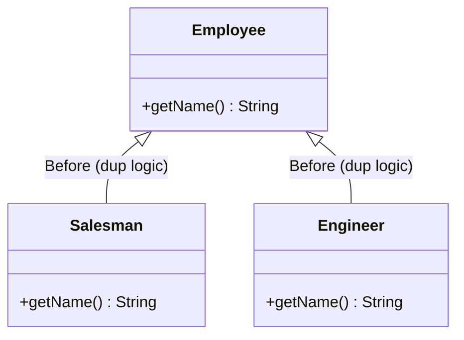

**Java — Before:**
```java
class Salesman extends Employee {
    String getName() { return "Sales: " + name; } // duplicated pattern
}
class Engineer extends Employee {
    String getName() { return "Eng: " + name; } // duplicated pattern, slightly different
}
```

**Java — After:**
```java
abstract class Employee {
    protected String name;
    String getName() { return getTitlePrefix() + ": " + name; } // pulled up, common structure
    abstract String getTitlePrefix();
}
class Salesman extends Employee {
    String getTitlePrefix() { return "Sales"; }
}
class Engineer extends Employee {
    String getTitlePrefix() { return "Eng"; }
}
```

---

### 6.2 Push Down Method / Push Down Field
**Description:** The opposite — move a method/field that's only relevant to some subclasses out of the superclass and down into just those subclasses.

**Problem It Solves:** A superclass method/field that only makes sense for a subset of its subclasses pollutes the general abstraction with specifics that don't apply everywhere.

**When to Use:** A superclass member is only used/meaningful in one (or a few) subclasses, not all of them.

---

### 6.3 Extract Superclass / Extract Interface
**Description:** **Extract Superclass** — create a common superclass for two classes with similar features, moving shared members up. **Extract Interface** — extract just the common method signatures (no implementation) into an interface, so unrelated classes can share a common type without sharing implementation.

**Problem It Solves:** Duplicated structure/behavior across unrelated classes, or client code that needs to treat several different classes uniformly through a common contract.

**When to Use:** Extract Superclass when classes share both structure and behavior. Extract Interface when classes just need to be usable interchangeably by client code (e.g., for dependency injection, testing with mocks).

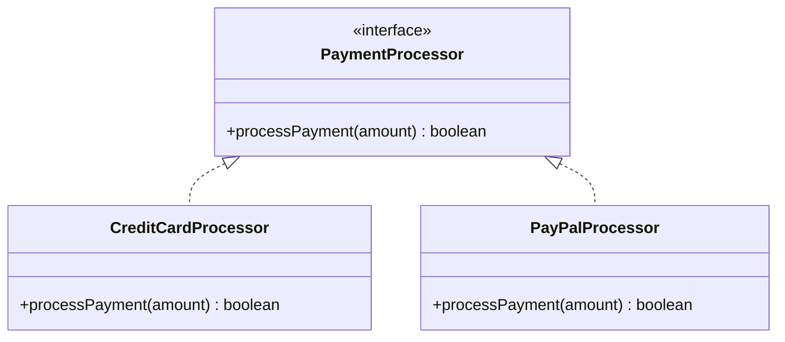

**Java — After (Extract Interface):**
```java
interface PaymentProcessor {
    boolean processPayment(double amount);
}
class CreditCardProcessor implements PaymentProcessor {
    public boolean processPayment(double amount) { /* ... */ return true; }
}
class PayPalProcessor implements PaymentProcessor {
    public boolean processPayment(double amount) { /* ... */ return true; }
}
// Client code depends only on the interface — easy to swap implementations or mock in tests
void checkout(PaymentProcessor processor, double amount) {
    processor.processPayment(amount);
}
```

---

### 6.4 Replace Inheritance with Delegation (Composition)
**Description:** When a subclass only uses part of its superclass's interface, or overrides methods to effectively "opt out" of inherited behavior, replace the "is-a" inheritance relationship with a "has-a" delegation relationship instead.

**Problem It Solves:** Misused inheritance — where a subclass inherits behavior it doesn't want, forcing awkward overrides that throw exceptions or do nothing, violating the Liskov Substitution Principle.

**When to Use:** A subclass extends a class but overrides/disables much of its inherited behavior — a strong signal that "is-a" is the wrong relationship; "has-a" (composition) is more accurate. This is the practical embodiment of "favor composition over inheritance."

**Java — Before (misused inheritance):**
```java
class Stack<T> extends ArrayList<T> { // Stack "is-a" ArrayList — but shouldn't allow random access/insertion!
    void push(T item) { add(item); }
    T pop() { return remove(size() - 1); }
    // problem: callers can still call add(index, item), remove(index), etc. — breaking stack semantics
}
```

**Java — After (composition):**
```java
class Stack<T> {
    private final List<T> items = new ArrayList<>(); // "has-a" list, not "is-a" list

    void push(T item) { items.add(item); }
    T pop() { return items.remove(items.size() - 1); }
    boolean isEmpty() { return items.isEmpty(); }
    // only the operations that make sense for a Stack are exposed — encapsulation restored
}
```

---

### 6.5 Form Template Method
**Description:** When subclasses implement similar algorithms with the same overall steps but different details in each step, factor the common step sequence into a superclass method (the template), and let subclasses override just the individual steps.

**Problem It Solves:** Sibling subclasses each implement a similar multi-step algorithm with slightly different logic per step, duplicating the *sequence* of steps everywhere.

**When to Use:** You see the same overall algorithm structure repeated in subclasses, differing only in specific steps.

**Java — Before:**
```java
class HourlyEmployeeReport {
    void printReport() {
        printHeader();
        printHourlyDetails(); // specific logic here
        printFooter();
    }
}
class SalariedEmployeeReport {
    void printReport() {
        printHeader();
        printSalariedDetails(); // duplicated sequence, different middle step
        printFooter();
    }
}
```

**Java — After:**
```java
abstract class EmployeeReport {
    final void printReport() {   // the "template" — final so subclasses can't change the sequence
        printHeader();
        printDetails();          // the varying step — deferred to subclasses
        printFooter();
    }
    abstract void printDetails();
    void printHeader() { /* shared */ }
    void printFooter() { /* shared */ }
}
class HourlyEmployeeReport extends EmployeeReport {
    void printDetails() { /* hourly-specific logic */ }
}
class SalariedEmployeeReport extends EmployeeReport {
    void printDetails() { /* salaried-specific logic */ }
}
```

---

## 7. Large-Scale / Architectural Refactoring

These operate at a system/module level rather than within a single class, and typically take days-to-months rather than minutes, requiring careful, incremental rollout.

### 7.1 Branch by Abstraction
**Description:** Introduce an abstraction layer in front of the code you want to replace, switch callers to use the abstraction, build the new implementation behind it, then swap the implementation and remove the old one — all without a long-lived feature branch.

**Problem It Solves:** Replacing a core piece of shared infrastructure (a data access layer, a payment provider) can't be done in one atomic commit without breaking everyone; a long-lived branch risks painful merge conflicts.

**When to Use:** Swapping out a widely-used component/library/service in a large codebase with many active contributors, where trunk-based development must continue uninterrupted.

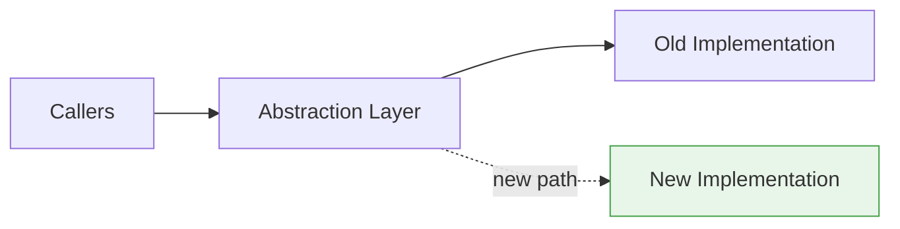

**Java Snippet:**
```java
interface PaymentGateway {
    boolean charge(double amount);
}
class LegacyPaymentGateway implements PaymentGateway { /* old implementation, still live */ }
class ModernPaymentGateway implements PaymentGateway { /* new implementation, built alongside */ }

class PaymentGatewayFactory {
    static PaymentGateway create() {
        return featureFlags.isEnabled("new-payment-gateway")
            ? new ModernPaymentGateway()
            : new LegacyPaymentGateway();      // toggle via config, no code branch needed
    }
}
```

---

### 7.2 Parallel Change (Expand-Contract)
**Description:** Change an interface/API in three phases: **Expand** (add the new interface alongside the old one), **Migrate** (move all callers over to the new interface one at a time), **Contract** (remove the old interface once nothing uses it).

**Problem It Solves:** Changing a widely-used API signature in one atomic step breaks every caller simultaneously; expand-contract lets you migrate incrementally and safely.

**When to Use:** Changing a public API, database schema, or shared method signature used by many callers across a large codebase or multiple services.

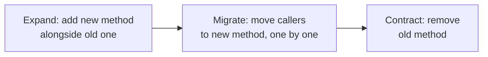

**Java Snippet:**
```java
class UserService {
    // Old method — kept temporarily during migration
    @Deprecated
    User getUser(int id) { return getUserById(id); }

    // New method — the expand phase
    User getUserById(long id) { /* real implementation */ return null; }
}
// Migrate phase: update callers one at a time from getUser(id) to getUserById(id)
// Contract phase: once no callers remain, delete the @Deprecated getUser(int) method
```

---

### 7.3 Sprout Method / Sprout Class
**Description:** When adding new behavior to legacy code that's too risky/hard to modify directly (no tests, tangled logic), write the new behavior as a brand-new method or class, and call it from a single, minimal insertion point in the legacy code.

**Problem It Solves:** Untested legacy code is risky to modify directly; sprouting keeps new logic isolated, testable, and easy to review, while touching the legacy code as little as possible (from Michael Feathers' *Working Effectively with Legacy Code*).

**When to Use:** Adding a new feature/behavior to legacy code that lacks a safety net of tests, where a full refactor of the legacy method isn't yet feasible.

**Java — Before (untested legacy method):**
```java
void processOrder(Order order) {
    // 200 lines of untested, tangled legacy logic...
}
```

**Java — After (sprouted, testable addition):**
```java
void processOrder(Order order) {
    // 200 lines of untested legacy logic, untouched...
    applyLoyaltyDiscount(order); // single new line inserted — the "sprout"
}

// New, fully unit-tested method — isolated from the legacy tangle
void applyLoyaltyDiscount(Order order) {
    if (order.getCustomer().isLoyaltyMember()) {
        order.applyDiscount(0.05);
    }
}
```

---

## 8. Code Smell → Refactoring Map

| Code Smell | Likely Refactoring(s) |
|---|---|
| Long Method | Extract Method, Replace Method with Method Object, Decompose Conditional |
| Large Class / God Object | Extract Class, Move Method |
| Long Parameter List | Introduce Parameter Object, Preserve Whole Object |
| Duplicated Code | Extract Method, Pull Up Method, Form Template Method |
| Primitive Obsession | Replace Data Value with Object, Replace Type Code with Class/Enum |
| Switch Statements on Type | Replace Conditional with Polymorphism |
| Feature Envy | Move Method |
| Data Clumps | Extract Class, Introduce Parameter Object |
| Deeply Nested Conditionals | Replace Nested Conditional with Guard Clauses |
| Comments Explaining a Block | Extract Method (name the method instead of commenting the block) |
| Message Chains ("train wrecks") | Hide Delegate |
| Middle Man (empty delegation) | Remove Middle Man |
| Refused Bequest (subclass ignores inherited members) | Replace Inheritance with Delegation, Push Down Method/Field |
| Speculative Generality (unused flexibility) | Collapse Hierarchy, Inline Class, Remove unused parameters |

---

## 9. The Safe Refactoring Process

Refactoring is defined as changing internal structure *without changing external behavior*. The process matters as much as the individual techniques:

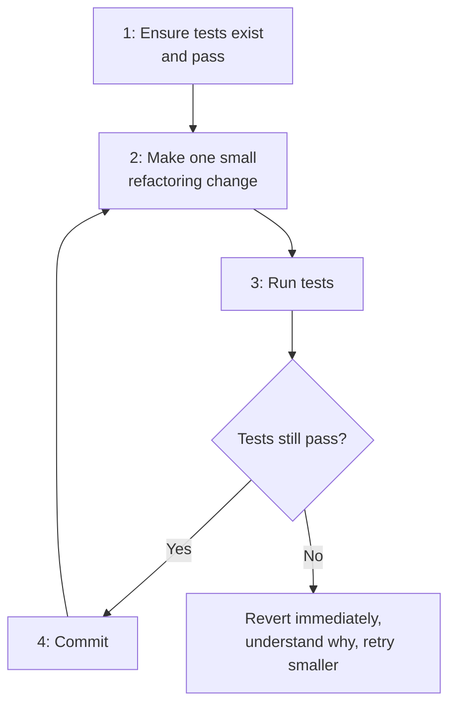

**Core rules for safe refactoring:**
1. **Never refactor without a safety net.** If tests don't exist for the code you're touching, write characterization tests first (tests that capture *current* behavior, even if it's imperfect) before changing structure.
2. **Take the smallest possible steps.** Each refactoring should be small enough to verify quickly and revert easily if something breaks.
3. **Run tests after every single step**, not just at the end of a refactoring session — this is what makes refactoring safe rather than a rewrite in disguise.
4. **Commit frequently**, so you always have a known-good point to return to.
5. **Separate refactoring commits from feature/behavior commits.** Mixing "I restructured this" with "I also changed what it does" makes code review and rollback much harder.
6. **Prefer automated/IDE-supported refactorings** (rename, extract method, etc. in IntelliJ/Eclipse) over manual find-and-replace — tooling guarantees correctness that manual edits can't.
7. **Refactor in the direction of a change you're about to make** ("make the change easy, then make the easy change" — Kent Beck), rather than refactoring speculatively with no concrete need.

---

*Categories and technique names follow Martin Fowler's "Refactoring: Improving the Design of Existing Code" (2nd ed.), supplemented with legacy-code techniques from Michael Feathers' "Working Effectively with Legacy Code" (Sprout Method/Class) and modern continuous-delivery practice (Branch by Abstraction, Parallel Change) as documented by Martin Fowler and the ThoughtWorks Technology Radar.*
