# Refactoring: Improving the Design of Existing Code — Complete Catalog

*Based on Martin Fowler's "Refactoring: Improving the Design of Existing Code," 2nd Edition (2018). Organized exactly as the book's catalog chapters. Each refactoring includes: Description, Use Case, a Diagram, and a Java Before/After code snippet.*

---

## Master List of All Refactorings (by Chapter)

**Ch. 6 — A First Set of Refactorings**
1. Extract Function
2. Inline Function
3. Extract Variable
4. Inline Variable
5. Change Function Declaration
6. Encapsulate Variable
7. Rename Variable
8. Introduce Parameter Object
9. Combine Functions into Class
10. Combine Functions into Transform
11. Split Phase

**Ch. 7 — Encapsulation**
12. Encapsulate Record
13. Encapsulate Collection
14. Replace Primitive with Object
15. Replace Temp with Query
16. Extract Class
17. Inline Class
18. Hide Delegate
19. Remove Middle Man
20. Substitute Algorithm

**Ch. 8 — Moving Features**
21. Move Function
22. Move Field
23. Move Statements into Function
24. Move Statements to Callers
25. Replace Inline Code with Function Call
26. Slide Statements
27. Split Loop
28. Replace Loop with Pipeline
29. Remove Dead Code

**Ch. 9 — Organizing Data**
30. Split Variable
31. Rename Field
32. Replace Derived Variable with Query
33. Change Reference to Value
34. Change Value to Reference

**Ch. 10 — Simplifying Conditional Logic**
35. Decompose Conditional
36. Consolidate Conditional Expression
37. Replace Nested Conditional with Guard Clauses
38. Replace Conditional with Polymorphism
39. Introduce Special Case (Null Object)
40. Introduce Assertion

**Ch. 11 — Refactoring APIs**
41. Separate Query from Modifier
42. Parameterize Function
43. Remove Flag Argument
44. Preserve Whole Object
45. Replace Parameter with Query
46. Replace Query with Parameter
47. Remove Setting Method
48. Replace Constructor with Factory Function
49. Replace Function with Command
50. Replace Command with Function

**Ch. 12 — Dealing with Inheritance**
51. Pull Up Method
52. Pull Up Field
53. Pull Up Constructor Body
54. Push Down Method
55. Push Down Field
56. Replace Type Code with Subclasses
57. Remove Subclass
58. Extract Superclass
59. Collapse Hierarchy
60. Replace Subclass with Delegate
61. Replace Superclass with Delegate

---

## Ch. 6 — A First Set of Refactorings

### 1. Extract Function
**Description:** Turn a code fragment into its own function, named for what it does.
**Use Case:** A method mixes several levels of detail; pulling a fragment into `calculateTax()` lets the caller read at one level of abstraction.
```mermaid
flowchart LR
    A[printOwing&#40;&#41;: inline calc + print] -->|extract| B[printOwing&#40;&#41;] --> C[calculateOutstanding&#40;&#41;]
```
```java
// Before
void printOwing() {
    double outstanding = 0;
    for (Order o : orders) outstanding += o.getAmount();
    System.out.println("Owing: " + outstanding);
}
// After
void printOwing() {
    System.out.println("Owing: " + calculateOutstanding());
}
double calculateOutstanding() {
    return orders.stream().mapToDouble(Order::getAmount).sum();
}
```

### 2. Inline Function
**Description:** Replace a function call with the function's body when the indirection adds no clarity.
**Use Case:** A one-line wrapper method that just delegates, making callers trace an extra hop for no benefit.
```mermaid
flowchart LR
    A[rating&#40;&#41; calls moreThanFive&#40;&#41;] -->|inline| B[rating&#40;&#41; has logic directly]
```
```java
// Before
int rating() { return moreThanFiveLateDeliveries() ? 2 : 1; }
boolean moreThanFiveLateDeliveries() { return numberOfLateDeliveries > 5; }
// After
int rating() { return numberOfLateDeliveries > 5 ? 2 : 1; }
```

### 3. Extract Variable
**Description:** Give a name to a complex sub-expression to explain its purpose.
**Use Case:** A dense boolean expression in an `if` condition that requires re-reading to understand.
```java
// Before
if (order.quantity * order.itemPrice - Math.max(0, order.quantity - 500) * order.itemPrice * 0.05 +
    Math.min(order.quantity * order.itemPrice * 0.1, 100) > 1000) { /*...*/ }
// After
double basePrice = order.quantity * order.itemPrice;
double quantityDiscount = Math.max(0, order.quantity - 500) * order.itemPrice * 0.05;
double shipping = Math.min(basePrice * 0.1, 100);
if (basePrice - quantityDiscount + shipping > 1000) { /*...*/ }
```

### 4. Inline Variable
**Description:** Replace a variable that adds no explanatory value with its expression directly.
**Use Case:** `boolean isActive = order.status == Status.ACTIVE;` used only once, adding no real clarity beyond the expression itself.
```java
// Before
boolean isActive = order.status == Status.ACTIVE;
return isActive;
// After
return order.status == Status.ACTIVE;
```

### 5. Change Function Declaration
**Description:** Rename a function and/or change its parameter list to better express intent (covers what used to be separate "Rename Method" and "Add/Remove Parameter" refactorings).
**Use Case:** `calc(a, b)` doesn't say what it computes or what `a`/`b` mean.
```mermaid
flowchart LR
    A["calc&#40;a, b&#41;"] -->|rename + clarify params| B["calculateSalesTax&#40;price, quantity&#41;"]
```
```java
// Before
double calc(double a, double b) { return a * b * 0.08; }
// After
double calculateSalesTax(double price, double quantity) { return price * quantity * 0.08; }
```

### 6. Encapsulate Variable
**Description:** Wrap access to a variable (especially a widely-shared/global one) behind getter/setter functions.
**Use Case:** A shared mutable field accessed directly from many places, making it hard to add validation or track changes.
```java
// Before
public static Map<String, Customer> customerData;
// After
private static Map<String, Customer> customerData;
public static Map<String, Customer> getCustomerData() { return customerData; }
public static void setCustomerData(Map<String, Customer> data) { customerData = new HashMap<>(data); }
```

### 7. Rename Variable
**Description:** Give a variable a clearer, more descriptive name.
**Use Case:** `int d;` used for "elapsed days" — unreadable without context.
```java
// Before
int d; // elapsed time in days
// After
int elapsedTimeInDays;
```

### 8. Introduce Parameter Object
**Description:** Replace a group of parameters that are always passed together with a single object.
**Use Case:** Multiple methods share the same repeated group of parameters (a date range, a coordinate pair).
```mermaid
flowchart LR
    A["calc&#40;startY, startM, endY, endM&#41;"] -->|group| B["calc&#40;DateRange range&#41;"]
```
```java
// Before
double amountInvoiced(int startY, int startM, int endY, int endM) { /*...*/ }
// After
record DateRange(int startYear, int startMonth, int endYear, int endMonth) {}
double amountInvoiced(DateRange range) { /*...*/ }
```

### 9. Combine Functions into Class
**Description:** Group functions that operate on the same shared data into a class, with the data as fields.
**Use Case:** Several free-standing functions (`base(reading)`, `taxableCharge(reading)`) all take the same `reading` parameter.
```java
// Before
double base(Reading reading) { return reading.baseRate * reading.quantity; }
double taxableCharge(Reading reading) { return Math.max(0, base(reading) - taxThreshold); }
// After
class ReadingCalculator {
    private final Reading reading;
    ReadingCalculator(Reading reading) { this.reading = reading; }
    double base() { return reading.baseRate * reading.quantity; }
    double taxableCharge() { return Math.max(0, base() - taxThreshold); }
}
```

### 10. Combine Functions into Transform
**Description:** Similar to the previous, but instead of a class, use a transform function that takes a data record and enriches/returns a new record with derived fields pre-calculated.
**Use Case:** Read-only derived data used by multiple downstream consumers — a functional alternative to Combine Functions into Class.
```java
// Before: each caller recomputes base() / taxableCharge() separately
// After
Reading enrichReading(Reading raw) {
    double base = raw.baseRate * raw.quantity;
    double taxableCharge = Math.max(0, base - taxThreshold);
    return raw.withDerived(base, taxableCharge); // returns new immutable record with fields precomputed
}
```

### 11. Split Phase
**Description:** Split code that's doing two distinct things in sequence (e.g., parsing input, then calculating results) into two clearly separated phases, passing an intermediate data structure between them.
**Use Case:** A function parses raw order text AND computes pricing in the same block, making each part hard to test/modify independently.
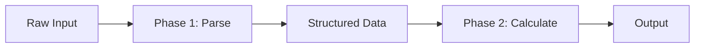
```java
// Before
double priceOrder(String rawOrderLine) {
    String[] parts = rawOrderLine.split(",");
    String product = parts[0]; int qty = Integer.parseInt(parts[1]);
    return productPrice(product) * qty;
}
// After
record OrderLine(String product, int quantity) {}
OrderLine parseOrder(String raw) {
    String[] parts = raw.split(",");
    return new OrderLine(parts[0], Integer.parseInt(parts[1]));
}
double priceOrder(OrderLine order) {
    return productPrice(order.product()) * order.quantity();
}
```

---

## Ch. 7 — Encapsulation

### 12. Encapsulate Record
**Description:** Wrap a raw record/struct-like data structure in a class so field access can be controlled and behavior added later.
**Use Case:** A plain data class (e.g. a `Map<String,Object>` or public-field struct) is accessed directly all over the codebase.
```java
// Before
Map<String, Object> organization = Map.of("name", "Acme", "country", "US");
// After
class Organization {
    private String name, country;
    Organization(Map<String, Object> data) { this.name = (String) data.get("name"); this.country = (String) data.get("country"); }
    String getName() { return name; }
}
```

### 13. Encapsulate Collection
**Description:** Don't return the raw underlying collection field directly; return an unmodifiable view (or provide add/remove methods) so callers can't mutate internal state unexpectedly.
**Use Case:** A `getOrders()` getter returns the live internal `List`, letting any caller `clear()` or corrupt it.
```java
// Before
public List<Order> getOrders() { return orders; } // callers can mutate directly!
// After
public List<Order> getOrders() { return Collections.unmodifiableList(orders); }
public void addOrder(Order o) { orders.add(o); } // controlled mutation point
```

### 14. Replace Primitive with Object
**Description:** Turn a primitive value (int, String) into a small object once it needs associated behavior or validation.
**Use Case:** A raw `String phoneNumber` field needs formatting/validation logic scattered across the codebase.
```java
// Before
String phoneNumber;
// After
class PhoneNumber {
    private final String areaCode, number;
    PhoneNumber(String raw) { /* parse & validate */ this.areaCode = raw.substring(0,3); this.number = raw.substring(3); }
    String format() { return "(" + areaCode + ") " + number; }
}
```

### 15. Replace Temp with Query
**Description:** Extract a temp variable's expression into its own method so it can be reused and tested independently.
**Use Case:** A local variable computed once but conceptually reusable elsewhere in the class.
```java
// Before
double basePrice = quantity * itemPrice;
return basePrice > 1000 ? basePrice * 0.95 : basePrice;
// After
double basePrice() { return quantity * itemPrice; }
double finalPrice() { return basePrice() > 1000 ? basePrice() * 0.95 : basePrice(); }
```

### 16. Extract Class
**Description:** Split a class doing the work of two into two classes, each with a single responsibility.
**Use Case:** A `Person` class holds both personal info and telephone-number logic — two distinct concepts bundled together.
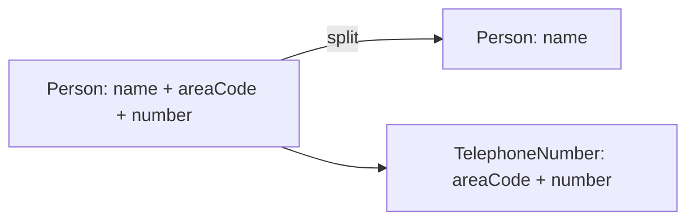
```java
class TelephoneNumber {
    private String areaCode, number;
    String toDisplay() { return "(" + areaCode + ") " + number; }
}
class Person {
    private String name;
    private TelephoneNumber phone = new TelephoneNumber();
}
```

### 17. Inline Class
**Description:** The opposite of Extract Class — merge a class that's no longer earning its keep into another.
**Use Case:** After other refactorings, a class is left with almost no responsibility of its own, mostly delegating.
```java
// Before: separate TrackingInformation class with a single field and pass-through methods
// After: fold display/deliveryDate directly into Shipment, removing the near-empty class
```

### 18. Hide Delegate
**Description:** Have a client call a wrapper method rather than reaching through an object to call a method on one of its fields.
**Use Case:** `person.getDepartment().getManager()` — callers depend on `Person`'s internal structure.
```java
// Before
Manager m = person.getDepartment().getManager();
// After
class Person {
    Manager getManager() { return department.getManager(); } // hides Department from callers
}
Manager m = person.getManager();
```

### 19. Remove Middle Man
**Description:** The inverse of Hide Delegate — if a class has become just a thin pass-through wrapper, let clients call the delegate directly.
**Use Case:** `Person` has accumulated dozens of trivial delegating methods to `Department`, adding no real value.
```java
// Before: Person.getManager(), Person.getBudget(), Person.getLocation() all just delegate
// After: expose department directly
Department department = person.getDepartment();
Manager m = department.getManager(); // client calls Department directly, skipping the middle man
```

### 20. Substitute Algorithm
**Description:** Replace an algorithm's implementation with a clearer, simpler, or more efficient one that produces the same result.
**Use Case:** A manually-written loop-based search can be replaced with a clearer built-in/standard-library equivalent.
```java
// Before
String found = null;
for (String candidate : candidates) {
    if (candidate.equals("target")) { found = candidate; break; }
}
// After
String found = candidates.stream().filter(c -> c.equals("target")).findFirst().orElse(null);
```

---

## Ch. 8 — Moving Features

### 21. Move Function
**Description:** Move a function to the class/module it uses most (its data or collaborators), leaving a delegator if needed.
**Use Case:** "Feature envy" — a method in class A mostly reads/calls class B's members.
```mermaid
flowchart LR
    A["Account.overdraftCharge&#40;&#41;
    (uses AccountType heavily)"] -->|move| B["AccountType.overdraftCharge&#40;&#41;"]
```
```java
// Before (in Account)
double overdraftCharge() { return type.isPremium() ? 10 : daysOverdrawn * 1.75; }
// After (moved to AccountType)
class AccountType {
    double overdraftCharge(double daysOverdrawn) { return isPremium ? 10 : daysOverdrawn * 1.75; }
}
```

### 22. Move Field
**Description:** Move a field to the class it's more naturally associated with.
**Use Case:** A `discountRate` field lives on `Customer` but is really about the `CustomerContract`.
```java
// Before: Customer holds discountRate directly
// After: CustomerContract holds discountRate; Customer.getDiscountRate() delegates to contract.getDiscountRate()
```

### 23. Move Statements into Function
**Description:** If a statement is always duplicated right before/after every call to a function, move that statement into the function itself.
**Use Case:** Every caller of `renderPerson()` also calls `photoLink()` right before it — should just be part of the function.
```java
// Before
result += photoDiv(person);
result += renderPerson(person);
// After (photoDiv moved inside)
result += renderPerson(person); // now includes the photo div internally
```

### 24. Move Statements to Callers
**Description:** The opposite — if a function does something that not all callers want, move that statement back out to the specific callers that need it.
**Use Case:** A shared function grows a piece of logic only relevant to one particular caller, hurting its general reusability.

### 25. Replace Inline Code with Function Call
**Description:** Replace repeated inline logic with a call to an existing function that already does the same thing.
**Use Case:** Duplicated appliance-of-discount code exists inline in three places while a `Discount.apply()` method already exists.
```java
// Before
double discounted = price - (price * 0.1); // repeated inline in several places
// After
double discounted = discountPolicy.apply(price); // reuses existing function
```

### 26. Slide Statements
**Description:** Move related statements so they sit next to each other, improving readability and enabling further extraction.
**Use Case:** Declaration and first use of a variable are far apart, with unrelated code in between.

### 27. Split Loop
**Description:** If a loop does two different things at once (e.g., summing totals AND finding a max), split it into two separate loops, one per responsibility.
**Use Case:** A single `for` loop accumulates a total *and* tracks the youngest employee — two unrelated tasks tangled together.
```java
// Before
double total = 0; Employee youngest = null;
for (Employee e : employees) {
    total += e.salary;
    if (youngest == null || e.age < youngest.age) youngest = e;
}
// After
double total = employees.stream().mapToDouble(e -> e.salary).sum();
Employee youngest = employees.stream().min(Comparator.comparingInt(e -> e.age)).orElse(null);
```

### 28. Replace Loop with Pipeline
**Description:** Replace an explicit loop with a chain of collection-pipeline operations (map/filter/reduce).
**Use Case:** A verbose `for` loop that filters and transforms a list can read far more declaratively as a stream pipeline.
```java
// Before
List<String> names = new ArrayList<>();
for (Employee e : employees) { if (e.isActive()) names.add(e.getName()); }
// After
List<String> names = employees.stream().filter(Employee::isActive).map(Employee::getName).toList();
```

### 29. Remove Dead Code
**Description:** Delete code that's no longer called/used from anywhere.
**Use Case:** An old feature flag branch or deprecated method that nothing references anymore, cluttering the codebase and confusing readers.
```java
// Before
@Deprecated
void oldCalculationMethod() { /* unused since 2019, still present */ }
// After
// deleted entirely — version control preserves history if ever needed again
```

---

## Ch. 9 — Organizing Data

### 30. Split Variable
**Description:** Give each distinct responsibility of a reused variable its own name, rather than reassigning one variable for multiple purposes.
**Use Case:** `temp` is used first to hold a perimeter calculation, then reassigned to hold an area calculation — two unrelated uses of one name.
```java
// Before
double temp = 2 * (height + width);
System.out.println(temp);
temp = height * width;
System.out.println(temp);
// After
double perimeter = 2 * (height + width);
System.out.println(perimeter);
double area = height * width;
System.out.println(area);
```

### 31. Rename Field
**Description:** Give a class field (often in a persistent record) a clearer name.
**Use Case:** A field named `data1` in a legacy `Customer` record should be renamed to `customerId` once its meaning is understood.

### 32. Replace Derived Variable with Query
**Description:** Instead of storing a value that's calculated from other data, recompute it via a method each time it's needed, removing the risk of it going stale.
**Use Case:** A cached `totalDiscount` field can drift out of sync if the underlying line items change without updating it.
```java
// Before
class Order { double totalDiscount; /* set once, can go stale */ }
// After
class Order {
    double totalDiscount() { return items.stream().mapToDouble(Item::discount).sum(); } // always fresh
}
```

### 33. Change Reference to Value
**Description:** Turn a reference object (mutable, shared, identity-based equality) into a value object (immutable, compared by content).
**Use Case:** Two `Money` objects with the same amount/currency should be treated as equal, not compared by object identity.
```java
// Before: Money is mutable, compared with ==
// After
final class Money {
    private final BigDecimal amount; private final Currency currency;
    Money(BigDecimal amount, Currency currency) { this.amount = amount; this.currency = currency; }
    @Override public boolean equals(Object o) { /* compares amount+currency, not identity */ return true; }
}
```

### 34. Change Value to Reference
**Description:** The opposite — when many copies of logically "the same" object need to stay in sync, replace duplicated value objects with a single shared reference.
**Use Case:** Multiple `Order` objects each hold their own copy of `Customer` data; when the customer's address changes, all copies must be found and updated — better to share one `Customer` reference looked up by ID.

---

## Ch. 10 — Simplifying Conditional Logic

### 35. Decompose Conditional
**Description:** Extract the condition and each branch of a complex `if` into separate, well-named methods.
**Use Case:** A conditional computing seasonal billing rates buries the "what" behind complex date-range logic.
```java
// Before
if (date.before(SUMMER_START) || date.after(SUMMER_END)) charge = quantity * winterRate + winterServiceCharge;
else charge = quantity * summerRate;
// After
charge = isSummer(date) ? summerCharge(quantity) : winterCharge(quantity);
```

### 36. Consolidate Conditional Expression
**Description:** Combine a sequence of conditions that all lead to the same result into a single combined check.
**Use Case:** Several sequential `if` statements all `return 0` for different disqualifying reasons.
```java
// Before
if (seniority < 2) return 0;
if (monthsDisabled > 12) return 0;
if (isPartTime) return 0;
// After
if (isNotEligibleForDisability()) return 0; // seniority < 2 || monthsDisabled > 12 || isPartTime
```

### 37. Replace Nested Conditional with Guard Clauses
**Description:** Replace nested if/else with early returns for edge cases, flattening the main logic path.
**Use Case:** A payroll method nests three levels of `if/else` before reaching the "normal" calculation.
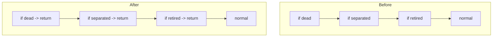
```java
double getPayAmount() {
    if (isDead) return deadAmount();
    if (isSeparated) return separatedAmount();
    if (isRetired) return retiredAmount();
    return normalPayAmount();
}
```

### 38. Replace Conditional with Polymorphism
**Description:** Move each branch of a type-based conditional into an overriding method on a subclass.
**Use Case:** A `switch` on bird type is duplicated across `getSpeed()`, `getPlumage()`, etc.
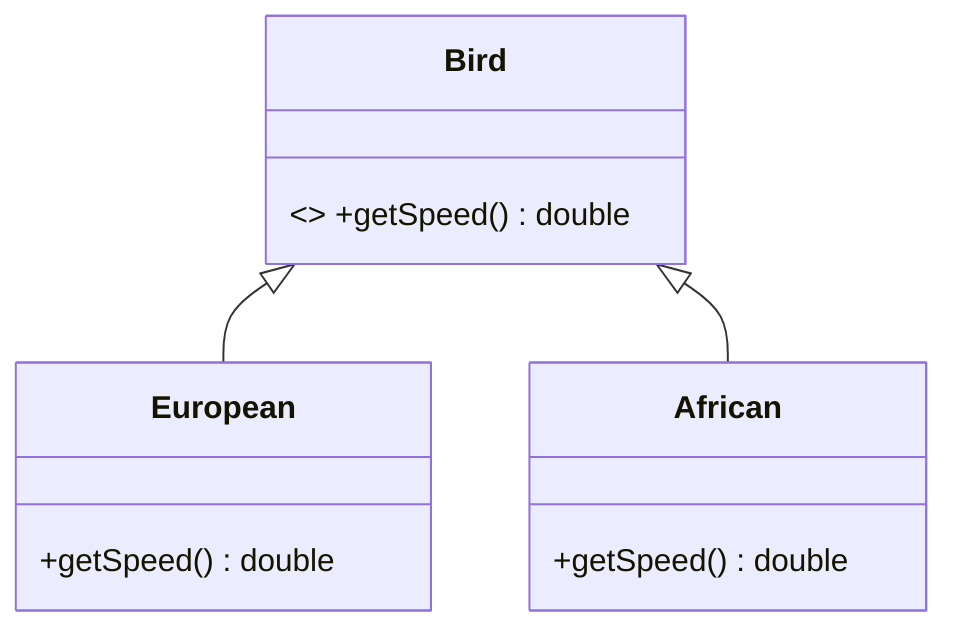
```java
abstract class Bird { abstract double getSpeed(); }
class European extends Bird { double getSpeed() { return 35; } }
class African extends Bird { double getSpeed() { return 40 - numberOfCoconuts * 2; } }
```

### 39. Introduce Special Case (Null Object)
**Description:** Replace repeated null/edge-case checks with a special-case object implementing default behavior.
**Use Case:** Every caller of `findCustomer()` checks for `null` before reading `getPlan()`.
```java
class NullCustomer extends Customer { String getPlan() { return "basic plan"; } }
Customer customer = registry.findCustomer(name); // returns Customer.NULL instead of null
String plan = customer.getPlan(); // no null-check needed
```

### 40. Introduce Assertion
**Description:** Make an assumption explicit in the code with an assertion, documenting and enforcing an invariant.
**Use Case:** A method silently assumes `discountRate` is between 0 and 1 but never states or checks it.
```java
// Before
double applyDiscount(double price, double discountRate) { return price * (1 - discountRate); }
// After
double applyDiscount(double price, double discountRate) {
    assert discountRate >= 0 && discountRate <= 1 : "discountRate must be between 0 and 1";
    return price * (1 - discountRate);
}
```

---

## Ch. 11 — Refactoring APIs

### 41. Separate Query from Modifier
**Description:** Split a function that both returns a value AND has side effects into two functions: a pure query, and a separate command.
**Use Case:** `getTotalOutstandingAndSendBill()` both calculates a total and mails an invoice — surprising and hard to reuse safely.
```java
// Before
double getTotalAndSendBill() { double total = calc(); mailer.send(total); return total; }
// After
double getTotal() { return calc(); }               // pure query — safe to call repeatedly
void sendBill() { mailer.send(getTotal()); }        // explicit command with the side effect
```

### 42. Parameterize Function
**Description:** Combine several near-identical functions that differ only by a literal value into one function taking that value as a parameter.
**Use Case:** `tenPercentRaise()` and `fivePercentRaise()` are identical except for the hardcoded rate.
```java
// Before
void tenPercentRaise(Employee e) { e.salary *= 1.10; }
void fivePercentRaise(Employee e) { e.salary *= 1.05; }
// After
void raise(Employee e, double factor) { e.salary *= (1 + factor); }
```

### 43. Remove Flag Argument
**Description:** Replace a boolean/enum "flag" parameter that changes a function's behavior with separate, clearly-named functions.
**Use Case:** `book(customer, true)` — the caller (and reader) has no idea what `true` means without checking the implementation.
```java
// Before
void book(Customer c, boolean isPremium) { if (isPremium) bookPremium(c); else bookRegular(c); }
// After
void bookRegular(Customer c) { /* ... */ }
void bookPremium(Customer c) { /* ... */ } // caller intent is now explicit at the call site
```

### 44. Preserve Whole Object
**Description:** Pass a whole object rather than pulling out several individual values to pass separately.
**Use Case:** A caller extracts `low` and `high` from a `Range` just to pass them individually to another method.
```java
// Before
boolean within = plan.withinRange(range.getLow(), range.getHigh());
// After
boolean within = plan.withinRange(range); // callee extracts what it needs internally
```

### 45. Replace Parameter with Query
**Description:** Remove a parameter if the callee can derive/query that value itself instead of requiring the caller to pass it in.
**Use Case:** A caller passes `discountLevel` when the callee could just ask `customer.getDiscountLevel()` directly.
```java
// Before
double finalPrice(double basePrice, int discountLevel) { /* ... */ return 0; }
// After
double finalPrice(double basePrice) { int discountLevel = customer.getDiscountLevel(); /* ... */ return 0; }
```

### 46. Replace Query with Parameter
**Description:** The opposite — if a function reaches into global/ambient state to get a value, and that creates unwanted coupling or hidden dependencies, pass it in explicitly as a parameter instead.
**Use Case:** A pricing function reads a global "current currency exchange rate" internally, making it hard to test with different rates.
```java
// Before
double convert(double amount) { return amount * globalExchangeRate.current(); } // hidden dependency
// After
double convert(double amount, double exchangeRate) { return amount * exchangeRate; } // explicit, testable
```

### 47. Remove Setting Method
**Description:** Remove a setter for a field that should never change after construction, reinforcing immutability.
**Use Case:** A `Customer` has `setId()` even though the ID should be permanently fixed once created.
```java
// Before
class Customer { private String id; void setId(String id) { this.id = id; } }
// After
class Customer { private final String id; Customer(String id) { this.id = id; } } // no setter — immutable
```

### 48. Replace Constructor with Factory Function
**Description:** Replace direct construction with a static factory method, enabling subtype selection or clearer construction intent.
**Use Case:** Different "kinds" of `Employee` need different construction logic/subclasses depending on input.
```java
class Employee {
    static Employee create(EmployeeType type) {
        return switch (type) { case ENGINEER -> new Engineer(); case SALESMAN -> new Salesman(); };
    }
}
```

### 49. Replace Function with Command
**Description:** Turn a complex function into its own "Command" class/object, giving it richer lifecycle (undo, logging, queuing) than a plain function call allows.
**Use Case:** An operation needs to support undo/redo or needs to be queued and executed later — a plain function call can't carry that state.
```java
class ChargeCommand {
    private final Account account; private final double amount;
    ChargeCommand(Account account, double amount) { this.account = account; this.amount = amount; }
    void execute() { account.charge(amount); }
    void undo() { account.refund(amount); } // richer lifecycle than a bare function call
}
```

### 50. Replace Command with Function
**Description:** The opposite — if a Command object's extra machinery (undo, queuing) isn't needed, simplify it back to a plain function call.
**Use Case:** A Command class was introduced speculatively but never actually needs undo/queuing — pure overhead now.

---

## Ch. 12 — Dealing with Inheritance

### 51. Pull Up Method
**Description:** Move a method duplicated in sibling subclasses up into their shared superclass.
**Use Case:** `Salesman` and `Engineer` both implement an identical `getContactInfo()` method.
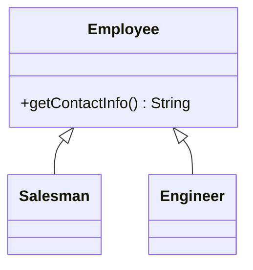
```java
abstract class Employee { String getContactInfo() { return name + " - " + email; } } // pulled up, no longer duplicated
```

### 52. Pull Up Field
**Description:** Move a field duplicated in sibling subclasses up into their shared superclass.
**Use Case:** Both `Salesman` and `Engineer` independently declare an identical `name` field.

### 53. Pull Up Constructor Body
**Description:** When subclass constructors share common initialization logic, move that shared logic up into the superclass constructor, called via `super()`.
**Use Case:** Every subclass constructor repeats the same `this.id = generateId(); this.createdAt = now();` boilerplate.
```java
abstract class Employee {
    protected String id; protected Instant createdAt;
    Employee() { this.id = generateId(); this.createdAt = Instant.now(); } // shared init, called via super()
}
class Engineer extends Employee { Engineer() { super(); } }
```

### 54. Push Down Method
**Description:** Move a method that's only relevant to some subclasses out of the superclass and down into just those subclasses.
**Use Case:** `Employee.calculateCommission()` only makes sense for `Salesman`, not `Engineer` or `Manager`.

### 55. Push Down Field
**Description:** Move a field that's only used by some subclasses down into just those subclasses.
**Use Case:** `Employee.commissionRate` is only ever populated/used for `Salesman` instances.

### 56. Replace Type Code with Subclasses
**Description:** Replace an int/string "type" field with actual subclasses, one per type, enabling polymorphic behavior.
**Use Case:** An `Employee` class carries a `type` field (`ENGINEER`/`SALESMAN`) driving `if/switch` logic throughout.
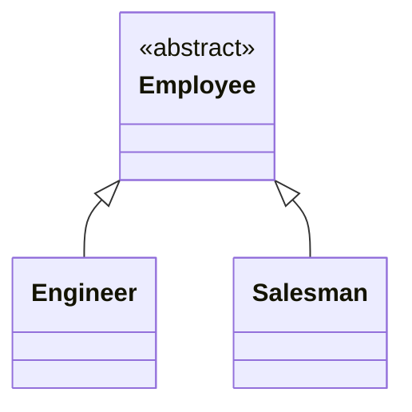
```java
abstract class Employee { abstract double payAmount(); }
class Engineer extends Employee { double payAmount() { return baseSalary; } }
class Salesman extends Employee { double payAmount() { return baseSalary + commission; } }
```

### 57. Remove Subclass
**Description:** The opposite — if a subclass barely differs from its parent (or its difference could be a simple field/flag), collapse it back into the parent.
**Use Case:** A `PremiumCustomer` subclass exists solely to override one constant — a field would be simpler.
```java
// Before: class PremiumCustomer extends Customer { double getDiscountRate() { return 0.1; } }
// After
class Customer {
    private double discountRate;
    Customer(double discountRate) { this.discountRate = discountRate; } // no subclass needed
    double getDiscountRate() { return discountRate; }
}
```

### 58. Extract Superclass
**Description:** Create a common superclass for two classes with similar features, moving shared members up.
**Use Case:** `Employee` and `Contractor` share several fields/methods (`name`, `getPayDetails()`) without a common parent.
```java
abstract class Person { protected String name; String getName() { return name; } }
class Employee extends Person { /* employee-specific */ }
class Contractor extends Person { /* contractor-specific */ }
```

### 59. Collapse Hierarchy
**Description:** Merge a superclass and subclass together when they're no longer sufficiently different to warrant separate classes.
**Use Case:** After several refactorings, a subclass has almost nothing distinct left from its parent.

### 60. Replace Subclass with Delegate
**Description:** Replace an inheritance relationship with a delegate (composition) object, when subclassing was overused for what's really a "has-a" variation in behavior.
**Use Case:** A `PremiumBooking` subclass of `Booking` only exists to change one piece of behavior — better modeled by delegating to a `PremiumExtra` policy object.
```java
class Booking {
    private PremiumExtra premiumExtra; // delegate instead of subclass
    double calculateFee() {
        double base = baseFee();
        return premiumExtra != null ? premiumExtra.extendFee(base) : base;
    }
}
```

### 61. Replace Superclass with Delegate
**Description:** Replace an inheritance relationship on the superclass side with delegation, when a class only wants to reuse *some* of its "parent's" behavior rather than fully be a subtype of it (avoiding Liskov violations).
**Use Case:** `Stack` extending `ArrayList` inherits unwanted operations like random insertion — composition (delegating to an internal `List`) is more correct.
```java
class Stack<T> {
    private final List<T> items = new ArrayList<>(); // delegate, not "is-a" ArrayList
    void push(T item) { items.add(item); }
    T pop() { return items.remove(items.size() - 1); }
}
```

---

## Summary Notes

- **The book's core principle:** Refactoring changes internal structure without changing observable external behavior — always paired with a solid automated test suite as a safety net.
- **Most-used, highest-leverage refactorings in practice:** Extract Function, Rename Variable/Change Function Declaration, Replace Conditional with Polymorphism, Introduce Parameter Object, Extract Class, Move Function, and Replace Nested Conditional with Guard Clauses. These alone resolve the majority of everyday code smells.
- **Reading order matters:** Fowler organizes the catalog so simpler, foundational refactorings (Ch. 6) enable and combine into the more structural ones later (Ch. 11–12) — e.g., you often Extract Function before you can Move Function or Extract Class.
- **IDE support:** Modern IDEs (IntelliJ IDEA, Eclipse, VS Code with appropriate extensions) automate the mechanical steps of most of these refactorings (especially #1–8, #16, #21–22, #51–55), making them close to risk-free to apply — always prefer automated refactoring tools over manual edits when available.

---

*Source: Martin Fowler, "Refactoring: Improving the Design of Existing Code," 2nd Edition (Addison-Wesley, 2018). Catalog structure, chapter groupings, and refactoring names follow the book directly; Java code examples are original illustrations of each technique.*
